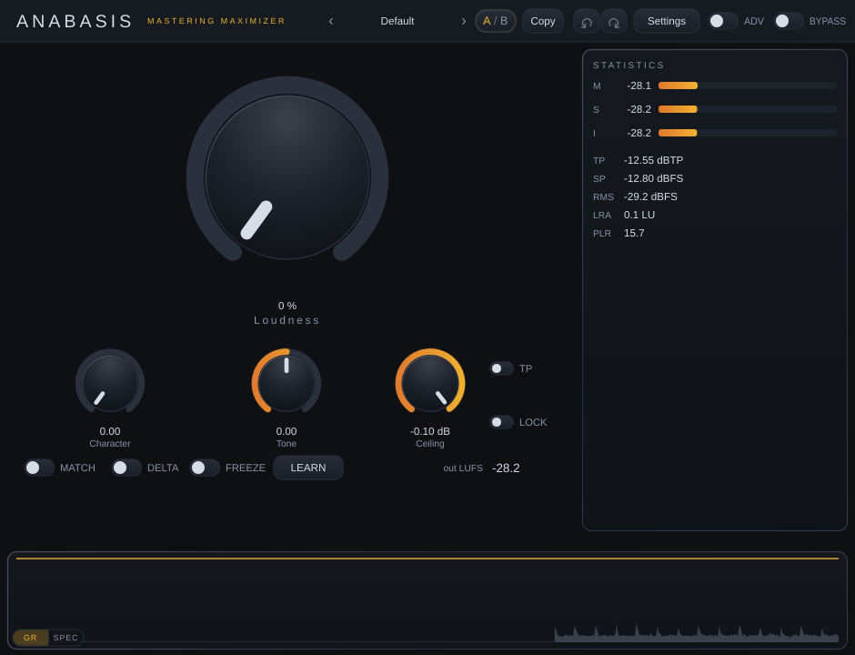
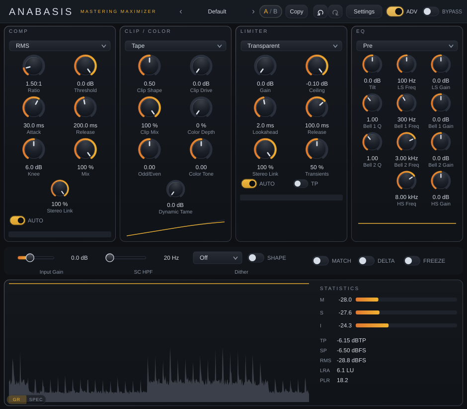

# Anabasis — Product / UX / UI / Interaction Audit and Roadmap

**Date:** 2026-09-26 · **Audited revision:** `e769f33` (`main`, version 0.2.12) · **Class:** dated audit record in `docs/reports/` — a snapshot of one analysis at one commit, superseded by a later audit rather than edited in place (`docs/SOURCE_OF_TRUTH.md`).

**How this record is organised.** This file carries every section of the audit and the index of all 146 findings. The complete record of each finding — evidence, behaviour, root cause, impact, proposal, alternatives, decision, gates, dependencies, acceptance criteria and verification trail — is in the per-category files of [`2026-09-26-anabasis-product-ux-audit/`](2026-09-26-anabasis-product-ux-audit/), linked from every finding id. Runtime observations (`LAY-`, `G-`, `ST-`, `V-`, `E` ids) are recorded step by step in [`worklogs/2026-09-26-product-ux-audit.md`](../../worklogs/2026-09-26-product-ux-audit.md). Fourteen captures are committed under [`2026-09-26-anabasis-product-ux-audit/captures/`](2026-09-26-anabasis-product-ux-audit/captures/); every other capture named in the records existed only in the audit session.

**Anchors.** Every code citation is pinned to the audited revision as `e769f33:path:line`, so it keeps naming the code it was written about after that code moves; the repository's citation gate deliberately leaves revision-pinned anchors alone, which is the right behaviour for a dated record.

**Nothing in the product was changed by this audit.** No source, test, CI, build or parameter file was modified. The runtime evidence was produced with a scratchpad harness that compiles the plug-in's own sources and is not committed (see *Evidence and method*).

## Contents

- [Executive summary](#executive-summary)
- [Scope](#scope)
- [Evidence and method](#evidence-and-method)
- [Current user / interaction model](#current-user--interaction-model)
- [Findings](#findings)
- [Systemic themes](#systemic-themes)
- [Prioritized roadmap](#prioritized-roadmap)
- [High-leverage changes](#high-leverage-changes)
- [Preserved, rejected, deferred and open items](#preserved-rejected-deferred-and-open-items)
- [Evidence limitations](#evidence-limitations)
- [Final decision record](#final-decision-record)

## Executive summary

**State of the product.** At e769f33 Anabasis is code complete for v0.1.0 and waiting for the owner's fine review. The engineering base is disciplined:
- The Simple/Advanced switch is sound-neutral by construction.
- Bypass is a delay-aligned, bit-exact null.
- Reported latency stays constant across presets, A/B, undo and session load.
- The meters read the render tap.
- Every restore runs under `MacroEngine::ScopedRestore`.
- The realtime gates do real work: allocation guard, RTSan, ASan/UBSan/valgrind, and pluginval in both modes ×3.

The audit calibrated 146 records (140 verified plus 6 new): 1 P0, 9 P1 (one of them an investigation), 69 P2, 50 P3 and 17 Preserve/Reject.

**Core UX/UI conclusion.** The weakness is not the layout or the look. It is whether the product tells the truth at the moment the user acts. Anabasis promises a dBTP ceiling, a loudness-matched comparison, a lock, a freeze and a session measurement. The user cannot see the scope, state or enforcement of any of them, and in a few places the DSP does not keep the promise. What the plugin explains about itself lives in tooltips, and those ship switched off (e769f33:src/gui/PluginEditor.cpp:972). The graphs are qualitative. Pointer and text input run on untuned JUCE defaults, so ordinary slips rewrite values.

**Most important findings (systemic).**
1. **The delivery guarantee does not hold in TP mode ([DSP-001][dsp-001], P0).**
   - The clamp is sample-peak only, and the limiter's TP detection is off at 4x and above (e769f33:src/dsp/AnabasisEngine.cpp:656).
   - True peaks exceed the ceiling by 1.1–1.7 dB at every oversampling factor, including the Force Max bounce the manual recommends.
   - The TP row is red at the defaults, so a real over looks the same as normal operation ([VIS-002][vis-002], [VIS-008][vis-008]).
2. **The comparison and the measurement are not fair.**
   - MATCH is applied after the bypass mix, so BYPASS plays the dry signal scaled by the same gain. The 4–7 LU advantage that MATCH exists to remove survives the manual's own A/B step ([UX-009][ux-009]).
   - The STATISTICS panel holds the figures a master is judged by. Any click on its ~318 px of blank glass wipes them, and the panel shows no scope, liveness or measurement standard ([UX-002][ux-002]).
3. **State silently changes what gets printed.**
   - Browsing a factory preset with LOCK on drops TP, Dither and Noise Shaping ([STATE-002][state-002]).
   - Any `prepareToPlay` drops the frozen trims while FREEZE stays lit ([STATE-004][state-004]).
   - Save overwrites an existing preset without asking ([UX-003][ux-003]).
   - At the default Oversampling Off, any Clip Drive low-passes the top end from 30 % Loudness: −5.1 dB at 15 kHz at 48 kHz ([DSP-004][dsp-004]).
4. **The graphs carry no numbers.**
   - There is no numeric gain-reduction reading anywhere ([VIS-007][vis-007]).
   - The spectrum reads 6.02 dB hot ([VIS-021][vis-021]), and above about 2.3 kHz it under-reads tones by tens of dB ([VIS-024][vis-024]).
5. **Input slips change values.**
   - Opening a percent box and confirming without typing multiplies a sub-1 % value by 100 ([INPUT-017][input-017]).
   - Unparseable text drives the Ceiling to 0.00 dB, and typing `nan` mutes the output and is saved with the session ([INPUT-001][input-001]).
   - Right-click performs the primary action everywhere ([INPUT-013][input-013]).
6. **Verification stops at the headless boundary.**
   - No host has ever loaded the plugin on record (COMPATIBILITY_MATRIX.md:68; [TEST-002][test-002]).
   - The Linux no-mouse-input report is still open ([TECH-001][tech-001]).
   - Several host behaviours are emulated rather than observed.

**Top priorities.**
- **Phase 0:**
  - Implement ADR-0006 D2/D3 with a lookahead that does not depend on TP mode, and make the TP warning honest.
  - Hold a locked ceiling as value plus TP mode.
  - Make Freeze survive a re-prepare.
  - Guard Save against silent overwrites.
  - Disclose the Oversampling-Off top-end loss.
  - Run the real-host evidence pass that later decisions depend on.
- **Phase 1:** move the MATCH gain onto the processed (wet) leg only and show the monitor state. Make the STATISTICS reset an explicit button and show the measurement's scope.
- **Later phases:** numbers on the graphs (Phase 2), input that changes values only on deliberate gestures (Phase 3), and visible preset, A/B, undo, macro and adaptive state (Phases 4–5).

Almost every P0/P1 fix crosses an Architecture Review Gate category or an Accepted ADR, so the fine review has to rule on those amendments first. All new captions are owner copy (C8).

**Counts.** 146 findings — P0: 1, P1: 9, P2: 69, P3: 50, no priority (Preserve/Reject): 17. Decisions — Proceed: 42, Modify: 74, Preserve: 15, Defer: 7, Reject: 2, Investigate further: 6.

**The P0 and P1 findings.**

| ID | Finding | Decision | Priority |
|---|---|---|---|
| [DSP-001][dsp-001] | TP mode does not hold the dBTP ceiling: the clamp is sample-peak only (ADR-0006 D2/D3 unimplemented while ADR_INDEX reads Verified), so true peaks exceed a '-0.10 dBTP' ceiling by… | Proceed | P0 |
| [DSP-004][dsp-004] | Any non-zero Clip Drive low-passes the whole programme at OS Off (ADAA-1: about -2.0/-5.1/-11.7 dB at 10/15/20 kHz at 48 kHz); the Loudness macro switches this on abruptly at 30 %… | Modify | P1 |
| [STATE-002][state-002] | Every factory-preset browse resets TP, Dither and Noise Shaping to Off: a locked Ceiling keeps its number but becomes a sample-peak limit, and 16-bit dither turns itself off | Proceed | P1 |
| [STATE-004][state-004] | Any prepareToPlay, including one at the same rate and block size, silently drops the frozen trims from the audio. FREEZE stays lit and the save keeps the vector (KI-006 audio half) | Modify | P1 |
| [TECH-001][tech-001] | KI-012 is still open: the owner reports that the Linux editor accepts no mouse input on a real session. The one measured mechanism is closed in current builds, but nothing here ca… | Investigate further | P1 |
| [TEST-002][test-002] | No real-host or real-device Level-5 validation is on record for the behaviours the audit could only emulate: host bypass routing, transport stop, bursty delivery, offline render w… | Modify | P1 |
| [UX-002][ux-002] | The whole STATISTICS panel, including about 310 px of empty glass in Simple, is an unmarked reset button: any click, drag or right-click discards I, LRA, PLR and both peak holds w… | Proceed | P1 |
| [UX-003][ux-003] | Save Preset silently overwrites an existing user preset, and because the name field comes prefilled with the current name, overwriting is the default action | Modify | P1 |
| [UX-009][ux-009] | Monitor-state combinations and persistence are not shown: DELTA is inaudible under BYPASS, MATCH makes BYPASS loudness-matched rather than unity, MATCH and DELTA can be on togethe… | Proceed | P1 |
| [VIS-007][vis-007] | There is no numeric gain-reduction readout, current or peak, for any stage in either view | Modify | P1 |

## Scope

The audit examined Anabasis at `e769f33`, the merge commit of PR #40 and `origin/main` at the time of the audit (project version 0.2.12, JUCE 9.0.1). It treated Anabasis as a product. The core subject was the interaction model and the UI. DSP, threading, tests and documentation were in scope where they reach the user or constrain UI work. The whole audit was read-only.

### Inspected

| Area | What was read or run | Evidence source |
|---|---|---|
| Processor, parameters, state | `src/PluginProcessor.{h,cpp}`, `src/PluginParameters.{h,cpp}`, `src/MacroEngine.{h,cpp}`, `src/PresetManager.{h,cpp}`, `src/InternalState.h`, `src/AbSlotIndex.h` | Maps parameter-macro-model, state-presets-ab-undo |
| Editor and UI | Every file in `src/gui/`: `PluginEditor`, `LookAndFeel`, `LoudnessMeterView`, `GrHistoryView`, `SpectrumView`, `CurveView`, `FrameClock.h`, `HiddenInterval.h` | Maps ui-architecture, metering-visualisation |
| DSP, as far as it reaches the user | `src/dsp/AnabasisEngine.{h,cpp}`, `AdaptiveEngine.h`, `LookaheadLimiter.h`, `CeilingClamp.h`, `ClipSat.h`, `MasteringComp.h`, `MasteringEQ.h`, `TruePeak.h`, `LoudnessMeter.h`, `RmsMeter.h`, `GrHistoryBuffer.h`, `ScopeBuffer.h`, `Latency.h`, `EngineParameters.h` | Maps dsp-chain-behaviour, metering-visualisation |
| Tests, CI, build (read only) | `tests/state_tests.cpp`, `tests/dsp_tests.cpp`, `tests/AllocationGuard.h`, `tests/fixtures/parameter_registry.snapshot`, `.github/workflows/build.yml`, `CMakeLists.txt`, `scripts/run-pluginval.sh`, `scripts/run-pluginval.ps1`, `scripts/run-tests.sh`, `scripts/check-realtime.py`, `tools/channel_probe.cpp` | Map tests-ci-robustness |
| Product documents | `docs/DEVELOPMENT_BRIEF.md` (Part I), `docs/DESIGN.md` (§5 to §7), `docs/user/USER_MANUAL.md`, `docs/user/INSTALLATION.md`, `README.md`, `CHANGELOG.md` (0.2.0 to 0.2.12), `docs/KNOWN_ISSUES.md`, `docs/FUTURE_RISKS.md`, `docs/OPEN_QUESTIONS.md` (open entries), `docs/BRAND_CONSISTENCY_CHECKLIST.md`, `docs/HANDOVER.md`, `docs/TEST_REPORT.md`, `docs/DOCUMENTATION_COVERAGE.md`, `docs/POSTMORTEMS.md` | Map product-contract-docs, plus cross-references in every other map |
| Architecture records | `docs/architecture/PARAMETER_REGISTRY.md`, `SERIALIZATION_REGISTRY.md`, `THREAD_MODEL.md`, `LATENCY_MODEL.md`, `REALTIME_SAFETY_AUDIT.md`, and `docs/procedures/TESTING.md` | Several maps |
| ADRs | `ADR_INDEX.md`, which lists 40 ADRs. The maps cite ADR-0002 to 0007, 0009 to 0011, 0013 to 0020, 0022 to 0027, 0029, 0033, 0034 and 0038 to 0040 | All maps |
| Policies | `MODE_AND_ADAPTATION_POLICY.md`, `DSP_POLICY.md`, `TESTING_POLICY.md`, `THREADING_POLICY.md`, `DEPENDENCY_POLICY.md`, `PARAMETER_COMPATIBILITY_POLICY.md` and `SESSION_COMPATIBILITY_POLICY.md` are cited by the maps. Phase 3 applied the hard-stop categories of `ARCHITECTURE_REVIEW_GATE.md` as gate flags | Maps; Phase-3 rules |
| Sibling reference | Anamorph at `fd78c3b` (0.9.5), read-only. That commit is 211 commits past the ADR-0009 copy pin `b6a3db8`. Files read: `src/PluginEditor.{h,cpp}`, `src/gui/LookAndFeel.{h,cpp}`, `src/gui/LevelMeter.cpp`, `src/gui/FrameClock.h`, `src/InternalState.h`, `docs/user/USER_MANUAL.md`, `docs/KNOWN_ISSUES.md`, `docs/POSTMORTEMS.md`, `CHANGELOG.md` | Map anamorph-reference (code and documents only) |
| Runtime: plugin UI | The real `AnabasisAudioProcessor` and its editor in the audit harness on Linux/Xvfb. Covered: the Simple view (940x720) and the Advanced view (940x822); the top bar (preset menu, prev/next preset buttons, A/B, Copy, undo/redo, Settings, ADV, BYPASS); the About overlay; every Settings row; Save Preset and Load Preset; the knobs, faders, toggles, combos and the inline value editor; keyboard focus and arrow keys; tooltips; the Statistics panel, 'out LUFS', GR history, SPEC, per-stage GR bars and curves; UI scale XS to XL | LAY-, G-, ST-, V- and E observations |
| Runtime: host-style events | Emulated through the harness control channel: automation writes, host bypass, transport flag, sample-rate and block changes, state save/load, corrupt state blobs. Two harness processes also shared one preset folder | ST-, V- and E observations |
| Runtime: plain Standalone | The product's own Linux Standalone with no audio device available on the machine. Only its no-device state and Options menu were exercised | E01, E21 |

### Not inspected

- **Real DAW hosts.** No DAW was used (REAPER, Live, Logic, Bitwig, Cubase, Pro Tools and FL Studio were all absent). The VST3 binary was not loaded anywhere. The only plugin wrapper that ran was the plain Linux Standalone, in its no-device state.
- **macOS and Windows.** Neither was run. Everything ran on Linux X11 under Xvfb, with no window manager, no compositor and no physical display.
- **AU and AUv3.** AU is built only on Apple (`e769f33:CMakeLists.txt:286-288`) and was neither built nor run.
- **The OpenGL paint path.** The GL context is attached only when `JUCE_MAC || JUCE_WINDOWS` (`e769f33:src/gui/PluginEditor.cpp:1020-1022`), so on Linux it is compiled out and was never exercised.
- **HiDPI.** Host-driven `setScaleFactor` was not exercised (`hostScale` stayed 1.0). Windows DPI scaling and Retina were not tested.
- **Audio.** Nothing was listened to, and output audio was not recorded or measured.
- **pluginval, CI and sanitizers.** pluginval was not run; its strictness lives in `ANABASIS_PLUGINVAL_STRICTNESS`, `e769f33:.github/workflows/build.yml:151`. No CI run or CI log was inspected. No test-suite result is used as evidence: the tests-ci-robustness map reads test and CI sources only. No ThreadSanitizer, AddressSanitizer, UBSan or RTSan build was made.
- **Performance.** CPU, paint cost and frame pacing were not measured.
- **Offline rendering.** Non-realtime rendering, the Offline Render setting in its effect, and bus layouts other than stereo in and stereo out were not exercised.
- **Editor lifecycle.** No editor was closed and reopened.
- **Assistive technology and input methods.** Screen readers, colour-vision-deficiency simulation, IME input and clipboard paste were not tested.
- **Anamorph at runtime.** Anamorph was not built or run, so every comparison with it is at code and document level.
- **Packaging.** Installers and release artefacts were not installed.

## Evidence and method
The audit ran in four phases. Each phase worked from the written evidence of the phases before it and re-opened code and runtime where it needed to. Code anchors taken from the evidence maps are pinned to `e769f33` in this report. The repository working tree was clean at that commit throughout.

### Phase 1: code and document evidence maps

Eight reader agents each mapped one area read-only. Each map has five parts:

- a narrative report;
- an inventory of the relevant code and document elements with their locations;
- potential findings, each tagged with the reader's own severity;
- runtime checks the reader wanted done;
- doc-versus-code drift.

| Map | Area | Inventory | Potential findings | Runtime checks requested | Doc/code drift |
|---|---|---|---|---|---|
| ui-architecture | UI architecture, layout, direct interaction (PluginEditor, LookAndFeel, graph-well switch, Settings, pop-up shield) | 48 | 20 | 25 | 16 |
| parameter-macro-model | Parameter model, macro layer (three macros to nine managed parameters, detach/re-engage/reset), Simple/Advanced ownership, parameter lock, Ceiling true-peak unit | 40 | 13 | 17 | 15 |
| state-presets-ab-undo | State model, presets, A/B, Copy, undo/redo, ceiling lock, bypass, persistence | 42 | 14 | 15 | 12 |
| dsp-chain-behaviour | Signal order, macros, adaptive engine/Learn/Freeze, MATCH/DELTA/BYPASS and the §2.8 duck, oversampling/phase/latency, ceiling semantics, dither | 33 | 17 | 15 | 12 |
| metering-visualisation | Statistics panel, out LUFS, GR history, spectrum, curves, per-stage GR lanes | 19 | 15 | 20 | 12 |
| product-contract-docs | Brief Part I, DESIGN §5 to §7, manual, README, KNOWN_ISSUES, FUTURE_RISKS, OPEN_QUESTIONS, brand checklist, CHANGELOG 0.2.0 to 0.2.12 | 24 | 14 | 25 | 32 |
| tests-ci-robustness | Suites, pluginval gate, realtime/threading enforcement, host edge cases, fragile areas | 47 | 10 | 18 | 10 |
| anamorph-reference | Inherited UI conventions, divergences, Anamorph lessons not applied, conventions that may not fit a one-knob maximizer | 27 | 13 | 17 | 12 |
| Total | | 280 | 116 | 152 | 121 |

### Phase 2: runtime observation

Five observers each drove the real processor and editor. Each had a private Xvfb display (1600x1100x24), their own harness instance, their own `HOME` (so user presets were written to a private preset folder) and their own control file. For each observation they recorded:

- the steps taken;
- what they saw;
- screenshot paths;
- their interpretation;
- a code cross-reference;
- their own severity and confidence labels. These labels are not the Phase-3 rubric priorities.

Each observer also listed positives and limitations.

| Observer (ids) | Display | Focus | Observations | Observer severity labels (high / medium / low / none) |
|---|---|---|---|---|
| layout (LAY-01 to LAY-18) | :111 | Layout, hierarchy, grouping, UI scale, resize | 18 | 0 / 7 / 10 / 1 |
| gestures (G-01 to G-22) | :112 | Knobs, faders, toggles, buttons, value entry, keyboard, tooltips | 22 | 2 / 7 / 10 / 3 |
| state (ST-01 to ST-22) | :113, two instances | Presets, A/B, Copy, undo/redo, LOCK, plugin vs host bypass, MATCH/DELTA, Settings rows, persistence, sample rate, transport | 22 | 3 / 6 / 8 / 5 |
| visuals (V-01 to V-19) | :114 | GR history, SPEC, Statistics, out LUFS, per-stage GR bars under signal | 19 | 2 / 7 / 10 / 0 |
| edges (E01 to E22) | :115, and :99 for the Standalone | Error, empty and unavailable states, input robustness, popups, focus | 22 | 0 / 7 / 13 / 2 |
| Total | | | 103 | 7 / 34 / 51 / 11 |

Observation counts are the `### ` headings in each observation file.

A first edges run was stopped part-way. Its files are kept under `rt/edges.partial-stopped/`. The edges observer then re-ran every item and cites partial-run screenshots only where the file name makes the steps unambiguous (edges, Limitations).

#### The audit harness

The harness is a small JUCE GUI application: a `CMakeLists.txt` plus a `main.cpp` of about 330 lines. It lives only in the audit session's scratchpad directory. It is not committed and is not part of the product.

**How it is built**

- It is a CMake project, `AnabasisAuditHarness`, in C++23, built as `juce_add_gui_app`, so no plugin wrapper is involved.
- JUCE 9.0.1 is taken from the repository's fetched dependency (`build/_deps/juce-src`), with a binary directory in the scratchpad.
- It defines `AnabasisDSP` exactly as the product does, as an INTERFACE target carrying `src/dsp/AnabasisEngine.cpp` (compare `e769f33:CMakeLists.txt:267-271`).
- It compiles the ten files of `ANABASIS_PLUGIN_SOURCES` straight from the repository's `src/` at `e769f33`. The list is identical to the plugin target's (`e769f33:CMakeLists.txt:312-322`).
- It links `juce_audio_utils`, `juce_dsp`, `juce_opengl` and `juce_recommended_config_flags`.
- It sets `ANABASIS_VERSION_STRING="0.2.12"`. `ANABASIS_BUILD_NUMBER="0"` is set on `PluginEditor.cpp` only. Other definitions are `JUCE_WEB_BROWSER=0`, `JUCE_USE_CURL=0`, `JUCE_DISPLAY_SPLASH_SCREEN=0`, `JUCE_REPORT_APP_USAGE=0`, `JUCE_STRICT_REFCOUNTEDPOINTER=1` and `JUCE_STANDALONE_APPLICATION=1`.
- Unlike the plugin target (`e769f33:CMakeLists.txt:360-370`), it links neither `AnabasisHardening`, the LTO flags nor `juce_recommended_warning_flags`.
- It is a Release build made with the system compiler (GCC 13.3.0, `/usr/bin/c++`). That is the same compiler as the repository's local build tree. It is not the toolchain pinned for CI (ADR-0031, ADR-0037).

**Hosting**

- The harness creates `AnabasisAudioProcessor`, attaches a simulated playhead, and calls `setPlayConfigDetails` (2 in, 2 out), `setNonRealtime(false)` and `prepareToPlay`.
- It creates the real editor with `createEditor()` and makes it the owned content of a `juce::DocumentWindow` with no title bar. The window uses the editor's constrainer and is resizable from its border.
- It logs the editor's screen bounds at start and on every editor move or resize.

**Simulated audio thread**

- A high-priority `juce::Thread` fills a two-channel buffer of exactly `block` samples on each pass.
- It then calls `processBlock` with an empty MIDI buffer, or `processBlockBypassed` while host bypass is set.
- It advances the playhead only while "playing", then sleeps until the next period of `block / rate`. The result is evenly paced, fixed-size blocks at real-time rate.
- Defaults: 48 kHz, 512-sample blocks, −18 dB level, program `music`. These can be overridden through `HARNESS_SR`, `HARNESS_BLOCK`, `HARNESS_LEVEL`, `HARNESS_SIGNAL` and `HARNESS_POS`.
- Samples are clamped to ±4.0 after the level gain.

| Signal program | What the generator produces |
|---|---|
| `silence` | Zeros |
| `sine [Hz]` | Sine, default 1 kHz, identical on L and R |
| `pink` | Seeded white noise through a seven-term pink filter, separate filter state per channel (decorrelated L/R) |
| `music` | 120 BPM. Each beat has a decaying 55 Hz kick with a pitch drop at onset and a noise transient (at 0.7 on R), over a pink-noise pad. Every other four bars (the "chorus") the whole sum is doubled |
| `burst` | Pink noise on a 3 s cycle: 1 s at full level, then 2 s at 0.03 (about −30 dB) |
| `square [Hz]` | ±1 square from the same oscillator as `sine`, identical on L and R |
| `sweep` | Exponential sine sweep, 20 Hz to 20 kHz over 5 s, repeating, identical on L and R |

**Simulated playhead**

- `isPlaying` defaults to true and is switched by `transport`. `isRecording` is always false.
- Tempo is 120 BPM in 4/4.
- Time in samples, seconds and PPQ comes from a counter that the audio thread advances.

**Control channel**

A message-thread timer polls a text file every 100 ms and runs newly appended lines in order. Results go to the harness log.

| Command | What it does to the processor |
|---|---|
| `signal NAME [Hz]` | Selects a program; the optional frequency applies to `sine` and `square` |
| `level DB` | Sets the generator gain |
| `transport 0` or `1` | Flips the playhead's `isPlaying`; audio keeps flowing |
| `hostbypass 0` or `1` | The audio thread calls `processBlockBypassed` instead of `processBlock` |
| `sr RATE BLOCK` | Stops the audio thread, calls `releaseResources` then `prepareToPlay` at the new rate and block size, and restarts the thread; the editor stays open |
| `param ID VALUE` | On the message thread: `beginChangeGesture`, `setValueNotifyingHost` (clamped to 0..1), `endChangeGesture` |
| `paramtext ID TEXT` | The same, with the value taken from `getValueForText` |
| `dump` | Logs every parameter's ID, name, value text, label, normalised value and automatable flag, plus `getLatencySamples()` and the bypass parameter's name |
| `save FILE`, `load FILE` | `getStateInformation` / `setStateInformation` on the message thread while audio keeps running |
| `savexml FILE` | Writes the state as XML |
| `bounds`, `quit` | Logs the editor bounds; quits |

**Input and capture.** `xdotool` supplied pointer moves, clicks, drags, wheel, keys and typed text. ImageMagick `import -window root` took full-screen captures, and PIL made crops.

**Plain Standalone.** The product's own Linux Standalone also ran on display :99. It is a Release binary from the repository's existing build tree, last linked 2026-09-08. Its sources differ from `e769f33` at most by the comment-only commit `e467e1d`. No audio device exists on this machine, so the Standalone shows JUCE's "Audio input is muted" banner and dashes in every meter (E01).

**Nothing in the product was modified.** No product code, test, CI or build file was changed: `git status --porcelain` prints nothing. The harness compiles repository sources in place and writes only into the scratchpad. The orchestration scripts for Phases 3 and 4 sit in the repository's git-ignored `build/` directory (`build*/` in `.gitignore`) and are not committed.

**Screenshots.** With `S` as the session scratchpad, `find $S/rt $S/shots -name '*.png' | wc -l` gives 1,597 PNG files:

| Directory | PNG files | Content |
|---|---|---|
| `rt/layout/` | 239 | layout observer |
| `rt/gestures/` | 191 | gestures observer |
| `rt/state/` | 225 | state observer |
| `rt/visuals/` | 307 | visuals observer |
| `rt/edges/` | 429 | edges observer |
| `rt/edges.partial-stopped/` | 195 | first, stopped edges run |
| `shots/` | 11 | Bring-up before Phase 2. By timestamp, 9 captures of the Standalone taken before the harness was built, and 2 of the first harness run |
| Total | 1,597 | |

The count includes derived images (crops, zooms, strips, contact sheets) as well as full-screen captures. The file names do not separate the two reliably, so the number of distinct capture events is lower and was not established. No Phase-3 reproduction captures existed when the count was taken; any made later under `rt/verify-*/` are not included.

### Phase 3: consolidation, re-verification, judgement, challenge

The workflow is defined in the git-ignored `build/wf-phase3.js`. It has four steps.

**1. Consolidate.** Three domain consolidators built the candidate findings:

| Domain | Maps read | Observations read |
|---|---|---|
| A: interaction and UI | ui-architecture, anamorph-reference, the UI parts of product-contract-docs | layout, gestures, edges |
| B: state and operation model | parameter-macro-model, state-presets-ab-undo, the user-facing parts of dsp-chain-behaviour, the workflow parts of product-contract-docs | state, G-13 to G-18, the state items in edges |
| C: feedback, technical, documentation, tests | metering-visualisation, dsp-chain-behaviour, tests-ci-robustness, the drift parts of product-contract-docs | visuals, edges, ST-13, ST-14, ST-17 |

The consolidation rules were:

- A runtime observation that confirms a code-derived potential finding becomes one candidate carrying both sources.
- Every potential finding, and every observation of severity low or above, is included unless it is an environment artefact or belongs to another domain.
- Each candidate records whether it was observed at runtime and whether it is sensitive to synthetic input.

**2. Merge.** One agent de-duplicated across domains and assigned final IDs by category, numbered in order of importance within each category. The categories are UX, UI, INPUT, STATE, MODEL, VIS, DSP, TECH, DOC and TEST. The agent recorded each dropped key with its reason, formed verification batches of 3 to 6 related findings, and recorded systemic themes and positives to preserve.

**3. Verify and judge.** One verifier per batch:

- re-opened every cited anchor at `e769f33` and viewed the key screenshots;
- tried to refute each claim before accepting it;
- reproduced runtime-only claims, and claims flagged as sensitive to synthetic input, on a private Xvfb display (:130 plus the batch index). Before every click it used stepped pointer motion: three or more intermediate moves with short sleeps;
- recorded a verification status (confirmed, partially-confirmed, refuted, unverifiable), the method used, and any corrections to the claim;
- wrote the root cause, user impact and scope, a concrete target behaviour with alternatives, a decision and rationale, a priority, the nine scores, a confidence level (high, medium, low), dependencies, gate flags, observable acceptance criteria and a workstream.

**4. Challenge.** Every finding judged P0 or P1, and every Proceed finding with a user-impact score of 4 or more, went to an adversarial reviewer. The reviewer re-opened the evidence, and had to record the evidence as not holding if it could not confirm it independently. It then tested the priority, the decision and the proposal against the Accepted ADRs and the hard-stop gates. It returned `evidence_holds`, `priority_justified` with a suggested priority, `decision_justified` with a suggested decision, the proposal's risks, and reasons.

Rules that applied throughout Phase 3:

- Code is cited as `e769f33:path:line`.
- Behaviour, intent and history are not invented; where evidence is insufficient, that is stated.
- A difference counts as a finding only when there is evidence that it harms clarity, workflow, consistency, correctness or maintainability.
- Environment artefacts the observers already identified (stale tooltip after an `xdotool` warp; the harness window not following UI-scale changes) are not reported as product defects unless independently confirmed.
- A proposal that touches a hard-stop category must name it. The categories are:
  - parameter ID rename or removal;
  - serialization schema change;
  - threading-model change;
  - DSP signal-order change;
  - reported-latency change;
  - Simple/Advanced macro-layer contract change;
  - ceiling-guarantee change;
  - plugin-format change;
  - build-system change;
  - conflict with an Accepted ADR.

#### Rubric (as used, verbatim from the Phase-3 workflow)

Priority definitions ("apply exactly; do not let ease of implementation raise priority or difficulty lower it"):

- P0 — blocks or seriously compromises normal product use: an ordinary action silently does something else or destroys work/settings; a default-configuration display that leads a user to a wrong mastering decision; loss of audio correctness.
- P1 — materially harms a common or important workflow (every session / every mastering pass), or a frequent trap with costly recovery.
- P2 — meaningful improvement to usability, clarity, consistency or robustness in a less frequent or lower-cost situation.
- P3 — polish, optimisation, lower-impact refinement.
- none — for Preserve / Reject decisions.

Scores run from 1 to 5, where 5 means most:

| Dimension | Meaning of 5 |
|---|---|
| user_impact | most impact |
| frequency | every session |
| severity | wrong output / destroyed work / misleading decision |
| discoverability | users cannot find/understand it at all |
| workflow_efficiency | large avoidable effort |
| coherence | strongly contradicts the product's own model |
| change_risk | risky to change |
| complexity | large |
| evidence_confidence | reproduced and code-confirmed |

Decisions:

- **Proceed**: should be addressed.
- **Modify**: address with a constrained or smaller change than the obvious one.
- **Preserve**: current behaviour should remain; the judge says why.
- **Defer**: worthwhile, not yet appropriate; the judge says what it waits for.
- **Reject**: not justified.
- **Investigate further**: evidence insufficient; the judge says exactly what evidence is needed.

Workstreams: Interaction model, Information architecture, Visual hierarchy, Workflow efficiency, State management, Feedback/observability, Preset/state workflow, Visualization, Accessibility/input, Technical robustness, Documentation, Test infrastructure.

### Phase 4: synthesis

Phase 4 turns the Phase-3 judgements and challenge reviews into the findings, themes and priority order in the rest of this report. This section records only the method. Outcomes, including each finding's verification status, are in the Findings section.

### Committed captures

| Capture | What it shows |
|---|---|
| [01-simple-view.png](2026-09-26-anabasis-product-ux-audit/captures/01-simple-view.png) | Simple view at defaults with the music signal playing (editor 940x720, scale M). |
| [02-advanced-view.png](2026-09-26-anabasis-product-ux-audit/captures/02-advanced-view.png) | Advanced view (940x822): four stage panels, the utility strip, the graph well and STATISTICS. |
| [03-knob-arcs-at-defaults.png](2026-09-26-anabasis-product-ux-audit/captures/03-knob-arcs-at-defaults.png) | Defaults: Character 0 shows no arc, Tone 0.00 (centre) shows a half arc, Ceiling -0.10 dB shows a near-full arc (LAY-02). |
| [04-tp-over-ceiling-os4x.png](2026-09-26-anabasis-product-ux-audit/captures/04-tp-over-ceiling-os4x.png) | Oversampling 4x, default settings. Left: TP off, true peak 1.39 dBTP. Right: TP on, the Ceiling reads -0.10 dBTP, and true peak is 1.27 dBTP. Sample peak is -0.10 dBFS in both ([DSP-001][dsp-001]). |
| [05-match-delta-states.png](2026-09-26-anabasis-product-ux-audit/captures/05-match-delta-states.png) | MATCH and DELTA can both be lit; nothing states what is being monitored (ST-15, [UX-009][ux-009]). |
| [06-ceiling-typed-entry.png](2026-09-26-anabasis-product-ux-audit/captures/06-ceiling-typed-entry.png) | Typed Ceiling entry: an empty field commits 0.00 dB, as does 1e9; -1e9 clamps to -20.00 dB (E05, [INPUT-001][input-001]). |
| [07-bypass-folds-into-holds.png](2026-09-26-anabasis-product-ux-audit/captures/07-bypass-folds-into-holds.png) | An 8.5 s BYPASS passage: the integrated reading and LRA keep integrating the dry signal (I -11.9 to -12.6, LRA 4.0 to 5.9) ([VIS-001][vis-001]). |
| [08-statistics-click-reset.png](2026-09-26-anabasis-product-ux-audit/captures/08-statistics-click-reset.png) | One click on the empty STATISTICS glass resets I, LRA, PLR and the TP hold with no cue ([UX-002][ux-002]). |
| [09-host-bypass-frozen.png](2026-09-26-anabasis-product-ux-audit/captures/09-host-bypass-frozen.png) | Host bypass (processBlockBypassed): no bypass indication anywhere; captures taken seconds apart were pixel-identical, every meter and the GR history frozen at their last values (E07, V-06, ST-14). |
| [10-lock-toggle.png](2026-09-26-anabasis-product-ux-audit/captures/10-lock-toggle.png) | LOCK lit: loading 'Loud Pop' kept the Ceiling at -1.00 dB and the name shows no '*' (ST-20). The same LOCK does not stop a drag, typed value, reset or automation from moving the Ceiling (G-16). |
| [11-detach-badges.png](2026-09-26-anabasis-product-ux-audit/captures/11-detach-badges.png) | Detach badges in Advanced: a small corner dot on a hand-edited macro-managed knob (G-14). |
| [12-keyboard-focus-invisible.png](2026-09-26-anabasis-product-ux-audit/captures/12-keyboard-focus-invisible.png) | Keyboard focus: after Tab, an arrow key moved Character from 0.00 to 0.03; no frame of the sequence shows which control holds focus (E08). |
| [13-save-overwrite.png](2026-09-26-anabasis-product-ux-audit/captures/13-save-overwrite.png) | Save Preset: typing 'Al/pha' saved as 'Alpha', silently legalising the name and overwriting the existing 'Alpha' preset with no prompt ([UX-003][ux-003]). |
| [14-settings-panel.png](2026-09-26-anabasis-product-ux-audit/captures/14-settings-panel.png) | Settings overlay (Standalone, no audio device): no latency figure and no explanation per row (ST-11). |

## Current user / interaction model

Runtime evidence below comes from the Phase-2 harness (Linux X11, Xvfb, synthetic xdotool input). Harness `param`/`paramtext` writes are gesture-bracketed on the message thread, so they behave like UI edits, not host automation playback; statements about real automation come from code.

### What the product presents

**Top bar (46 px, both views).** From left to right: the wordmark (a hidden About button), `‹ preset name ›` (the name opens the preset menu), A/B, Copy, undo, redo, a "Settings" text button, and the ADV and BYPASS pills (`e769f33:src/gui/PluginEditor.cpp:1405`). The wordmark and name respond to left and right clicks (LAY-13).

**Simple view** (940 x 720 logical, `e769f33:src/gui/PluginEditor.h:633`):
- A Loudness knob, 224 px measured (LAY-01), with a 14 px "edited" dot at its top-right (`e769f33:src/gui/PluginEditor.cpp:1710`).
- Character, Tone and Ceiling knobs, with TP stacked above LOCK beside Ceiling.
- A toggle row: MATCH, DELTA, FREEZE, LEARN and an "out LUFS" readout.
- A 292 x 530 STATISTICS panel, about 310 px of it empty (LAY-01).
- A 924 x 108 graph well along the bottom.

**Advanced view** (940 x 822, `e769f33:src/gui/PluginEditor.h:638`):
- Four panels, COMP, CLIP / COLOR, LIMITER and EQ, each opening with an uncaptioned mode combo (LAY-05) and ending in an unlabelled GR bar or curve (LAY-06).
- A utility strip: the Input Gain and SC HPF faders, Dither with SHAPE, and MATCH, DELTA and FREEZE.
- A metering strip: a ~624 x 254 graph well and the STATISTICS panel.

Advanced has no macro knob, LEARN, LOCK or out LUFS. Switching views changes the window height instantly and relocates Ceiling, TP, MATCH, DELTA and FREEZE (LAY-03).

**Graph well.** Shared by both views. GR mode draws a limiter-only gain-reduction line over a linear peak fill, spanning 20 s and 24 dB with no axis, legend or number (V-01, V-02). SPEC mode draws unlabelled input and output traces, −90 to 0 dB over log frequency (V-14). A 78 x 18 GR / SPEC pill flips the mode whichever half is pressed (V-15).

**STATISTICS panel.** M/S/I bars and TP/SP/RMS/LRA/PLR rows; a click anywhere resets the integrated and held values (V-07).

**Settings.** A 380 x 350 overlay (`e769f33:src/gui/PluginEditor.cpp:1453`) with rows Oversampling, Phase, Offline Render, Integrated, RMS Reference, UI Scale, UI Animations and Tooltips. It has no close control and no latency figure (ST-11); a click outside dismisses it, Escape does not (E02).

**UI scale.** XS–XL (75–150 %) by transform: Simple spans 705 x 540 to 1410 x 1080 (LAY-09); Advanced at XL computes to 1410 x 1233. There is no resize corner (LAY-10).

| Control | What it does | Simple | Advanced | Automatable |
|---|---|---|---|---|
| Loudness | Macro. Writes up to seven managed parameters | Large knob | Absent | No |
| Character | Macro. Writes Color Depth | Macro row | Absent | No |
| Tone | Macro. Writes Tilt and Color Tone | Macro row | Absent | No |
| Ceiling | Output limit. Its unit follows TP | Macro row | LIMITER | Yes |
| TP | Makes the ceiling a true-peak limit | Beside Ceiling | LIMITER | No |
| LOCK | Preset applies skip `ceiling` | Beside Ceiling | Absent | Not a parameter |
| MATCH ("Loudness Comp") | Loudness-matched monitoring, real-time only | Toggle row | Utility strip | Yes |
| DELTA | Plays the removed signal, real-time only | Toggle row | Utility strip | Yes |
| FREEZE | Holds the adaptive trims | Toggle row | Utility strip | No |
| LEARN | Starts or stops a reference pass | Toggle row | Absent | Not a parameter |
| Detach indicators | The Simple dot re-lands nine parameters when clicked | 14 px dot, clickable | 7 px dot per knob (`e769f33:src/gui/PluginEditor.cpp:1362`), paint only (G-14) | n/a |
| out LUFS | Short-term LUFS, identical to the S row (V-09) | Toggle row | Absent | n/a |
| COMP knobs, Detector, AUTO | Glue compressor | Absent | COMP | Yes |
| CLIP / COLOR knobs, Color model | Clipper and saturation | Absent | CLIP / COLOR | Yes |
| LIMITER knobs, Style, AUTO | Limiter | Absent | LIMITER | Yes, except Lookahead |
| EQ knobs, Position | Four-band EQ | Absent | EQ | Yes |
| Input Gain, SC HPF | Input trim; detector high-pass filter | Absent | Utility faders | Yes |
| Dither, SHAPE | Output dither | Absent | Utility strip | No |
| ADV | Switches the view | Top bar | Top bar | No |
| BYPASS | ~10 ms crossfade; also the host bypass parameter (`e769f33:src/PluginProcessor.cpp:722`) | Top bar | Top bar | Yes |
| A/B, Copy, undo, redo, presets, Settings | Slots, history, presets, preferences | Top bar | Top bar | Not parameters |
| GR / SPEC pill, STATISTICS panel | Well mode; meter reset | Well; right column | Well; right of well | Not parameters |

Non-automatable flags: `e769f33:src/PluginParameters.cpp:281`, `e769f33:src/PluginParameters.cpp:282`, `e769f33:src/PluginParameters.cpp:309`, `e769f33:src/PluginParameters.cpp:366`, `e769f33:src/PluginParameters.cpp:377`, `e769f33:src/PluginParameters.cpp:399`. LOCK and Settings live in host-hidden `ANABASIS_INTERNAL` (`e769f33:src/InternalState.h:27`).

### The mental model the UI implies vs the model the code implements

| Concept | What the screen implies | What the code does, which the user must know unaided |
|---|---|---|
| One-knob maximizer | One dominant knob: "How hard the adaptive chain pushes" (G-02) | Loudness never reaches the DSP (`e769f33:src/PluginParameters.h:132`); the mapper writes stage parameters (`e769f33:src/MacroEngine.cpp:225`). At Character 0, a 0–100 % sweep moved six knobs (G-13): Ratio 1.50→2.00:1, Threshold 0→−12 dB (flat from 75 %), Clip Drive 0→9 dB, Clip Shape 0.50→0.35, Dynamic Tame 0→1.5 dB, Limiter Gain 0→18 dB. The seventh, Color Depth, scales with Character. |
| Managed parameters | No knob is marked as managed (G-13) | Nine ids are managed (`e769f33:src/MacroEngine.h:34`). Under colourModel Clean the Character knob does nothing, and two factory presets set Clean. |
| Detach | A ~5 px corner dot with no explanation even with tooltips on (G-14); a Simple dot explained only by a tooltip, off by default | A parameter detaches only while a gesture is open on it, including a double-click or Alt-click reset (`e769f33:src/PluginProcessor.cpp:650`); playback automation, preset apply, A/B, undo and load never detach. Simple does not say which or how many are detached. User presets store the mask (`e769f33:src/PresetManager.cpp:126`). |
| Re-engage | "Move a macro" | The start of a gesture on any macro clears the whole mask and re-lands all nine, even if nothing moves (`e769f33:src/PluginProcessor.cpp:306`). Typing into Loudness took a hand-set Threshold from −16.3 to −10.0 dB without a prompt (G-14). By code, touching Tone also resets a hand-set Limiter Gain. |
| Simple / Advanced | Two layouts with largely disjoint controls | One parameter set; the switch only toggles visibility (`e769f33:src/gui/PluginEditor.cpp:1767`). Macro positions, invisible in Advanced, still decide the next re-engage and factory apply. ADV is an undo step that clears redo (ST-09) and is pinned across A/B. |
| LOCK | "This knob is locked" | LOCK is a skip in preset apply only (`e769f33:src/PresetManager.cpp:67`, `e769f33:src/PresetManager.cpp:314`). With LOCK on, drag, typing, reset and automation still move the ceiling (G-16). A/B, undo, Copy and load also move it, because slot adoption has no lock check (`e769f33:src/PluginProcessor.cpp:1451`). The locked value shows no `*` (ST-20). TP is not locked. |
| TP | A unit suffix | TP changes what the ceiling guarantees; the suffix follows (G-17). The TP row always shows true peak, and it read red in both modes at defaults: 0.49 dBTP with TP off, and −0.06/−0.07 dBTP against −0.10 dBTP with TP on (V-12, E14). |
| LEARN / FREEZE | Two neighbouring toggles | LEARN latches: a 5 s countdown, then an orange label until clicked again; it runs under FREEZE without warning (G-18). The learned target is session-global, not per slot, undoable or in presets, and a stop followed by no audio is never saved (`e769f33:src/PluginProcessor.h:655`). FREEZE is a parameter with a per-slot trim vector. Neither trims nor target are displayed; `adaptiveReadout()` feeds only LEARN (`e769f33:src/gui/PluginEditor.cpp:624`, `e769f33:src/gui/PluginEditor.cpp:2048`). |
| MATCH / DELTA | Toggles beside the processing toggles | Both do nothing in an offline render but stay lit (`e769f33:src/dsp/AnabasisEngine.cpp:668`). The meters read the render tap before both (`e769f33:src/PluginProcessor.cpp:966`, V-13). Both can be on at once (ST-15). They are excluded from A/B, undo and presets. |
| A/B | Two letters, one accented | Each slot has its own values, name, dirty baseline, mask, frozen trims and undo stack; switching is not undoable (ST-07). B starts at defaults (`e769f33:src/PluginProcessor.cpp:59`). Settings, LOCK, the learned target, the view, BYPASS/MATCH/DELTA and the meters are shared. Copy always goes live→other, with no direction or feedback, undoable only in the destination (ST-08). |
| Undo | Two arrows | Each slot keeps 128 steps (`e769f33:src/PluginProcessor.h:457`), cleared on load (ST-16). Settings rows, LOCK, LEARN and A/B are not undoable, so undo after a Settings change silently reverts an older preset change (ST-09 f, g). An undo can switch the view and resize the window (ST-09 e). |
| Presets | Name, tick and `*` | A factory apply loads defaults plus overrides, re-lands the curves (`e769f33:src/PluginProcessor.cpp:1652`) and clears the mask. A user apply overlays the stored values and mask. The view, BYPASS, MATCH, DELTA and FREEZE are excluded (`e769f33:src/PluginParameters.cpp:433`). After a reload, `*` does not appear again until a preset is applied or saved (E09). Overwrites and corrupt files proceed or fail silently (ST-05, E11). |

### The implicit workflow sequence

The layout and the manual's worked examples imply this order:
1. **Insert.** The plugin opens in Simple on Default, with the GR well showing, tooltips off and a −0.10 dB sample-peak ceiling (`e769f33:src/PluginParameters.cpp:303`, `e769f33:src/PluginParameters.cpp:377`).
2. **Start point.** Optionally choose one of the 13 factory presets. This re-derives every managed parameter.
3. **Loudness**, watching the GR history and out LUFS. The history shows limiter reduction only; compressor reduction appears only in Advanced (V-02).
4. **Character and Tone.**
5. **Ceiling and TP.** Engage LOCK before browsing presets.
6. **Optional LEARN, then FREEZE.**
7. **Compare.** Use MATCH, DELTA, BYPASS and A/B with Copy. The manual adds a STATISTICS click before a reading. A/B, preset changes and BYPASS do not reset the holds (V-08), and BYPASS feeds the dry signal into them (V-05).
8. **Save.** Save a user preset (overwrites are silent) or the host session. The session restores the view, scale, tooltips, active slot and both slots. It drops the undo histories, the `*` and the meter holds (ST-16).

Forced view changes: LEARN, LOCK, the macros and out LUFS exist only in Simple; stage knobs, Limiter Style (manual pop/EDM step 3), per-stage GR and detach badges only in Advanced. Returning a stage edit to the macro sound needs Simple (a macro gesture or the dot). Each ADV press resizes the window 720↔822 px and is an undo step (ST-09). Settings covers the whole editor including the top bar, and each popup dismissal consumes its click, so the next control takes a second click (E03).

### State inventory

| State item | Owner | Category | Session | Preset | Per slot | Undoable | Visible where |
|---|---|---|---|---|---|---|---|
| Loudness, Character, Tone | APVTS param | current, persistent | yes | yes | yes | yes | Simple knobs only |
| Nine managed parameters | APVTS param | current; derived unless detached | yes | yes (factory re-derives) | yes | yes | Advanced knobs, unmarked |
| Detach mask | processor-only (SLOT) | current, persistent | yes (ST-16) | user yes; factory clears | yes | yes | Advanced badges; Simple dot (no names or count) |
| `advancedMode` | APVTS param | current, persistent | yes (ST-16) | no | no (pinned) | yes (ST-09) | ADV pill; window height |
| `bypass` | APVTS param | current | yes | no | no (pinned) | no | red pill and dim (ST-13) |
| MATCH, DELTA | APVTS param | current | yes | no | no (pinned) | no | toggles; meters unaffected (V-13) |
| `freeze` | APVTS param | current | yes | no | yes | yes | FREEZE toggle |
| Frozen trim vector | processor-only | persistent; stale after re-prepare (KI-006) | while Freeze on | no | yes | yes | not displayed |
| Learned target | processor-only (root `ADAPTIVE`) | persistent once committed | if committed | no | no | no | not displayed (commit unverified) |
| Learn pass | processor and editor | temporary | no | no | no | no | LEARN countdown and colour (G-18) |
| `ceiling` | APVTS param | current | yes | yes (skipped if locked) | yes | yes | two knobs, always equal (G-15) |
| Ceiling lock | InternalState | persistent | yes (ST-20) | no | no | no (code) | LOCK, Simple only |
| `truePeakMode` | APVTS param | current | yes | yes | yes | yes (ST-09) | two TP toggles; ceiling suffix |
| Oversampling, phase, offline | InternalState | persistent | yes | no | no | no (ST-09) | Settings; no latency shown (ST-11) |
| Integrated standard, RMS reference | InternalState | persistent | yes | no | no | no | Settings only (V-18) |
| UI scale, tooltips, animations | InternalState | persistent | yes (ST-16) | no | no | no (ST-09) | Settings; window size |
| Graph-well mode | InternalState | persistent | yes | no | no | no | pill in both views (LAY-04) |
| Active slot | processor-only | current, persistent | yes (ST-16) | no | n/a | no (ST-07) | accented letter |
| Inactive slot | processor-only | remembered, persistent | yes (ST-16) | no | n/a | its own stack | not until switched |
| Undo/redo histories | processor-only | temporary | no (ST-16) | no | yes | n/a | button enablement |
| Preset identity | processor-only | persistent; stale if the file is removed | yes | n/a | yes | yes | name; menu tick |
| Dirty marker `*` | processor-only baseline | derived | no (E09) | no | yes | yes | name suffix |
| I, LRA, TP/SP holds | processor-only | temporary, cumulative | no | no | no (span slots) | no | STATISTICS |
| PLR | editor-only (TP − I) | derived | no | no | no | no | STATISTICS |
| M, S, RMS, out LUFS | processor-only | current; frozen when processing stops (V-06) | no | no | no | no | STATISTICS; out LUFS in Simple |
| GR history | processor-only (engine ring) | temporary | no | no | no (spans slots) | no | well, GR mode |
| Spectrum frame | editor-only | temporary; held when idle | no | no | no | no | well, SPEC mode |
| Per-stage GR bars | processor-only | current | no | no | no | no | Advanced only |
| User preset files | file | persistent, shared across instances (ST-19) | n/a | n/a | n/a | no | menu, USER section |

The ST-16 session XML holds `ANABASIS` (50 PARAM), `ANABASIS_INTERNAL` (ten fields) and `AB` (active index; two SLOTs with preset identity, 50 PARAM and `DETACH_MASK`), with no modified flag; a preset file holds 45 PARAM and `DETACH_MASK` (ST-04). Code anchors: exclusion predicates `e769f33:src/PluginParameters.cpp:413` and `e769f33:src/PluginParameters.cpp:433`; slot builder `e769f33:src/PluginProcessor.cpp:1219`; A/B pins `e769f33:src/PluginProcessor.cpp:1485`; baseline dropped on load `e769f33:src/PluginProcessor.cpp:1760`; history cleared `e769f33:src/PluginProcessor.cpp:1846`; meters reset on load `e769f33:src/PluginProcessor.cpp:1871`; holds cleared on prepare `e769f33:src/PluginProcessor.cpp:807`; GR ring cleared only on a rate/block change `e769f33:src/dsp/GrHistoryBuffer.h:217`. The slot also carries a `BASELINE` field that nothing produces. Standalone persistence between launches is unverified.

| Event | I/LRA/TP/SP holds | M/S/RMS | GR history | Undo | `*` |
|---|---|---|---|---|---|
| STATISTICS click | reset (V-07) | blanked until next block (`e769f33:src/PluginProcessor.h:648`) | kept (`e769f33:src/dsp/AnabasisEngine.h:397`) | unchanged | unchanged |
| A/B switch | kept (V-08) | live | kept (V-04) | other slot's stack (ST-07) | swaps (ST-07) |
| Preset apply | kept (V-08) | live | kept (V-04) | one step (ST-09) | clean (ST-20) |
| Plugin BYPASS | kept, fed dry signal (V-05) | dry signal | kept; limiter GR still drawn (ST-13) | none | unchanged (code) |
| Host state load | reset (V-08) | live | kept (V-04) | cleared (ST-16) | lost for the session (E09) |
| Rate/block change | reset (ST-17, E15) | reset (ST-17) | cleared (ST-17) | unchanged (code, unverified) | unchanged (code) |
| Host bypass (harness) | frozen (V-06) | frozen (ST-14) | frozen (E07) | n/a | n/a |

The harness emulates host bypass via `processBlockBypassed`; a host driving the bypass parameter instead would, by code, light the BYPASS pill. Which path real hosts take is unverified. ST-13 read "AuditTest *" under BYPASS, but the slot was already dirty (ST-07) and the dirty projection excludes view-tier parameters, so it does not show that BYPASS sets `*`.

### Gesture grammar

| Gesture | Knobs | Faders | Toggles | Combos | Value text | Panels / other |
|---|---|---|---|---|---|---|
| Vertical drag | 100 px = 36 % of range; ~278 px for full travel (G-03) | pointer snap only (G-10) | n/a | n/a | 180 px for full range, ~1.5x the knob rate (G-07) | STATISTICS resets on press (E04); well inert (E19) |
| Horizontal drag | nothing (E19) | Input Gain 0.44 dB/px; SC HPF 77→240 Hz per 40 px (G-10) | n/a | n/a | not tested | well inert (E19) |
| Single click | focus only (G-08) | jumps to the pointer: +17.6 dB at x=140 (G-10) | flips; ADV also resizes (LAY-03) | opens the list (G-12) | nothing (G-05) | STATISTICS resets (V-07); pill flips (V-15); A/B acts on press (`e769f33:src/gui/PluginEditor.h:198`) |
| Double-click | reset to default (G-05) | reset to default (G-05) | net no change (E18) | not tested | opens the editor without the unit (G-06, G-20) | STATISTICS resets (V-07); A/B nets out (E18) |
| Alt-click | reset on press, then the drag is inert (G-03) | same `Knob` class (`e769f33:src/gui/PluginEditor.h:217`) | not tested | not tested | not tested | n/a |
| Ctrl-drag | ~20:1 finer; readout gains a decimal (G-03) | 40 px = 0.1 dB (G-10) | n/a | n/a | not tested | n/a |
| Shift- or Super-drag | same as a plain drag (G-03) | not tested | n/a | n/a | not tested | n/a |
| Wheel notch | 2.93 % of range; modifiers ignored (G-04) | Input Gain ~1.1 dB (G-04) | not tested | nothing (G-12) | works (G-04) | n/a |
| Right-click | nothing (G-05) | nothing (G-05) | not tested | nothing (G-12) | not tested | STATISTICS resets (V-07; any button, `e769f33:src/gui/LoudnessMeterView.cpp:67`); wordmark and name open About and the menu (LAY-13) |
| Arrow keys | 1 % of range; Ceiling 0.01 dB per press (G-08) | Input Gain +0.36 dB (G-08) | not tested | Down moves through the open list (G-12) | n/a | no focus ring anywhere (G-08, E08) |
| Tab / Shift+Tab | Loudness → Character → Tone → Ceiling, then no slider responds (G-08, E08) | not reached | not identified | not identified | n/a | invisible |
| Typed entry | n/a | n/a | n/a | n/a | Return, Tab or focus loss commits; Escape cancels. Garbage or empty input commits 0, so Ceiling becomes 0.00 dB; a comma truncates ("-2,5"→−2.00) (G-06, E05). "0.5"→50 %, "1"→100 %, "1.5"→1.5 % | n/a |
| Escape | n/a | n/a | n/a | closes the list (E02) | cancels (E02) | closes the preset menu and Save; Settings and About stay open (E02) |
| Click outside a popup | n/a | n/a | n/a | dismisses; the click is consumed (E03) | commits (G-06) | dismisses without acting on the target (E03, LAY-18) |
| Drag past window edge | keeps tracking; clean release (G-09) | not tested | n/a | n/a | n/a | n/a |
| Automation during a drag | the knob jumps, then the drag wins (E16) | not tested | n/a | n/a | n/a | n/a |

Keyboard behaviour was observed on Linux only; with `EDITOR_WANTS_KEYBOARD_FOCUS FALSE` (`e769f33:CMakeLists.txt:304`), keyboard reach in macOS hosts is unverified. No tooltip mentions a gesture (G-02). Post-popup click hijacks (ST-01, E20) occurred only with instantaneous warp-and-click input, never after a hover pause; their effect with a physical mouse is unverified.

## Findings

146 findings survived consolidation of the Phase-1 and Phase-2 evidence, per-finding re-verification and calibration. Ids are grouped by category: **UX** operation logic and workflow, **UI** visual interface and layout, **INPUT** pointer, text entry, keyboard and accessibility, **STATE** state, presets and persistence, **MODEL** the macro/operation model, **VIS** metering and visualisation, **DSP** DSP behaviour as the user meets it, **TECH** technical robustness, **DOC** documentation and product-contract drift, **TEST** test infrastructure. Each id links to its complete record. Priorities follow the rubric in *Evidence and method*; "Roadmap" names the phase that addresses the finding.

Verification outcomes: confirmed 79, partially-confirmed 60, recorded at triage 6, refuted 1. One candidate was refuted outright and is recorded as Reject; six further findings were written from verifier notes at triage.

### Finding index

| ID | Finding | Decision | Priority | Confidence | Theme | Roadmap |
|---|---|---|---|---|---|---|
| [DSP-001][dsp-001] | TP mode does not hold the dBTP ceiling: the clamp is sample-peak only (ADR-0006 D2/D3 unimplemented while ADR_INDEX reads Verified), so true peaks exceed a '-0.10 dBTP'… | Proceed | P0 | high | The dBTP delivery ceiling is claimed but not enforced, and its warning cannot tell an over from normal operation | Phase 0 |
| [UX-002][ux-002] | The whole STATISTICS panel, including about 310 px of empty glass in Simple, is an unmarked reset button: any click, drag or right-click discards I, LRA, PLR and both pe… | Proceed | P1 | high | The session figures have no visible scope, liveness or tap, and a stray click wipes them | Phase 1 |
| [UX-003][ux-003] | Save Preset silently overwrites an existing user preset, and because the name field comes prefilled with the current name, overwriting is the default action | Modify | P1 | high | Save, load, browse and restore change or lose state without saying so | Phase 0 |
| [UX-009][ux-009] | Monitor-state combinations and persistence are not shown: DELTA is inaudible under BYPASS, MATCH makes BYPASS loudness-matched rather than unity, MATCH and DELTA can be… | Proceed | P1 | high | Listening aids and default voicing do not do what the product says | Phase 1 |
| [STATE-002][state-002] | Every factory-preset browse resets TP, Dither and Noise Shaping to Off: a locked Ceiling keeps its number but becomes a sample-peak limit, and 16-bit dither turns itself… | Proceed | P1 | high | Save, load, browse and restore change or lose state without saying so | Phase 0 |
| [STATE-004][state-004] | Any prepareToPlay, including one at the same rate and block size, silently drops the frozen trims from the audio. FREEZE stays lit and the save keeps the vector (KI-006… | Modify | P1 | medium | The adaptive engine changes the audio from state the user cannot see, keep or reset | Phase 0 |
| [VIS-007][vis-007] | There is no numeric gain-reduction readout, current or peak, for any stage in either view | Modify | P1 | medium | The graphs are qualitative and partly mis-calibrated | Phase 2 |
| [DSP-004][dsp-004] | Any non-zero Clip Drive low-passes the whole programme at OS Off (ADAA-1: about -2.0/-5.1/-11.7 dB at 10/15/20 kHz at 48 kHz); the Loudness macro switches this on abrupt… | Modify | P1 | high | Listening aids and default voicing do not do what the product says | Phase 0 |
| [TECH-001][tech-001] | KI-012 is still open: the owner reports that the Linux editor accepts no mouse input on a real session. The one measured mechanism is closed in current builds, but nothi… | Investigate further | P1 | low | Verification stops at the headless boundary, and gesture/restore threading can crash the host | Phase 0 |
| [TEST-002][test-002] | No real-host or real-device Level-5 validation is on record for the behaviours the audit could only emulate: host bypass routing, transport stop, bursty delivery, offlin… | Modify | P1 | high | Verification stops at the headless boundary, and gesture/restore threading can crash the host | Phase 0 |
| [UX-001][ux-001] | LOCK reads as 'this knob cannot move' but only filters preset loads: drags, typing, reset, automation, A/B and undo all move a locked Ceiling; neither Ceiling knob shows… | Modify | P2 | high | Save, load, browse and restore change or lose state without saying so | Phase 5 |
| [UX-004][ux-004] | Advanced view hides LOCK and LEARN, including a Learn pass that is still running; the relocations and the out-LUFS removal are not losses | Modify | P2 | high | Controls do not show whether they are live or what they select, and the explanation sits in tooltips that ship off | Phase 5 |
| [UX-005][ux-005] | LEARN hides its state: a stop before 5 s is silently refused, the countdown has no words, afterwards only an accent text colour shows Learn is still running, and a commi… | Proceed | P2 | high | The adaptive engine changes the audio from state the user cannot see, keep or reset | Phase 5 |
| [UX-006][ux-006] | Tooltips ship off (an inherited ⊕ family default), yet they are the only in-product explanation of LOCK, LEARN's running state, MATCH/DELTA/FREEZE, the edited dot, the S… | Modify | P2 | high | Controls do not show whether they are live or what they select, and the explanation sits in tooltips that ship off | Phase 5 |
| [UX-010][ux-010] | MATCH and DELTA stay lit but are ignored in offline renders, and their automation lanes are ignored there too, with no cue | Modify | P2 | medium | Listening aids and default voicing do not do what the product says | Phase 1 |
| [UX-011][ux-011] | The inactive A/B slot is a black box: its preset name, edited state and history are invisible until switched to, and after Copy both slots carry the same label | Proceed | P2 | high | The tier and undo model is principled in code but invisible at the point of action | Phase 4 |
| [UX-012][ux-012] | Copy does not say which way it copies, gives no acknowledgement and silently overwrites the other slot; the only recovery is to switch slots and undo there | Proceed | P2 | high | The tier and undo model is principled in code but invisible at the point of action | Phase 4 |
| [UX-013][ux-013] | Controls are never marked inactive when another control overrides them. In the default patch both Release knobs are inert because AUTO is on. SHAPE is inert at Dither Of… | Modify | P2 | high | Controls do not show whether they are live or what they select, and the explanation sits in tooltips that ship off | Phase 5 |
| [UX-016][ux-016] | Nothing in the product shows how to use the controls: a single click on a value does nothing, typing needs a double-click, the pointer never changes shape, and the toolt… | Modify | P2 | high | Pointer and text entry run on untuned JUCE defaults, so ordinary slips rewrite values | Phase 3 |
| [UX-018][ux-018] | Save Preset gives no validation feedback: an empty name is a silent no-op (Save never disables), illegal characters are stripped without notice, the field can be prefill… | Modify | P2 | high | Save, load, browse and restore change or lose state without saying so | Phase 0 |
| [UX-020][ux-020] | At L/XL the editor can be taller than the display (XL Advanced 1410x1233 logical), and nothing checks the screen before or after a scale or ADV change | Modify | P2 | high | The inherited frame, renderer and palette were not re-derived for this product's content or the user's display | Phase 5 |
| [UX-023][ux-023] | In the Standalone, the JUCE wrapper's banner 'Settings...' button (audio device and input mute) sits just above the plugin's own 'Settings' button (plugin preferences).… | Modify | P2 | high | User and design documents contradict the shipped product | Phase 1 |
| [UX-024][ux-024] | Preset housekeeping happens only in a hidden OS folder the plugin cannot open: the preset menu has no rename, delete or 'show folder' action, and the manual sends users… | Proceed | P2 | high | Save, load, browse and restore change or lose state without saying so | Phase 4 |
| [UI-001][ui-001] | Detach indication: the Advanced badge is a 7 px inert dot anchored to the slider cell (left-column badges float between knobs); the Simple edited dot is an unlabelled pr… | Proceed | P2 | high | The macro layer overwrites hand edits and automation with almost no notice | Phase 4 |
| [UI-002][ui-002] | The inline value editor is a stock JUCE TextEditor in a 14 px readout box. It clips glyph bottoms, is left-aligned against a centred readout, hides the leading minus und… | Proceed | P2 | high | Pointer and text entry run on untuned JUCE defaults, so ordinary slips rewrite values | Phase 3 |
| [UI-004][ui-004] | Value arcs and fader fills always start at the range minimum, so the eight zero-centred controls (including the Simple Tone macro) and the Input Gain fader look partly e… | Modify | P2 | high | The inherited frame, renderer and palette were not re-derived for this product's content or the user's display | Phase 5 |
| [UI-005][ui-005] | Every Advanced panel opens with a full-width mode combo that has no visible caption ('RMS', 'Tape', 'Transparent', 'Pre'); they are the only uncaptioned controls in the… | Proceed | P2 | high | Controls do not show whether they are live or what they select, and the explanation sits in tooltips that ship off | Phase 5 |
| [UI-006][ui-006] | One amber-gold accent carries value, data and every mode/state cue (Learn running, toggles on including DELTA/MATCH/FREEZE, detach and edited dots, active A/B, selected… | Modify | P2 | medium | The inherited frame, renderer and palette were not re-derived for this product's content or the user's display | Phase 5 |
| [UI-010][ui-010] | Simple view: the STATISTICS panel is 292x530 for about 212 px of content (about 318 px of blank glass), while the GR/spectrum well, the view's maximizer visual, is squee… | Proceed | P2 | high | The inherited frame, renderer and palette were not re-derived for this product's content or the user's display | Phase 2 |
| [UI-013][ui-013] | The preset-name slot has 106 px of text width at 13 pt and ellipsises the whole 'name *' string, so the dirty marker is the first thing cut: 'Transparent Master *' and '… | Proceed | P2 | high | Save, load, browse and restore change or lose state without saying so | Phase 4 |
| [INPUT-001][input-001] | Typed value entry commits a value for unparseable text: garbage, an empty field, a comma decimal or a typographic minus all give 0, which drives the Ceiling to 0.00 dB w… | Proceed | P2 | high | Pointer and text entry run on untuned JUCE defaults, so ordinary slips rewrite values | Phase 3 |
| [INPUT-002][input-002] | The Input Gain and SC HPF faders jump to wherever they are pressed, from any mouse button, across a hit area about 113x48 px, on a ~73 px track: one stray click can put… | Modify | P2 | high | Pointer and text entry run on untuned JUCE defaults, so ordinary slips rewrite values | Phase 3 |
| [INPUT-003][input-003] | Keyboard focus is accepted but never drawn, and Tab follows JUCE's screen-position order, which in Advanced zig-zags across all four panels row by row | Modify | P2 | high | Keyboard and assistive-technology operation is half-implemented | Phase 3 |
| [INPUT-004][input-004] | Escape cannot close Settings or About (it closes every other pop-up), Settings has no close control, and keyboard focus stays on the controls hidden underneath | Proceed | P2 | high | Keyboard and assistive-technology operation is half-implemented | Phase 3 |
| [INPUT-006][input-006] | Arrow keys step by the value interval or 1 % of the linear value range: Ceiling needs 2000 presses end to end, and log-tapered knobs jump (Lim Release 5 → 1 → 11 ms); Pa… | Proceed | P2 | high | Keyboard and assistive-technology operation is half-implemented | Phase 3 |
| [INPUT-007][input-007] | No usable fine-adjust modifier: Shift does nothing, the Ctrl/Cmd/Alt velocity mode stalls on slow drags (1 px per event gives zero change), Alt resets instead, and knobs… | Modify | P2 | high | Pointer and text entry run on untuned JUCE defaults, so ordinary slips rewrite values | Phase 3 |
| [INPUT-009][input-009] | KI-013: the click absorbed by a pop-up dismissal still starts a double-click run, so a quick second click on a knob resets it. Reproduced with the preset menu, the Setti… | Proceed | P2 | high | Pointer and text entry run on untuned JUCE defaults, so ordinary slips rewrite values | Phase 3 |
| [INPUT-013][input-013] | The right button behaves exactly like the left button everywhere, with no context menu: right-click toggles A/B, MATCH and FREEZE, runs Copy, resets STATISTICS, jumps fa… | Modify | P2 | high | Pointer and text entry run on untuned JUCE defaults, so ordinary slips rewrite values | Phase 3 |
| [INPUT-016][input-016] | Mouse-only controls have no accessible name, role or keyboard path: a screen reader or the keyboard cannot find or press the A/B pill, the edited dot or the GR\|SPEC pill… | Proceed | P2 | high | Keyboard and assistive-technology operation is half-implemented | Phase 3 |
| [INPUT-017][input-017] | Opening a percent value editor and confirming without typing (Return, Tab or click-away) multiplies any value in (0, 1] % by 100: Loudness 0.5 % becomes 50 % and 1 % bec… | Proceed | P2 | high | Pointer and text entry run on untuned JUCE defaults, so ordinary slips rewrite values | Phase 3 |
| [STATE-001][state-001] | The '*' edited marker stops working after every session load: a reopened project claims the clean preset and never marks later edits | Modify | P2 | high | Save, load, browse and restore change or lose state without saying so | Phase 4 |
| [STATE-003][state-003] | Settings, LOCK, Learn, BYPASS and MATCH/DELTA are not recorded by undo, and the Undo button does not say what it will revert, so pressing Undo after one of them silently… | Modify | P2 | high | The tier and undo model is principled in code but invisible at the point of action | Phase 4 |
| [STATE-005][state-005] | A failed session restore is silent: corrupt, truncated or foreign blobs are rejected and the plugin keeps whatever state it had, with no warning | Proceed | P2 | high | Save, load, browse and restore change or lose state without saying so | Phase 4 |
| [STATE-007][state-007] | How an edit is made decides its undo and macro behaviour: arrow keys make no undo step and never detach, while each wheel notch is its own undo step and, over a macro, r… | Modify | P2 | high | The tier and undo model is principled in code but invisible at the point of action | Phase 3 |
| [STATE-008][state-008] | The A/B 'independent setups' share the learned reference, LOCK, every Settings row (oversampling included) and the session meter holds | Modify | P2 | high | The tier and undo model is principled in code but invisible at the point of action | Phase 1 |
| [STATE-009][state-009] | The learned reference is global, cannot be undone or reset, and a Learn stopped just before saving with the transport stopped is lost | Modify | P2 | medium | The adaptive engine changes the audio from state the user cannot see, keep or reset | Phase 5 |
| [STATE-016][state-016] | The Standalone persists its full state across launches and offers Save, Load and an irreversible Reset in its Options menu. The manual says it has 'no session to save in… | Modify | P2 | high | User and design documents contradict the shipped product | Phase 4 |
| [STATE-018][state-018] | Non-parameter state changes never tell the host the project changed: Settings rows, LOCK, Copy and a Learn commit call no updateHostDisplay, so a host that tracks edits… | Investigate further | P2 | medium | Save, load, browse and restore change or lose state without saying so | Phase 0 |
| [MODEL-001][model-001] | Any macro gesture, including one wheel notch, a typed value or a press that moves nothing, re-engages every detached parameter across all three axes and discards Advance… | Modify | P2 | high | The macro layer overwrites hand edits and automation with almost no notice | Phase 4 |
| [MODEL-003][model-003] | Host automation of a managed parameter is silently overridden by the next macro touch, even on another axis, and the manual's automation FAQ does not say so | Modify | P2 | medium | The macro layer overwrites hand edits and automation with almost no notice | Phase 4 |
| [MODEL-004][model-004] | The Character macro does nothing after loading 'Transparent Master' or 'Classical Dynamics' (Clean colour model), and nothing on screen says why | Proceed | P2 | high | The macro layer overwrites hand edits and automation with almost no notice | Phase 5 |
| [MODEL-006][model-006] | What a DAW records during a macro gesture is undefined: the managed writes are unbracketed, and the macros are only advisorily non-automatable | Investigate further | P2 | medium | The macro layer overwrites hand edits and automation with almost no notice | Phase 0 |
| [VIS-001][vis-001] | Bypassed passages are folded into the session measurements: I, LRA, PLR (always) and TP/SP holds (when the dry peaks higher) absorb the unprocessed input and stay wrong… | Modify | P2 | high | The session figures have no visible scope, liveness or tap, and a stray click wipes them | Phase 1 |
| [VIS-002][vis-002] | The TP row is red at the shipped defaults on every limited pass, and still red in TP mode when TP equals the ceiling, so the warning colour carries no information | Modify | P2 | high | The dBTP delivery ceiling is claimed but not enforced, and its warning cannot tell an over from normal operation | Phase 0 |
| [VIS-003][vis-003] | Every gain-reduction display outside the Advanced COMP lane is limiter-only and unattributed: the clipper's reduction (which the Loudness macro engages) and the compress… | Modify | P2 | high | The graphs are qualitative and partly mis-calibrated | Phase 2 |
| [VIS-004][vis-004] | Under BYPASS the GR history trace and the COMP/LIMITER lanes keep showing processed-path gain reduction over a waveform and meters that switched to the dry signal | Proceed | P2 | high | The session figures have no visible scope, liveness or tap, and a stray click wipes them | Phase 1 |
| [VIS-005][vis-005] | When the host stops calling processBlock, the rolling readouts (M, S, RMS, out LUFS), the COMP/LIMITER lanes and the spectrum freeze at their last values with no stale i… | Modify | P2 | medium | The session figures have no visible scope, liveness or tap, and a stray click wipes them | Phase 1 |
| [VIS-006][vis-006] | The GR history, spectrum, COMP/LIMITER lanes and clip/EQ curves carry no scale, tick, unit, legend or over-range cue; GR displays pin silently at 24 dB | Modify | P2 | high | The graphs are qualitative and partly mis-calibrated | Phase 2 |
| [VIS-008][vis-008] | Peak holds are judged against the current ceiling and TP mode: lowering the ceiling paints earlier legal holds red (SP included) until a manual reset, and raising it hid… | Modify | P2 | high | The dBTP delivery ceiling is claimed but not enforced, and its warning cannot tell an over from normal operation | Phase 0 |
| [VIS-009][vis-009] | The scope of the session measurement is invisible and inconsistent: I, LRA, TP, SP and PLR span A/B switches, preset loads and bypassed passages, but reset on a host sta… | Modify | P2 | high | The session figures have no visible scope, liveness or tap, and a stray click wipes them | Phase 1 |
| [VIS-010][vis-010] | With MATCH or DELTA on, every meter, the out-LUFS readout and the spectrum output trace still read the pre-monitor render tap, and nothing on screen says so | Modify | P2 | high | The session figures have no visible scope, liveness or tap, and a stray click wipes them | Phase 1 |
| [VIS-011][vis-011] | The adaptive trims have no readout, so FREEZE and LEARN act on invisible state and the Advanced knobs show values the engine is not applying. The display-only overlay re… | Modify | P2 | high | The adaptive engine changes the audio from state the user cannot see, keep or reset | Phase 5 |
| [VIS-012][vis-012] | Held, live and no-signal are never distinguished: in silence I, TP (red), LRA and PLR hold with live styling; '-' covers 'no reading yet', measured silence and 'no audio… | Proceed | P2 | high | The session figures have no visible scope, liveness or tap, and a stray click wipes them | Phase 1 |
| [VIS-014][vis-014] | The active Integrated standard and RMS reference are not shown on the rows they change; under AES-17, RMS can read above the sample peak or in positive dBFS with no refe… | Proceed | P2 | high | The session figures have no visible scope, liveness or tap, and a stray click wipes them | Phase 1 |
| [VIS-015][vis-015] | There is no input metering: a hot or clipping input is invisible, and no input-versus-output loudness ('how much louder') figure exists anywhere | Modify | P2 | medium | The session figures have no visible scope, liveness or tap, and a stray click wipes them | Phase 2 |
| [VIS-018][vis-018] | The COMP and LIMITER GR lanes differ in meaning and are sampled without peak-hold: the COMP lane shows detector reduction that ignores Comp Mix, the LIMITER lane shows o… | Modify | P2 | medium | The graphs are qualitative and partly mis-calibrated | Phase 2 |
| [VIS-019][vis-019] | On hosts that deliver audio in bursts (render-ahead or anticipative processing), the GR trace jumps and then stalls; OQ-017 is still open and no one has measured REAPER… | Investigate further | P2 | medium | The graphs are qualitative and partly mis-calibrated | Phase 0 |
| [VIS-021][vis-021] | The spectrum reads 6.02 dB hot, so every tonal component between -6 dBFS and 0 dBFS collapses into the same flat plateau at the top of the fixed -90..0 dB range. The inp… | Modify | P2 | high | The graphs are qualitative and partly mis-calibrated | Phase 2 |
| [VIS-024][vis-024] | The spectrum under-reads high-frequency tonal content by tens of dB: above about 2.3 kHz (48 kHz, Simple at M), each pixel column is the dB-domain MEAN of every covered… | Proceed | P2 | high | The graphs are qualitative and partly mis-calibrated | Phase 2 |
| [DSP-002][dsp-002] | The transition duck dips to silence, not to dry, on every A/B, preset load, undo and session load, including no-op ones (identical slots, re-selecting the loaded preset,… | Modify | P2 | medium | Listening aids and default voicing do not do what the product says | Phase 4 |
| [DSP-003][dsp-003] | The TP toggle is a DSP no-op at oversampling 4x and above (it only relabels the Ceiling), and at those factors neither setting holds a dBTP ceiling, while the manual and… | Modify | P2 | high | The dBTP delivery ceiling is claimed but not enforced, and its warning cannot tell an over from normal operation | Phase 0 |
| [DSP-005][dsp-005] | MATCH only ever attenuates, rests on a limiter-only predict floor for the first ~3 s, and the engine comment on the floor's error direction contradicts its own arithmetic | Modify | P2 | high | Listening aids and default voicing do not do what the product says | Phase 1 |
| [DSP-007][dsp-007] | The base-rate hard clamp sits after the decimation filter, so raising Oversampling makes it clip more: at mid Loudness the clamp hard-clips 4-5x more samples, with ~45 d… | Investigate further | P2 | low | The dBTP delivery ceiling is claimed but not enforced, and its warning cannot tell an over from normal operation | Phase 0 |
| [DSP-008][dsp-008] | At the default 100 % link the adaptive stereo-link trim works in one direction only: sparse programme loosens the link to about 0.89 (0.80 after a denser Learn), and den… | Defer | P2 | medium | The adaptive engine changes the audio from state the user cannot see, keep or reset | — |
| [TECH-003][tech-003] | An off-message-thread state restore can crash the host: the KI-008 lock-order inversion aborts on a knob drag, and the KI-003 restore races corrupt the heap | Modify | P2 | high | Verification stops at the headless boundary, and gesture/restore threading can crash the host | Phase 3 |
| [TEST-001][test-001] | The editor's 24 Hz tick (bypass dim, out LUFS, GR lanes, Learn state, undo enablement, graph-mode flip, edited badge) and the tooltip gate have no test. The tick's work… | Modify | P2 | high | Verification stops at the headless boundary, and gesture/restore threading can crash the host | Phase 1 |
| [TEST-003][test-003] | The owner has reported the GR history's newest edge three times (0.2.8, 0.2.11, 0.2.12), each fix recorded as verified. The frame-sequence validation behind those fixes… | Proceed | P2 | high | Verification stops at the headless boundary, and gesture/restore threading can crash the host | Phase 2 |
| [TEST-004][test-004] | The STATISTICS panel's display rules (TP and SP warn predicates, the '-' sentinel formatting with a unit suffix, bar mapping) live inline in LoudnessMeterView::paint and… | Modify | P2 | high | Verification stops at the headless boundary, and gesture/restore threading can crash the host | Phase 0 |
| [TEST-005][test-005] | No ThreadSanitizer lane in CI: a TSAN build finds the KI-008 cycle today, and none of the ~20 two-thread tests reproduces the KI-003 restore race | Proceed | P2 | high | Verification stops at the headless boundary, and gesture/restore threading can crash the host | Phase 3 |
| [UX-007][ux-007] | Advanced does not show which knobs the macros manage until one is hand-edited; the six a Loudness sweep moves look like any other knob | Defer | P3 | high | The macro layer overwrites hand edits and automation with almost no notice | — |
| [UX-008][ux-008] | Plugin BYPASS is signalled only by the family red pill and a 40 % near-black dim. There is no textual state in the body, and the live displays under the dim undercut it. | Modify | P3 | medium | Controls do not show whether they are live or what they select, and the explanation sits in tooltips that ship off | Phase 1 |
| [UX-014][ux-014] | Settings explain their consequences only in tooltips, which ship off: there is no latency readout, the Phase row does not show that it needs Oversampling or Force Max, a… | Modify | P3 | high | Controls do not show whether they are live or what they select, and the explanation sits in tooltips that ship off | Phase 5 |
| [UX-015][ux-015] | Switching views resizes the window 720↔822 px by design; the family's async-resize tear is not tracked for Anabasis in any host check | Modify | P3 | medium | The inherited frame, renderer and palette were not re-derived for this product's content or the user's display | Phase 5 |
| [UX-017][ux-017] | A corrupt or foreign user preset is listed like any other and silently does nothing when chosen, while the ‹ › ring skips it, so the menu and the arrows disagree about w… | Proceed | P3 | high | Save, load, browse and restore change or lose state without saying so | Phase 4 |
| [UX-019][ux-019] | LEARN and FREEZE run together with no interlock or hint, so a Learn can commit a reference that has no audible effect until Freeze is released | Modify | P3 | high | The adaptive engine changes the audio from state the user cannot see, keep or reset | Phase 5 |
| [UX-021][ux-021] | There is no free or host resize, only five fixed scale steps (75-150 %), against the brief's 'resizable' 80-200 %; the layout is width-fluid but height-rigid | Defer | P3 | high | The inherited frame, renderer and palette were not re-derived for this product's content or the user's display | — |
| [UX-022][ux-022] | The wordmark is an invisible About button: a 330 px ghost hit area over the wordmark and subtitle, with no hover state, cursor change, tooltip or accessible name | Modify | P3 | high | Controls do not show whether they are live or what they select, and the explanation sits in tooltips that ship off | Phase 5 |
| [UI-003][ui-003] | Readout precision and units vary: '0 %' vs '60.8 %', unitless Character/Tone/Odd-Even, a 2-dp Ceiling beside 1-dp dB knobs, '300 Hz' vs '3.00 kHz', and M/S/I and PLR met… | Modify | P3 | high | The inherited frame, renderer and palette were not re-derived for this product's content or the user's display | Phase 5 |
| [UI-007][ui-007] | The GR\|SPEC pill (78x18) sits over live plot content, so the GR trace at heavy reduction, the spectrum floor and the LF skirt draw through its labels. Its target size is… | Modify | P3 | high | The inherited frame, renderer and palette were not re-derived for this product's content or the user's display | Phase 2 |
| [UI-008][ui-008] | A tooltip can show a neighbouring control's text: Anabasis lacks the sibling's 0.9.4 live re-hit-test, so JUCE's cached component-under-mouse labels a box placed at the… | Proceed | P3 | medium | Controls do not show whether they are live or what they select, and the explanation sits in tooltips that ship off | Phase 5 |
| [UI-009][ui-009] | MATCH toggle is named 'Loudness Comp' in the host lane and to screen readers, bringing back the 'Comp = compressor' reading; other caption/name differences are prefix dr… | Modify | P3 | high | Keyboard and assistive-technology operation is half-implemented | Phase 3 |
| [UI-011][ui-011] | The LIMITER panel's toggle and GR foot sits 74 px above the other three panels' feet (its GR lane is not level with COMP's) because ADR-0019 added a row to COMP only; th… | Modify | P3 | high | The inherited frame, renderer and palette were not re-derived for this product's content or the user's display | Phase 5 |
| [UI-012][ui-012] | Utility row: the MATCH/DELTA/FREEZE pills sit 6 px below the faders, Dither combo and SHAPE because they centre in the full band including the caption strip; fader capti… | Modify | P3 | high | The inherited frame, renderer and palette were not re-derived for this product's content or the user's display | Phase 5 |
| [UI-014][ui-014] | Tooltips are anchored just below-right of the pointer and routinely cover the hovered knob's own readout or a neighbouring control | Defer | P3 | high | Controls do not show whether they are live or what they select, and the explanation sits in tooltips that ship off | — |
| [UI-016][ui-016] | At XS the secondary captions and tags render at about a 6 px cap height (4 px x-height) and are hard to read on 1x displays | Defer | P3 | medium | Keyboard and assistive-technology operation is half-implemented | — |
| [UI-017][ui-017] | Knob pointers ease after every non-drag change (wheel, keyboard, host automation, macro-follow), not only after preset/A-B/reset jumps, and they ease downward about 3x s… | Proceed | P3 | high | The inherited frame, renderer and palette were not re-derived for this product's content or the user's display | Phase 5 |
| [UI-018][ui-018] | Family differences from Anamorph (toggle label case, About without the lens flare, Save/Cancel geometry) are not listed as deviation candidates in the brand checklist; t… | Modify | P3 | high | The inherited frame, renderer and palette were not re-derived for this product's content or the user's display | Phase 5 |
| [UI-019][ui-019] | While isShowing() is false, stepMicroAnims skips all easing, so drawn knob and toggle states freeze; confirmed only under a forced condition, and the realistic effect is… | Modify | P3 | medium | The inherited frame, renderer and palette were not re-derived for this product's content or the user's display | Phase 5 |
| [UI-021][ui-021] | Disabled Undo/Redo buttons still show the hover wash: the background brightens exactly as on an enabled button while the glyph stays at 40 % | Proceed | P3 | high | The inherited frame, renderer and palette were not re-derived for this product's content or the user's display | Phase 5 |
| [INPUT-005][input-005] | Keyboard delivery to the editor may vary by host (EDITOR_WANTS_KEYBOARD_FOCUS FALSE, single Save-field focus grab), but the product's own record shows macOS typing works… | Investigate further | P3 | medium | Keyboard and assistive-technology operation is half-implemented | Phase 0 |
| [INPUT-010][input-010] | The mouse wheel moves a fixed 15 % × wheel delta per event: about 2.9 % of the range per notch on Linux (≈3.5 % on Windows, per the code), untidy readouts (52.9 %, -9.41… | Proceed | P3 | high | Pointer and text entry run on untuned JUCE defaults, so ordinary slips rewrite values | Phase 3 |
| [INPUT-011][input-011] | Dragging the value text uses 180 px for full scale while the knob uses JUCE's 250 px, so one control has two drag sensitivities, and the text drag has no fine mode | Proceed | P3 | high | Pointer and text entry run on untuned JUCE defaults, so ordinary slips rewrite values | Phase 3 |
| [INPUT-015][input-015] | Each Settings toggle (UI Animations, Tooltips) spans the full 340 px row, so a click on the empty glass right of the label flips the preference | Proceed | P3 | high | Pointer and text entry run on untuned JUCE defaults, so ordinary slips rewrite values | Phase 3 |
| [STATE-010][state-010] | Host automation and host-panel edits are not undo steps, so the next in-plugin Undo reverts them together with the user's last edit | Modify | P3 | medium | The tier and undo model is principled in code but invisible at the point of action | Phase 4 |
| [STATE-012][state-012] | UI preferences (UI scale, tooltips, animations) and the metering standards are per-instance session state with no global preference, so every new instance opens at M wit… | Defer | P3 | high | The tier and undo model is principled in code but invisible at the point of action | — |
| [STATE-015][state-015] | A deleted or moved user preset leaves its name in the bar with no menu tick, and ‹ › restart from the edge of the list | Modify | P3 | high | Save, load, browse and restore change or lose state without saying so | Phase 4 |
| [STATE-017][state-017] | A saved session can embed an absolute filesystem path, including the username, for an out-of-folder user preset, and the inactive slot re-emits it | Modify | P3 | high | User and design documents contradict the shipped product | Phase 4 |
| [VIS-013][vis-013] | The GR well does not distinguish 'no data yet', 'unmeasured history' and 'silence': it is blank before the first entry, draws zero-GR data over the unmeasured region, an… | Modify | P3 | high | The session figures have no visible scope, liveness or tap, and a stray click wipes them | Phase 1 |
| [VIS-016][vis-016] | 'out LUFS' (Simple only) is an exact duplicate of the STATISTICS S row under a different name; the manual calls it 'live' without saying it is short-term | Modify | P3 | high | The session figures have no visible scope, liveness or tap, and a stray click wipes them | Phase 2 |
| [VIS-017][vis-017] | The GR-history waveform fills to the top on a pushed master, so it carries no information there and lowers the GR trace's contrast; its linear mapping squeezes quiet pas… | Modify | P3 | medium | The graphs are qualitative and partly mis-calibrated | Phase 2 |
| [VIS-020][vis-020] | The GR history timeline has no event markers: A/B switches, preset loads, state loads and bypass leave no boundary, so one 20 s trace can mix two settings | Defer | P3 | high | The session figures have no visible scope, liveness or tap, and a stray click wipes them | — |
| [VIS-022][vis-022] | The spectrum mono-sums L+R, so side-only or out-of-phase content is invisible or under-reads, and the manual does not say so | Modify | P3 | high | The graphs are qualitative and partly mis-calibrated | Phase 2 |
| [VIS-023][vis-023] | Display resolution degrades at high sample rates and large prepared blocks: a fixed 4096-point FFT blurs the spectrum's low end already at 96 and 192 kHz, and a 4096-sam… | Modify | P3 | high | The graphs are qualitative and partly mis-calibrated | Phase 2 |
| [DSP-010][dsp-010] | Lookahead is non-automatable on a rationale (pitch or comb artefacts from dragging the audio tap) that the implementation does not have, because only the detector tap mo… | Modify | P3 | high | User and design documents contradict the shipped product | Phase 5 |
| [TECH-002][tech-002] | Editor paint() reads the non-atomic detach-mask StringArray, a cross-thread read outside THREADING_POLICY's Message→Painting row and unrecorded in THREAD_MODEL; at the J… | Modify | P3 | high | Verification stops at the headless boundary, and gesture/restore threading can crash the host | Phase 4 |
| [TECH-004][tech-004] | Editor message-thread cost has no recorded budget; the FFT and the micro-animation loop are small, and on Linux most of the cost is spectrum painting | Modify | P3 | high | Verification stops at the headless boundary, and gesture/restore threading can crash the host | Phase 5 |
| [DOC-001][doc-001] | The user-facing entry documents contradict the product: the manual says the output is always stereo although mono-to-mono ships, README calls the main knob 'Push', and t… | Proceed | P3 | high | User and design documents contradict the shipped product | Phase 5 |
| [DOC-002][doc-002] | A meter reset also blanks M, S and RMS (indefinitely while no audio flows), contradicting the manual's 'the rolling windows (M, S, RMS) are not reset' | Proceed | P3 | high | The session figures have no visible scope, liveness or tap, and a stray click wipes them | Phase 1 |
| [DOC-003][doc-003] | User presets carry the detach mask, but the manual says loading a preset re-attaches detached knobs and omits the mask from 'what a preset contains' | Proceed | P3 | high | User and design documents contradict the shipped product | Phase 4 |
| [DOC-004][doc-004] | The Learn contract text disagrees with itself and with the code: the tooltip says 'Play the loudest section' while the manual says 'representative section', DESIGN §5.4… | Proceed | P3 | high | User and design documents contradict the shipped product | Phase 5 |
| [DOC-005][doc-005] | Undo/Redo and Settings are documented wrongly: the build ships ↺/↻ (U+21BA/U+21BB) rotated 180°, but the manual shows ↶/↷ and a Settings 'gear', and the in-code comment… | Proceed | P3 | high | User and design documents contradict the shipped product | Phase 5 |
| [DOC-006][doc-006] | USER_MANUAL says re-engaged parameters 'glide back … smooth, not a jump', but the mapper lands each target in one write, de-clicked only by the stages' 20 ms smoothers | Modify | P3 | high | The macro layer overwrites hand edits and automation with almost no notice | Phase 4 |
| [DOC-007][doc-007] | The product brief (DEVELOPMENT_BRIEF Part I) still states requirements that owner decisions later replaced (80-200 % scaling, streaming target lines with a penalty estim… | Modify | P3 | high | User and design documents contradict the shipped product | Phase 5 |
| [DOC-008][doc-008] | The UI sections of DESIGN (§6.2-6.4) carry no supersession banners although most of their wireframes and Settings list were replaced, and the manual's Settings table ord… | Modify | P3 | high | User and design documents contradict the shipped product | Phase 5 |
| [DOC-009][doc-009] | Some Accepted-ADR and code-comment text in the metering area describes behaviour the code no longer has: ADR-0016's spectrumOn default (true) and RmsMeter's '24 Hz displ… | Modify | P3 | high | User and design documents contradict the shipped product | Phase 5 |
| [DOC-010][doc-010] | Stale comments and docs misdescribe the state contracts future UI work will build on: BASELINE, '49 wide', detach 'at P4', the Learn undo bracket, 'captured and re-asser… | Proceed | P3 | high | User and design documents contradict the shipped product | Phase 5 |
| [DOC-011][doc-011] | Engineering status banners are stale: THREAD_MODEL's 'Status: P4' header, REALTIME_SAFETY_AUDIT saying RTSan has never run, and TESTING.md's 'P1 skeleton' banner above a… | Proceed | P3 | high | User and design documents contradict the shipped product | Phase 5 |
| [TEST-006][test-006] | The wrapper's own per-block code (meter publish, lazy loudness histogram walks, snapshot build, mono copy) sits outside RTSan, the allocation guard and the static lint's… | Proceed | P3 | high | Verification stops at the headless boundary, and gesture/restore threading can crash the host | Phase 5 |
| [TEST-007][test-007] | Stale Windows editor-hosting comments in run-pluginval.ps1, channel_probe.cpp and TESTING_POLICY rule 4 contradict CI, which opens the editor on windows-latest | Modify | P3 | high | Verification stops at the headless boundary, and gesture/restore threading can crash the host | Phase 5 |
| [UI-015][ui-015] | Load Preset… opens JUCE's stock file chooser (non-native on Linux) in a separate, unbranded window, next to a branded Save overlay | Preserve | none | medium | Save, load, browse and restore change or lose state without saying so | — |
| [UI-020][ui-020] | Release-outside stuck press on a value-box drag: does not reproduce on X11, and the pinned JUCE already handles capture loss on Windows | Reject | none | high | Pointer and text entry run on untuned JUCE defaults, so ordinary slips rewrite values | — |
| [UI-022][ui-022] | Input Gain reads '-0.0 dB' after a host writes a normalised value just below its default | Reject | none | high | The inherited frame, renderer and palette were not re-derived for this product's content or the user's display | — |
| [INPUT-008][input-008] | Percent boxes read a bare '1' as 100 % but '1.5' as 1.5 %, and Character (0…1) clamps '75' to 1.00 while Loudness beside it accepts 75 | Preserve | none | high | Pointer and text entry run on untuned JUCE defaults, so ordinary slips rewrite values | — |
| [INPUT-012][input-012] | The GR\|SPEC switch looks like a two-segment selector but acts as a single flip, so clicking the label that is already active switches away from it | Preserve | none | high | Pointer and text entry run on untuned JUCE defaults, so ordinary slips rewrite values | — |
| [INPUT-014][input-014] | Pop-up modality costs one extra click: every dismissing click is consumed; tooltips and combo hover art are suppressed while a list is open; the 'click outside the plugi… | Preserve | none | high | Pointer and text entry run on untuned JUCE defaults, so ordinary slips rewrite values | — |
| [STATE-006][state-006] | The ADV toggle is an undo step by owner decision (ADR-0018); undoing across it switches view, resizes, clears redo and dips the audio | Preserve | none | high | The tier and undo model is principled in code but invisible at the point of action | — |
| [STATE-011][state-011] | A factory (or user) preset apply keeps the frozen trim latch (KI-007 item 1). The behaviour is coherent and should be kept. | Preserve | none | high | The adaptive engine changes the audio from state the user cannot see, keep or reset | — |
| [STATE-013][state-013] | Slot B starts as the Default patch rather than a copy of A, so the first A/B press compares against an unrelated sound | Preserve | none | high | The tier and undo model is principled in code but invisible at the point of action | — |
| [STATE-014][state-014] | After a preset loads under LOCK, the name reads as the clean preset although its Ceiling is not the preset's | Preserve | none | high | Save, load, browse and restore change or lose state without saying so | — |
| [MODEL-002][model-002] | Advanced does not show the macro positions, but nothing that consumes them can be reached from Advanced, and factory presets carry their own | Preserve | none | high | The macro layer overwrites hand edits and automation with almost no notice | — |
| [MODEL-005][model-005] | The same Tone position means different things depending on Character: at the default Character 0, Tone is only a ±2 dB EQ tilt | Preserve | none | medium | The macro layer overwrites hand edits and automation with almost no notice | — |
| [DSP-006][dsp-006] | Changing oversampling mid-playback reports the new PDC to the host at once, while the engine keeps the old delay for up to one block plus 6 ms, inside the duck fade, and… | Preserve | none | high | Listening aids and default voicing do not do what the product says | — |
| [DSP-009][dsp-009] | Dither quantises the processed path to the 16- or 24-bit grid even in a float session, and the ~10 ms bypass crossfade is off-grid because the dry leg is undithered. Bot… | Preserve | none | high | The dBTP delivery ceiling is claimed but not enforced, and its warning cannot tell an over from normal operation | — |
| [TEST-008][test-008] | The combo drop-down fit test prints its pixel margin instead of asserting a floor, but the user-protecting 'fits' requirement (>= 0) is still asserted. The downgrade is… | Preserve | none | high | Verification stops at the headless boundary, and gesture/restore threading can crash the host | — |
| [TEST-009][test-009] | A line shift in PluginEditor.cpp or LookAndFeel turns source-lint red until docs are re-anchored, but the gate covers 11 Markdown anchors (not 33), ignores SpectrumView,… | Preserve | none | high | Verification stops at the headless boundary, and gesture/restore threading can crash the host | — |
| [TEST-010][test-010] | Rosetta-slice float miscompare: the flake is rare, its cause unknown, and the no-retry, no-skip stance is deliberate and documented. It is not specific to UI pushes | Preserve | none | medium | Verification stops at the headless boundary, and gesture/restore threading can crash the host | — |

### Where the complete records are

- [`2026-09-26-anabasis-product-ux-audit/findings-ux.md`](2026-09-26-anabasis-product-ux-audit/findings-ux.md) — User experience and operation logic (24 findings)
- [`2026-09-26-anabasis-product-ux-audit/findings-ui.md`](2026-09-26-anabasis-product-ux-audit/findings-ui.md) — Visual interface and layout (22 findings)
- [`2026-09-26-anabasis-product-ux-audit/findings-input.md`](2026-09-26-anabasis-product-ux-audit/findings-input.md) — Input, keyboard and accessibility (17 findings)
- [`2026-09-26-anabasis-product-ux-audit/findings-state-model.md`](2026-09-26-anabasis-product-ux-audit/findings-state-model.md) — State, presets and persistence and Operation model (24 findings)
- [`2026-09-26-anabasis-product-ux-audit/findings-visualisation.md`](2026-09-26-anabasis-product-ux-audit/findings-visualisation.md) — Metering and visualisation (24 findings)
- [`2026-09-26-anabasis-product-ux-audit/findings-dsp-tech.md`](2026-09-26-anabasis-product-ux-audit/findings-dsp-tech.md) — DSP behaviour as the user meets it and Technical robustness (14 findings)
- [`2026-09-26-anabasis-product-ux-audit/findings-doc-test.md`](2026-09-26-anabasis-product-ux-audit/findings-doc-test.md) — Documentation and product contract and Test infrastructure (21 findings)

## Systemic themes

### The dBTP delivery ceiling is claimed but not enforced, and its warning cannot tell an over from normal operation

**Pattern.** With TP on, output true peak exceeds a '-0.10 dBTP' ceiling. The overshoot is about 0.03 dB at OS-Off defaults, +0.10 to +0.47 dB with Punchy or high Transients (three factory presets), and +1.04 to +1.58 dB at every oversampling factor, including the Force Max bounce the manual recommends. At 4x and above the TP toggle only relabels the Ceiling. The STATISTICS TP row is warn-red at the shipped defaults on every limited pass. In TP mode it is also red when its printed value equals the ceiling. TP and SP holds are judged against the current ceiling and mode, so lowering the ceiling paints earlier legal holds red, and raising it hides earlier overs.

**Shared root cause.** ADR-0006 D2/D3 and ADR-0002 D4 were never implemented: there is no clamp-level TP estimate driving a gain. CeilingClamp is still the sample-level backstop, and the limiter cannot stand in for it, because its TP detection is off at 4x and above (e769f33:src/dsp/AnabasisEngine.cpp:656) and decimation regrowth arrives after it. No test asserts TP-mode output ≤ ceiling + 0.1 dB, so ADR_INDEX keeps ADR-0006 at 'Verified'. On the display side, the view has one warn colour and an exact TP comparison (ADR-0020 Amendment 2), and it keeps no record of the ceiling or mode a hold was measured under.

**User consequence.** A master printed in TP mode at the recommended oversampling fails a -1 dBTP delivery spec by up to ~1.6 dB while the knob reads dBTP. The only red on the panel is lit in almost every configuration, so it does not single out the real over.

**Direction.** A delivery guarantee is either enforced by the DSP and pinned by a test at every setting the UI offers, or the UI stops claiming it. Warn-red means exactly one thing: the guarantee in force was violated.

**Findings.** [DSP-001][dsp-001], [DSP-003][dsp-003], [VIS-002][vis-002], [VIS-008][vis-008], [DSP-007][dsp-007], [DSP-009][dsp-009]

### Listening aids and default voicing do not do what the product says

**Pattern.** The MATCH gain is applied after the bypass mix (e769f33:src/dsp/AnabasisEngine.cpp:1284-1287), so BYPASS plays dry×g. The 4.5–6.5 LU loudness advantage survives while the manual promises a matched bypass. The predict floor counts only limiter GR, so the matched wet sits 0.7–1.3 LU below dry at macro settings and up to 5.3 LU below with a heavy compressor. Any Clip Drive above Loudness 30 % low-passes the programme at the OS-Off default: -2.0/-5.1/-11.7 dB at 10/15/20 kHz at 48 kHz. That loss is printed into the bounce, and 9 of 13 presets are affected. A/B, undo and preset re-selection dip to silence even when nothing changed. MATCH and DELTA stay lit but are inert in host offline bounces, and a realtime print captures them.

**Shared root cause.** Monitor and voicing trade-offs are recorded only in engine comments and ADR text that the implementation diverges from. The comment on the predict floor's error direction is inverted (AnabasisEngine.cpp:1034-1042). No test pins the bypass level under MATCH or the clip stage's linear-region response. The duck is requested before the processor knows whether anything changed.

**User consequence.** The manual's central honesty workflow (judge with MATCH, then A/B against BYPASS) compares unmatched levels while telling the user they are matched. Pushed masters are darkened in the bounce with no cue. Comparing identical slots still produces an audible dropout.

**Direction.** What the user hears while judging must be the fair comparison the UI claims. Any audible trade-off on a default path is measured, pinned by a test and disclosed where the user makes the choice.

**Findings.** [UX-009][ux-009], [DSP-004][dsp-004], [UX-010][ux-010], [DSP-002][dsp-002], [DSP-005][dsp-005], [DSP-006][dsp-006]

### Save, load, browse and restore change or lose state without saying so

**Pattern.** Save Preset silently overwrites an existing preset, and the prefilled name makes overwriting the default path (e769f33:src/gui/PluginEditor.cpp:943-961). A factory browse resets TP, Dither and Shaping even under LOCK (e769f33:src/PresetManager.cpp:310-357), so a locked '-1.00 dBTP' becomes a sample-peak limit. The '*' marker is dead after every session load, because the processor maps 'unknown' to clean (e769f33:src/PluginProcessor.h:165-168). The marker is also the first thing ellipsised on long names (e769f33:src/gui/PluginEditor.cpp:2165). A rejected session restore is silent. LOCK carries an unscoped label and does not appear in Advanced. The preset folder is hidden and cannot be opened from the plugin. Non-parameter changes may never mark the host project modified.

**Shared root cause.** The preset and session layer has no status or notice surface and no confirm state: the save overlay has only an early return and a success branch. The ceiling's meaning is split across two parameters, and only one of them is lockable (ADR-0010:191-195). The dirty baseline is deliberately kept out of the blob, and the editor has no third 'unknown' state.

**User consequence.** A user can lose a preset they did not load in this session, a protected delivery ceiling silently stops being a true-peak limit, a reopened project claims a clean preset and cannot flag later edits, and a failed restore leaves defaults running unnoticed.

**Direction.** Every save, load, browse and restore either preserves what the user set or says, when it happens, what it changed or could not do.

**Findings.** [UX-003][ux-003], [STATE-002][state-002], [UX-001][ux-001], [UX-018][ux-018], [STATE-001][state-001], [UI-013][ui-013], [STATE-005][state-005], [UX-024][ux-024], [STATE-018][state-018], [UX-017][ux-017], [STATE-015][state-015], [STATE-014][state-014], [UI-015][ui-015]

### The session figures have no visible scope, liveness or tap, and a stray click wipes them

**Pattern.** Any click on the STATISTICS panel resets I, LRA, PLR and both peak holds (e769f33:src/gui/LoudnessMeterView.cpp:67-70), including anywhere in the ~318 px of blank glass in Simple. The session accumulators absorb bypassed dry audio, span A/B switches and presets, and reset on prepareToPlay. Nothing shows since when they have been measuring. Held, live, no-signal and unmeasured values look identical, and '- dBFS' prints a unit after a dash. The rolling rows freeze when processBlock stops. Under BYPASS, the GR taps keep showing processed reduction. The meters read the pre-monitor tap with no label saying so. The active Integrated standard and RMS reference are not shown on the rows they change. There is no input or gain figure.

**Shared root cause.** The meter views are push-only renderers of the latest atomics. They have no model of signal presence, measurement start or age, tap identity or scope, and they use one sentinel threshold for everything. The reset is bound to the whole component rather than to a control. The session accumulators take the bypass-mixed render tap, and lifecycle events clear them.

**User consequence.** The integrated loudness and PLR a user reads for delivery can silently include bypassed input or both A/B slots, or cover only the time since the last transport start. One accidental click erases the measurement, and replaying the programme is the only recovery.

**Direction.** Every reading states what it measures, since when, and whether it is live, held or stale. Destructive meter actions are explicit, labelled controls.

**Findings.** [UX-002][ux-002], [VIS-001][vis-001], [VIS-004][vis-004], [VIS-005][vis-005], [VIS-009][vis-009], [VIS-010][vis-010], [VIS-012][vis-012], [VIS-014][vis-014], [VIS-015][vis-015], [VIS-013][vis-013], [VIS-016][vis-016], [VIS-020][vis-020], [DOC-002][doc-002]

### The graphs are qualitative and partly mis-calibrated

**Pattern.** Neither view shows a numeric current or peak GR. The GR history, spectrum, lanes and curves have no scale, ticks, unit, legend or over-range cue. The GR history shows the limiter alone and does not say so, while the clipper that Loudness engages takes 3.5–6 dB off peaks unseen. The spectrum reads 6.02 dB hot because the Hann window gain is compensated twice (e769f33:src/gui/SpectrumView.cpp:202-203). The same view under-reads HF tones by tens of dB, because it averages covered bins in dB. The COMP lane ignores Comp Mix, and the LIMITER lane shows one block in four. On hosts that deliver audio in bursts, the trace may step.

**Shared root cause.** The visualisers were built without an annotation or text layer; labels were set aside under C8 in 0.1.6, and the sibling's rulers were never ported. pubGrDb lost its only consumer in 0.1.2. No test pins the calibration constants. The lanes reuse per-call atomics sampled at 24 Hz.

**User consequence.** The most basic maximizer question, 'how many dB am I limiting?', has no answer on screen. The spectrum mis-levels the top 6 dB and HF resonances, which is where mastering EQ decisions are made.

**Direction.** Every graph is calibrated against a test and carries enough scale and attribution that an amount can be read off it.

**Findings.** [VIS-007][vis-007], [VIS-003][vis-003], [VIS-006][vis-006], [VIS-018][vis-018], [VIS-021][vis-021], [VIS-024][vis-024], [VIS-019][vis-019], [VIS-017][vis-017], [VIS-022][vis-022], [VIS-023][vis-023]

### The adaptive engine changes the audio from state the user cannot see, keep or reset

**Pattern.** Any prepareToPlay silently drops the frozen trims from the audio (e769f33:src/dsp/AdaptiveEngine.h:118-121, :164-166), while FREEZE stays lit and the save still holds the vector. The display-only trim overlay that ADR-0005 decision 10 requires was never built. Learn's state is shown only as text hue: an early stop is refused with no feedback, a commit is not acknowledged, and a running pass is invisible in Advanced. A learned reference cannot be reset or undone. At the default 100 % link, the link trim can only loosen.

**Shared root cause.** The engine publishes publishedTrim*, hasPublishedTrims, isLearning and hasLearned, but the editor projects almost none of it. reset() zeroes the applied trims by design; the fix was deferred as a Freeze-semantics owner decision (KI-006).

**User consequence.** Freeze's one promise, repeatability, breaks invisibly on routine host events, so a bounce can differ from the frozen audition. The user cannot see what was frozen or learned, and cannot back out of a bad Learn.

**Direction.** Adaptive state that changes the audio is visible, survives host lifecycle events exactly as displayed, and has explicit start, stop, acknowledge and reset.

**Findings.** [STATE-004][state-004], [UX-005][ux-005], [STATE-009][state-009], [VIS-011][vis-011], [UX-019][ux-019], [DSP-008][dsp-008], [STATE-011][state-011]

### The macro layer overwrites hand edits and automation with almost no notice

**Pattern.** Any macro gesture re-engages every detached parameter on all three axes (e769f33:src/PluginProcessor.cpp:285-308). That includes a wheel notch, a zero-movement press, a typed or no-op editor commit, and a Tone nudge that re-lands Limiter Gain. The only notice is a vanishing dot. The Advanced detach badge is a 7 px dot anchored to the slider cell, so a left-column badge floats beside the wrong knob. The Simple edited dot fires on press. A macro touch silently overrides an automated managed lane. Character is dead in two factory presets because they use the Clean model. What hosts record during a macro drag is undefined.

**Shared root cause.** ADR-0005 decision 6 keys re-engage on gesture begin and on the whole mask. The UI gives no transient feedback naming what was discarded, and the in-product legend removed by the 0.1.3 owner directive was not replaced.

**User consequence.** Hand-tuned Advanced edits are discarded by an accidental Simple-view touch. The user notices only by spotting a 5 px dot disappear.

**Direction.** Whenever the macro layer overwrites a user value it says so at that moment, names what changed and offers a one-step undo. Changes to the contract go to the owner with evidence.

**Findings.** [MODEL-001][model-001], [MODEL-003][model-003], [MODEL-004][model-004], [UI-001][ui-001], [MODEL-006][model-006], [UX-007][ux-007], [DOC-006][doc-006], [MODEL-002][model-002], [MODEL-005][model-005]

### The tier and undo model is principled in code but invisible at the point of action

**Pattern.** The inactive A/B slot cannot be seen. Copy shows no direction and gives no acknowledgement. Undo is blind: Settings, LOCK, Learn, BYPASS and MATCH/DELTA are not recorded, and nothing previews what the next press reverts. Arrow keys create no undo step and never detach, while each wheel notch is its own step and, over a macro, re-engages. The 'independent' A/B setups share Settings (oversampling included), LOCK, the learned reference and the statistics holds. Host automation folds into the next undo.

**Shared root cause.** The tier split is deliberate and never rendered: the per-slot StateSet, the global INTERNAL and ADAPTIVE state, and the view tier (ADR-0004, ADR-0007, ADR-0018). Undo entries carry no description. Undo and detach key on host gesture brackets, which JUCE opens per wheel notch and not at all for keys; no Knob override corrects either.

**User consequence.** The natural 'take that back' click reverts something the user was not looking at. A Copy silently overwrites a hand-built slot. The user compares against a slot they cannot see.

**Direction.** Before and after an action, the user can see which state it covers. One user intention is one gesture and one undo step, whatever the device.

**Findings.** [UX-011][ux-011], [UX-012][ux-012], [STATE-003][state-003], [STATE-007][state-007], [STATE-008][state-008], [STATE-010][state-010], [STATE-012][state-012], [STATE-006][state-006], [STATE-013][state-013]

### Controls do not show whether they are live or what they select, and the explanation sits in tooltips that ship off

**Pattern.** In the default patch both Release knobs are inert because AUTO is on, and SHAPE (at Dither Off), Phase (at OS Off) and Character or the Colour knobs (under Clean) are inert too. All of them still render fully drawn. The four Advanced mode combos have no caption. LOCK and a running LEARN are missing from Advanced. The tooltip layer, which is the only in-product explanation, ships off (e769f33:src/InternalState.h:110). BYPASS has no textual state. The wordmark is an invisible About button. Settings consequences such as latency appear only in tips.

**Shared root cause.** Widgets bind 1:1 to parameters. There is no derived 'effective' state, and the LookAndFeel has no inactive rendering. Disjoint simpleOnly/advOnly lists split what can be operated in each view (e769f33:src/gui/PluginEditor.cpp:1795-1803). Load-bearing meaning was placed in an opt-in layer whose off default is an inherited ⊕ value (DESIGN.md:605).

**User consequence.** Users turn knobs that do nothing, cannot tell what 'Pre' or 'Tape' selects, and cannot see or stop a Learn pass started in the other view.

**Direction.** A control's visible state says whether it is live and what it selects, in both views, without depending on the tooltip switch.

**Findings.** [UX-004][ux-004], [UX-006][ux-006], [UX-013][ux-013], [UI-005][ui-005], [UX-008][ux-008], [UX-014][ux-014], [UX-022][ux-022], [UI-008][ui-008], [UI-014][ui-014]

### Pointer and text entry run on untuned JUCE defaults, so ordinary slips rewrite values

**Pattern.** Opening a percent editor and confirming without typing multiplies any value in (0, 1] % by 100, and on a macro it re-engages. Unparseable text, a comma decimal or a typographic minus commits 0, which drives the Ceiling to 0.00 dB; 'nan' writes NaN and mutes the output. The right button performs the primary action on every control. Faders jump to the press point from any button (+17.6 dB). A click that dismisses a pop-up starts a double-click run, so a quick second click resets the knob underneath. There is no usable fine modifier. The stock editor clips glyphs and hides the Ceiling's minus sign under the caret. No cursor or single-click cue reveals any of this.

**Shared root cause.** The product never specified its own input grammar. It inherits JUCE Slider, Label and Button defaults and Anamorph's gestures unchanged. Parsing is getFloatValue with no validity check. The editor pre-fill strips the unit (e769f33:src/gui/LookAndFeel.cpp:796-817). snapsToMousePos stays on. Custom mouseDown handlers test no mouse button (e.g. e769f33:src/gui/PluginEditor.h:198). JUCE tracks multi-clicks per input source rather than per component.

**User consequence.** Ordinary slips silently rewrite values, including the delivery Ceiling: a double-click followed by a click away, a right-click looking for a menu, a mis-aimed fader click, a comma decimal.

**Direction.** A pointer or text action changes a value only as the primary, deliberate gesture, and anything that is not a valid intended value leaves the parameter untouched.

**Findings.** [INPUT-017][input-017], [INPUT-001][input-001], [UI-002][ui-002], [INPUT-013][input-013], [INPUT-009][input-009], [INPUT-002][input-002], [INPUT-007][input-007], [UX-016][ux-016], [INPUT-010][input-010], [INPUT-011][input-011], [INPUT-015][input-015], [UI-020][ui-020], [INPUT-008][input-008], [INPUT-012][input-012], [INPUT-014][input-014]

### Keyboard and assistive-technology operation is half-implemented

**Pattern.** Controls accept focus but never draw it. Tab zig-zags across the four Advanced panels row by row. Escape does not close Settings or About, and keys pressed while Settings is open change hidden parameters, the Ceiling among them. Arrow steps are linear in value, so Lim Release jumps from 5 ms to 1 ms. The A/B pill, the edited dot and the GR|SPEC pill have no accessible role or keyboard path. Undo and Redo are named by glyphs, and MATCH reads 'Loudness Comp' to screen readers.

**Shared root cause.** 0.1.1 added focusability only (e769f33:src/gui/PluginEditor.cpp:1154-1169). There is no focus paint, no traversal table and no focus containment in the overlays. The custom Components have no accessibility handlers. HANDOVER records the audit as done (HANDOVER.md:1337, :1376-1378), so the gap is not tracked anywhere.

**User consequence.** The keyboard and screen-reader workflow in brief §8 cannot be used. A/B compare and reset-to-macro need a mouse. Keys pressed with Settings open silently move the Ceiling.

**Direction.** Every interactive control is reachable, visibly focused, named and operable by keyboard and assistive technology, and modal overlays contain focus.

**Findings.** [INPUT-003][input-003], [INPUT-004][input-004], [INPUT-006][input-006], [INPUT-016][input-016], [UI-009][ui-009], [INPUT-005][input-005], [UI-016][ui-016]

### The inherited frame, renderer and palette were not re-derived for this product's content or the user's display

**Pattern.** In Simple, the STATISTICS panel is 292×530 for about 212 px of content, while the GR/spectrum plot gets 108 px. XL (1410×1233) and L-Advanced exceed a 1080-line display, and nothing checks the display. Value arcs start at the range minimum, so the eight bipolar controls and Input Gain look half engaged at their neutral 0. One amber accent carries both value and every mode or state cue. Panel feet sit at different heights. Pointers ease after every change. The pill glyphs are overdrawn by the plot. Disabled buttons still hover.

**Shared root cause.** Anamorph's 940×720 frame, single renderer and palette were adopted and not re-derived after ADR-0015 and ADR-0020 changed the content. The status and colour-blind palette pass deferred to P5 was waived. applyUiScale never reads the display area (e769f33:src/gui/PluginEditor.cpp:1923-1935).

**User consequence.** The Simple view spends a third of its right column on blank glass while squeezing its maximizer visual. Large scales overflow laptop screens. Active modes do not stand out from value arcs, and a neutral Tone reads as engaged.

**Direction.** Layout, colour and scale are derived from this product's content and the user's display, and every divergence from the family is recorded, not implicit.

**Findings.** [UX-020][ux-020], [UI-004][ui-004], [UI-006][ui-006], [UI-010][ui-010], [UX-015][ux-015], [UI-003][ui-003], [UI-007][ui-007], [UI-011][ui-011], [UI-012][ui-012], [UI-017][ui-017], [UI-018][ui-018], [UI-019][ui-019], [UI-021][ui-021], [UX-021][ux-021], [UI-022][ui-022]

### User and design documents contradict the shipped product

**Pattern.** The manual says the Standalone has 'no session to save into', yet it persists its state and offers an irreversible Reset. The manual sends users to the wrong Settings and never mentions 'Mute audio input'. It also says the output is always stereo, that presets re-attach detached knobs and that re-engage 'glides'. The brief still promises 80–200 % scaling and target lines. DESIGN §6 has no supersession banners. ADR-0016's stated default, the lookahead rationale and several status banners are stale. The recorded privacy disclosure for absolute preset paths is missing.

**Shared root cause.** Owner directives and later ADRs superseded text in the brief, DESIGN and the manual without forward pointers or a deviations register. The stock JUCE Standalone wrapper behaviour was never documented.

**User consequence.** The Standalone looks broken at first launch, and users can erase state they did not know was kept. Contributors risk 'fixing' code to match stale law (e.g. the mono→mono row in COMPATIBILITY_MATRIX).

**Direction.** Code is the source of truth. Every superseded statement carries a forward pointer to the record that replaced it, and user docs describe the shipped behaviour.

**Findings.** [UX-023][ux-023], [STATE-016][state-016], [STATE-017][state-017], [DSP-010][dsp-010], [DOC-001][doc-001], [DOC-003][doc-003], [DOC-004][doc-004], [DOC-005][doc-005], [DOC-007][doc-007], [DOC-008][doc-008], [DOC-009][doc-009], [DOC-010][doc-010], [DOC-011][doc-011]

### Verification stops at the headless boundary, and gesture/restore threading can crash the host

**Pattern.** No host has ever loaded Anabasis (e769f33:docs/architecture/COMPATIBILITY_MATRIX.md:68), and the harness's bypass path is not the one VST3 and AU hosts take. The editor's 24 Hz tick and the panel's warn and format rules have no tests. The GR-history frame harness behind three fixes lived outside the repo. There is no TSAN lane, although a TSAN build reports 23 KI-008 lock-order inversions. A knob grab during an off-message-thread restore aborts the host (KI-008), and restore races corrupt the heap (KI-003). The Linux no-mouse report (KI-012) is still open.

**Shared root cause.** Tick and paint rules are private. Session tooling was never landed as tests. Level 5 was deferred. The sanitizer matrix has no TSAN. The §7 undo pre-state is captured with apvts.copyState() inside parameterGestureChanged, under the listener lock (e769f33:src/PluginProcessor.cpp:272-275, :350-353).

**User consequence.** Feedback-layer fixes can regress with a green suite, UI decisions rest on emulated host behaviour, and a rare but real host crash goes unguarded.

**Direction.** Every UI rule the user reads is reachable by a headless test, every threading contract by a sanitizer lane, and every host-dependent behaviour by a recorded real-host result before a fix is designed around it.

**Findings.** [TEST-002][test-002], [TECH-001][tech-001], [TECH-003][tech-003], [TEST-001][test-001], [TEST-003][test-003], [TEST-004][test-004], [TEST-005][test-005], [TECH-002][tech-002], [TECH-004][tech-004], [TEST-006][test-006], [TEST-007][test-007], [TEST-008][test-008], [TEST-009][test-009], [TEST-010][test-010]

## Prioritized roadmap

The roadmap orders work by user harm and dependency, not by ease. Each phase is a coherent unit with its own acceptance criteria; the gates column names the owner decisions (Accepted ADRs and `ARCHITECTURE_REVIEW_GATE.md` categories) that must be cleared before the corresponding change lands.

| Phase | Objective | Findings | Gates to clear |
|---|---|---|---|
| Phase 0 — Nothing printed or saved is silently wrong | Restore the delivered-audio guarantee (the only P0) and remove the P1 traps that change the printed master or destroy saved work without the user knowing. Start the real-host evidence pass that later priorities and fixes depend on. | 17 | [DSP-001][dsp-001]/DSP-007: ARCHITECTURE_REVIEW_GATE ceiling-guarantee change (the CeilingClamp stage behind DSP_POLICY invariant 4).; [DSP-001][dsp-001]: reported-latency change. Accepted ADR-0003 (option D; Consequences :239-241, footnote ⁴) makes truePeakMode latency-neutral, so the clamp lookahead must be mode-independent under the ADR-0004 constant-allowance contract. A TP-only lookahead conflicts with ADR-0003.; [DSP-001][dsp-001]: DSP signal-order/graph change (a new clamp TP tap and gain node, as ADR-0006 D2/D3 and ADR-0002 D4 specify). Correct ADR_INDEX, the ADR-0006 banner and Related code, and ADR-0015 D7 through a new ADR (ADR_POLICY rule 4, append-only). The owner names the yardstick for invariant 4. TP-on sessions change voicing, so SESSION_COMPATIBILITY review applies.; [STATE-002][state-002]: conflicts with Accepted ADR-0010 (lockable set {ceiling} at :191-195; option I, a wider set, rejected at :87-90), so it needs a superseding ADR. It is a Parameter Registry change (PARAMETER_COMPATIBILITY_POLICY rule 6; PARAMETER_REGISTRY.md:165-170) and a Serialization Registry semantic change to int_ceilingLock (SERIALIZATION_REGISTRY.md:337-339). Review it as a strengthening under the ceiling-guarantee gate.; [STATE-004][state-004]: a Freeze-semantics change is a MODE_AND_ADAPTATION_POLICY Enforcement item (ARCHITECTURE_REVIEW_GATE plus AI Agent Hard Stop). It needs a new ADR cross-linking Accepted ADR-0014. Carrying trims with Freeze off is a separate owner call.; [VIS-002][vis-002]: amends ADR-0020 Amendment 2 (the TP row's exact comparison, :229-231) and answers part of the owner's open fine-review question in ADR-0015 §Consequences (:217-229).; [DSP-004][dsp-004]: the owner's ⊕ oversampling-default decision is a reported-latency change; check how a restored session lacking int_oversample resolves. Any droop filter is a DSP-graph change, and an FIR form conflicts with ADR-0003 item 2.; [UX-003][ux-003]: a deviation from the inherited family convention of silent overwrite (DEVELOPMENT_BRIEF §1.2 'Inherit'; BRAND_CONSISTENCY_CHECKLIST.md:53 §A must-match). It needs an ADR plus owner sign-off, or a family-wide proposal. Not a hard stop.; [UX-003][ux-003]/UX-018 prompt and status wording is owner copy (DEVELOPMENT_BRIEF C8, :338). |
| Phase 1 — Comparisons and session figures tell the truth | Make the MATCH/BYPASS/DELTA comparison fair and always labelled. Make the STATISTICS panel's scope, liveness, standard and reset explicit, so every figure the user judges a master by is honest before anything is made more discoverable. | 17 | [UX-009][ux-009] restores the outcome ADR-0006 D8 states ('loudness-matched by construction') and the Consequences bullet 'A/B loudness-matched comparison works out of the box'. It does not reverse them. D8's mechanism sentence ('the dry ring scaled by the same compensation') describes today's post-mix gain, so D8 needs a dated amendment (ADR_POLICY rule 4). Moving the gain is a DSP signal-order change on the monitor stage (hard stop), named at the gate; the render, reported latency and ceiling stay untouched. DSP_POLICY inv 7/12 wording is amended and inv 10 is preserved. Redefining DELTA+MATCH as dry − g·wet would be a second D8 change, which this plan avoids.; [DSP-005][dsp-005] must stay within ADR-0006 D7 (stateless, floor-only, attenuation-only) and DSP_POLICY inv 10 (no continuous AGC). A stateful predict/measure handover would be an Accepted-ADR conflict.; Thread Model review (ADR-0011; THREAD_MODEL Meters→GUI row) for the new relaxed meter-row scalars: the MATCH gain ([VIS-010][vis-010]), the since-reset counter ([VIS-009][vis-009]) and the engine-side session TP/SP holds ([VIS-001][vis-001]). ADR-0020's precedent treats such atomics as no new cross-thread path; confirm at the gate.; [VIS-001][vis-001] conflicts with Accepted ADR-0020's session-cumulative contract (every quantity on the render tap; reset and accumulate rules in Consequences) and with the documented choice that meters report what was emitted. It needs an owner-approved amendment or superseding ADR before code, and DESIGN §1.2 is reconciled.; [UX-002][ux-002]: a dated amendment note on ADR-0020 Consequences, not a rewrite (ADR_INDEX.md:91). It changes a recorded family convention (Anamorph's click-to-reset), so it needs owner acknowledgement and a BRAND_CONSISTENCY_CHECKLIST note. Header additions stay inside ADR-0020 Decision 6's budget.; [UX-008][ux-008] keeps the BYPASS pill's position, size, colour and dim unchanged (DEVELOPMENT_BRIEF §1.2; BRAND_CONSISTENCY_CHECKLIST A).; KI-007 item 6, an owner listening decision, precedes any spectrum idle change ([VIS-005][vis-005]).; New tags, captions, indicator words and the LRA threshold are owner copy or product calls (DEVELOPMENT_BRIEF C8). |
| Phase 2 — Graphs you can read an amount from | Give the core maximizer reading a number, calibrate the spectrum, add scale and attribution to the graph well, and give the well room in the Simple view. | 14 | ADR-0023 decision 7 (the bottom-left pill as one whole toggle, with its corner reasoning) and decision 6 (fixed scales; the unmeasured region drawn as zero data) constrain [VIS-007][vis-007]'s placement and [VIS-006][vis-006]'s ticks. Moving the pill would conflict.; Accepted ADR-0020 Decision 6 (a fixed eight-row panel, 202/234 px): [VIS-015][vis-015] is a new metering surface and needs an amendment or new ADR with owner sign-off. [VIS-007][vis-007] needs one only if it is placed in the panel. [UI-010][ui-010] needs a dated note against D6's 'neither view relayouts' and keeps the 940×720 frame (BRAND_CONSISTENCY_CHECKLIST A).; Thread Model review: [VIS-015][vis-015]'s dry-tap scalars against the meter row, which is documented as render-tap-fed, and [VIS-007][vis-007]'s processor-side hold (ADR-0020 precedent). [VIS-018][vis-018] becomes a Thread Model change only if the audio side adds a read-and-reset publication, which it should avoid.; Per-stage clip/comp history traces ([VIS-003][vis-003] step 2) need an owner definition of the metric and an ADR-0040 amendment (the Slot layout assertion at e769f33:tests/state_tests.cpp:10258; ring memory 2 → 3–4 MiB). They are not part of this phase.; ADR-0009 provenance and brand deviations: [VIS-021][vis-021] and [VIS-024][vis-024] diverge from Anamorph's SpectrumImager, and [TEST-003][test-003] extracts FrameClock's pacing. Record both in the [UI-018][ui-018] ledger.; [TEST-003][test-003] lands inside AnabasisStateTests; a new CMake target would be a Build System change. What stays untestable carries ADR-0025's disclosures.; The §2.7 predict-floor input (grDbNow) must not change, or the MATCH gain would move.; Tick labels, legends and the GR readout's label are maintainer copy (C8). |
| Phase 3 — Input does only what the user meant | Ordinary pointer, text and keyboard actions change a value only when the user deliberately asks. Keyboard and assistive-technology users can reach, see and operate every control. Gesture handling can no longer deadlock or abort the host during a state restore. | 19 | Simple/Advanced macro-layer contract (ADR-0005 items 3 and 6; MODE_AND_ADAPTATION_POLICY inv 3; DESIGN §5.3). [STATE-007][state-007]'s detach and re-engage behaviour for key bursts, and re-engage for wheel bursts over a macro, are owner decisions at the gate. [INPUT-013][input-013]'s filter changes which pointer events count as a macro gesture (e769f33:src/PluginProcessor.cpp:285-308), so it is confirmed at the gate. [INPUT-017][input-017] follows the recorded round-46 value-box precedent (e769f33:src/gui/LookAndFeel.cpp:897-919).; [TECH-003][tech-003] step 1: moving the §7 undo pre-state snapshot point is the undo-architecture change KI-008 routes to ARCHITECTURE_REVIEW_GATE review. The ADR-0018 undo grammar and the raw-exact restore must be shown unchanged. Step 2, restore staging or marshalling, would be a Thread Model change (hard stop) with ADR-0011 and ADR-0012 amendments. It is not in this phase.; [TEST-005][test-005]: a new CI job is arguably a Build System change. Record it as an ADR-0034 sanitizer-set amendment; ADR-0029 option D already requires a separate TSAN binary.; [UI-009][ui-009]: a display-name change under PARAMETER_COMPATIBILITY_POLICY rule 2, with the ID unchanged (registry doc, CHANGELOG, snapshot). Not a hard stop.; No parameter range, interval or default changes for [INPUT-002][input-002] or [INPUT-006][input-006]; any would be a Parameter Registry change.; Family and brand: ADR-0009:188 sanctions ABControl's accessibility delta. The gesture, parser and Settings-geometry divergences from Anamorph go into the [UI-018][ui-018] ledger. The focus indicator's look is a BRAND_CONSISTENCY_CHECKLIST Level-5 D item, and the accent is still ⊕.; Any gesture hint or context-menu copy is owner text (C8). |
| Phase 4 — State you can trust: presets, sessions, A/B, undo and the macro layer | Make every state transition the user triggers legible before and after it happens: load, restore, A/B, Copy, Undo and macro touches. Stop silent overwrites of user edits. | 19 | [STATE-001][state-001]'s persisted per-slot flag is a Serialization schema change (hard stop) and needs a new ADR with owner clearance. Changing SESSION_COMPATIBILITY rule 4 is a Policy change, enacted by ADR (ADR_POLICY rule 5). ADR-0026:77-79 is corrected by amendment, append-only. The flag must never enter saveSlotFromLive, because that is the ADR-0007 StateSet: the A/B and undo unit.; [DSP-002][dsp-002] conflicts with Accepted ADR-0018 §Consequences (:93-95), where an ADV-only undo ducks 'for uniformity', so ADR-0018 needs an amendment. ADR-0014's 'every stager must request the duck' wording is amended, and the DSP_POLICY inv 8 test is re-fixtured.; [MODEL-001][model-001] part (c), and any change to [MODEL-003][model-003]'s lane-versus-macro precedence, are Simple/Advanced macro-layer contract changes (hard stop): Accepted ADR-0005 decision 6, MODE_AND_ADAPTATION_POLICY inv 3, the OQ-004 sign-off and DESIGN §5.3 rule 3. Parts (a) and (b) cross no hard stop, but the owner must approve the notice itself: the 0.1.3 directive (CHANGELOG.md:1426-1429), DESIGN §5.3 rule 2 and C8.; [TECH-002][tech-002] (b): a published bitmask read from paint is a new Message→Painting site, which is a Thread Model change under THREADING_POLICY's Message→Painting row and ADR-0027 clause 4 (as amended by ADR-0038/ADR-0039). It goes to the Architecture Review Gate. [STATE-005][state-005]'s epoch reuses the historyEpoch pattern but adds a THREAD_MODEL row, confirmed at the gate. [STATE-018][state-018] must not detect a Learn commit through a new audio→message flag.; Family must-match items: A/B (BRAND_CONSISTENCY_CHECKLIST.md:55-56) for [UX-011][ux-011] and [UX-012][ux-012], and the preset system (:53) for [UX-024][ux-024]. Propose each to Anamorph, which is read-only here, or record it as a deviation with an ADR and owner sign-off. Widening Copy touches §A 'Overall frame layout'.; [UI-013][ui-013] must not alter currentPresetName() or the stored name, which is a serialized SLOT field under ADR-0022.; KI-011: the equivalence query never runs on the 24 Hz tick, because of the APVTS lock cost. |
| Phase 5 — Controls explain themselves, in both views and on any display (plus polish) | Without relying on tooltips, make every control show whether it is live, what it selects and what state it is in, in both views. Expose the adaptive engine's applied state and lifecycle. Make the editor fit the display. Clear the P3 polish and documentation backlog. | 36 | Owner ⊕ decisions pending the fine review: the int_tooltipsOn default (DESIGN.md:605), the accent swatch and colour-blind pass (BRAND_CONSISTENCY_CHECKLIST; DESIGN §6.1), and the Learn material wording.; [UX-004][ux-004]: Accepted ADR-0023 item 9 (Advanced 940×822) applies only if kUtilityH or kPanelRowH grows; the planned placements keep both.; [VIS-011][vis-011] implements Accepted ADR-0005 decision 10 and must stay display-only; writing trims to parameters would be a macro-layer contract change. If the owner declines the overlay, a superseding ADR is required.; [STATE-009][state-009]: the reset reuses ADR-0012's staged-record row through the paired helper, so no new cross-thread path. Revert or undoable Learn is reserved to the owner (MODE_AND_ADAPTATION_POLICY :164-166), and putting it in the undo stack would conflict with ADR-0007. [UX-019][ux-019]'s interlock and auto-release alternatives are Freeze-semantics gate items and are excluded.; [UX-020][ux-020]: the render-only fallback keeps ADR-0017 Decisions 1–2 and testAnOutOfListUiScaleClampsConsistently intact. A write-back or a new persisted scale field would be a Serialization Registry change and is excluded; so is moving int_tooltipsOn out of session state.; [UI-004][ui-004]: a detent through NormalisableRange, interval or default would be a Parameter Registry change, so any detent is UI-side only.; [UX-013][ux-013]: relocating the AUTO pills overrides an owner-directed 0.1.1 layout and needs owner review; not a hard stop. ADR-0010 option N already accepts that Character is inert under Clean.; Every family deviation in the [UI-018][ui-018] ledger needs an ADR and owner sign-off (BRAND_CONSISTENCY_CHECKLIST :34-37): [UX-002][ux-002], [UX-003][ux-003], [UX-011][ux-011], [UX-012][ux-012], [UX-024][ux-024], [UX-022][ux-022], [VIS-024][vis-024], [INPUT-015][input-015], [UI-004][ui-004] and [UI-021][ui-021].; Documentation: Accepted ADR text is corrected only by amendment banners or registry rows (ADR_INDEX.md:90-94). [DOC-007][doc-007]'s register needs owner approval (SOURCE_OF_TRUTH.md:35-37).; All captions, status words and hints are owner copy (C8). |

### Phase 0 — Nothing printed or saved is silently wrong

**Objective.** Restore the delivered-audio guarantee (the only P0) and remove the P1 traps that change the printed master or destroy saved work without the user knowing. Start the real-host evidence pass that later priorities and fixes depend on.

**Workstreams.** Clamp-stage true-peak control and honest ceiling readouts ([DSP-001][dsp-001], [DSP-003][dsp-003], [VIS-002][vis-002], [VIS-008][vis-008], [TEST-004][test-004]; [DSP-007][dsp-007] as a measurement and acceptance item), Preset LOCK holds the delivery limit ([STATE-002][state-002]), Freeze keeps its audio across host re-prepares ([STATE-004][state-004]), Clip-stage top-end loss disclosed and pinned; oversampling-default decision put to the owner ([DSP-004][dsp-004]), Save never destroys a preset silently ([UX-003][ux-003], [UX-018][ux-018]), Real-host Level-5 evidence pass ([TEST-002][test-002]), which also collects the data for [TECH-001][tech-001], [STATE-018][state-018], [MODEL-006][model-006], [VIS-019][vis-019] and [INPUT-005][input-005]

**Findings addressed.** [DSP-001][dsp-001], [DSP-003][dsp-003], [VIS-002][vis-002], [VIS-008][vis-008], [TEST-004][test-004], [STATE-002][state-002], [STATE-004][state-004], [DSP-004][dsp-004], [UX-003][ux-003], [UX-018][ux-018], [TEST-002][test-002], [DSP-007][dsp-007], [TECH-001][tech-001], [STATE-018][state-018], [MODEL-006][model-006], [VIS-019][vis-019], [INPUT-005][input-005]

**Concrete changes.**

- [DSP-001][dsp-001] (with [DSP-007][dsp-007] as an acceptance item): implement ADR-0006 D2/D3 and ADR-0002 D4 as recorded. The clamp gets its own TruePeakEstimator tap on its input (after the Post-EQ, at base rate), a short base-rate lookahead of at least the estimator's 6-sample lag plus an attack, and a smooth gain that holds the TP estimate ≤ ceiling in TP mode at every OS factor and style. The sample hard clip stays as the backstop. The limiter cannot stand in, because its TP detection is off at 4x and above (e769f33:src/dsp/AnabasisEngine.cpp:656). Add the hostile-input matrix test and name the yardstick behind the ≤0.1 dBTP promise. Until this merges: add a KNOWN_ISSUES true-peak entry, mark FUTURE_RISKS RISK-003 as triggered, downgrade ADR-0006's evidence entry in ADR_INDEX, and make the manual and tooltip state where TP mode currently holds dBTP (OS Off, Transparent/Loud, Transients ≤50 %). Drop 'true-peak accuracy' from the Oversampling row.
- [DSP-003][dsp-003]: once [DSP-001][dsp-001] lands, rewrite USER_MANUAL §3.2, §3.3, the Oversampling row and the TP tooltip to describe TP per factor: limiter detection at Off/2x, clamp TP gain at every factor. The interim text says that at 4x and above the toggle only changes the unit. The unit rule (ADR-0015 Decision 5) stays as it is.
- [TEST-004][test-004]: extract LoudnessMeterView's inline paint rules into pure statics that paint() uses as its only source: tpWarns, spWarns, formatReading, barFraction. Add boundary tests (SP at ceiling+0.004 and +0.006, and -0.09999997 against -0.1), mutation-verified. Update ADR-0020:241-243's 'no headless driver' sentence.
- [VIS-002][vis-002]: give the TP row the SP row's half-print slack (0.005 dB), at least in TP mode, so a TP hold printed equal to the ceiling is never warn-red. When TP is off, add an on-row, non-colour qualifier (e.g. 'ISP'). Keep colours::warn; no amber, per the CVD decision at e769f33:src/gui/LookAndFeel.h:53-60.
- [VIS-008][vis-008]: the view records the ceiling and TP mode in force at the last reset and at each hold rise. When either differs, the TP/SP holds render in a neutral 'stale' style with an inline 'ceiling changed' hint instead of warn or white. GUI-only, through [TEST-004][test-004]'s statics.
- [STATE-002][state-002]: interim, now: USER_MANUAL §3.2, §7.3 and the FAQ state that presets set TP, Dither and Noise Shaping, and that LOCK holds the number only. Then, through a superseding ADR, hold a locked ceiling as value plus mode: one shared isLockedByPresetLock(id) predicate replaces the two hand-written ceiling checks (e769f33:src/PresetManager.cpp:67, :314) and also covers truePeakMode. The owner rules whether a factory browse leaves dither and ditherShaping alone. That rule is expressed through the shared exclusion walk, not a third exclusion category, and is pinned against testTheDirtyMarkerMeasuresOnlyWhatAPresetCanCarry.
- [STATE-004][state-004]: while Freeze is on, AdaptiveEngine::reset() (e769f33:src/dsp/AdaptiveEngine.h:118-121, :164-166) restores the four published trim atomics and pubTrimEver, and leaves the retained set and its generation untouched. A publishTrims(true) implementation would reopen the round-42 slot-isolation defect. When an A/B switch enters a Freeze-ON slot that has no FROZEN_TRIMS, stage a zero vector. Rewrite the two-set rationale at AdaptiveEngine.h:586-636. Correct USER_MANUAL §4's 'locks … exactly' now.
- [DSP-004][dsp-004], now: add a KNOWN_ISSUES entry, or widen KI-005 and fix its 'Character' to 'Loudness', with the steady-state droop at 44.1 and 48 kHz. State the OS-Off top-end cost in the Oversampling row, the §8 workflows and the Oversampling tooltip (e769f33:src/gui/PluginEditor.cpp:759-762). Add the linear-region figure to TEST_REPORT. Add a clip-stage regression test on the StageTrace clipOut tap that pins today's droop. The DSP remedy goes to the owner as the ⊕ oversampling-default decision: 4x is the only route verified to meet ±0.5 dB up to 16 kHz.
- [UX-003][ux-003] + [UX-018][ux-018]: add one status line to the Save overlay (e769f33:src/gui/PluginEditor.cpp:1454, :1476-1484).
- While the cleaned name is empty, Save is disabled and the line reads 'Enter a name'.
- It shows 'Will save as …' when createLegalFileName changes the text.
- A failed write, including a Windows reserved name, keeps the panel open with an error line.
- Focus returns to the name field.
- When the cleaned target exists, the first Save or Return writes nothing and arms 'Replace'. The one exception is the unedited prefill of the currently selected user preset. The confirm needs a fresh key press, so an auto-repeating Return cannot confirm it.
- The decision is factored out of the private lambda so a test can exercise it outside the real preset folder.
- [TEST-002][test-002]: add the missing items as lines in RELEASE_COMPATIBILITY_CHECKLIST, and record results in the COMPATIBILITY_MATRIX A-rows and the brand Result table rather than in a parallel table. Expected observations come from the code: a mapped DAW bypass flips BYPASS and keeps processBlock running. The same sessions collect evidence for:
- [TECH-001][tech-001]: same-machine Anamorph/Anabasis A/B on 9.0.1, xwininfo, scale factor, CPU load;
- [STATE-018][state-018]: save prompt after changing only Oversampling, LOCK, Copy or Learn;
- [MODEL-006][model-006]: which lanes record during a macro drag;
- [VIS-019][vis-019]: anticipative-FX / ASIO-Guard stepping;
- [INPUT-005][input-005]: keyboard matrix;
- [UX-010][ux-010]: realtime print with MATCH on;
- [STATE-004][state-004] and [VIS-009][vis-009]: re-prepare on transport start and on bounce;
- [TECH-003][tech-003]: off-thread restores.
The Debug-build pass runs in its own session.

**Dependencies.**

- No upstream phase: the owner gate session for [DSP-001][dsp-001], [STATE-002][state-002] and [STATE-004][state-004] is the first deliverable.
- [DSP-003][dsp-003]'s final copy and [VIS-002][vis-002]'s TP-mode red depend on [DSP-001][dsp-001]. Until it lands, genuine TP-mode overs stay red, which is correct.
- [TEST-004][test-004]'s statics land before [VIS-002][vis-002] and [VIS-008][vis-008], so each fix has a test that fails first. Phase 1's [VIS-012][vis-012] and [VIS-014][vis-014] reuse formatReading.
- [UX-003][ux-003] needs [UX-018][ux-018]'s status line. Phase 4's [UX-017][ux-017] reuses the same feedback mechanism.
- [STATE-002][state-002] precedes [UX-001][ux-001]'s lock indicator (Phase 5), which must describe value and mode.
- [STATE-004][state-004]'s P1 rests on [TEST-002][test-002]'s re-prepare evidence. If major hosts do not re-prepare on transport start or bounce, it drops to P2 and can move to Phase 5 with [VIS-011][vis-011] without holding this phase open.

**Gates the owner must clear.**

- [DSP-001][dsp-001]/DSP-007: ARCHITECTURE_REVIEW_GATE ceiling-guarantee change (the CeilingClamp stage behind DSP_POLICY invariant 4).
- [DSP-001][dsp-001]: reported-latency change. Accepted ADR-0003 (option D; Consequences :239-241, footnote ⁴) makes truePeakMode latency-neutral, so the clamp lookahead must be mode-independent under the ADR-0004 constant-allowance contract. A TP-only lookahead conflicts with ADR-0003.
- [DSP-001][dsp-001]: DSP signal-order/graph change (a new clamp TP tap and gain node, as ADR-0006 D2/D3 and ADR-0002 D4 specify). Correct ADR_INDEX, the ADR-0006 banner and Related code, and ADR-0015 D7 through a new ADR (ADR_POLICY rule 4, append-only). The owner names the yardstick for invariant 4. TP-on sessions change voicing, so SESSION_COMPATIBILITY review applies.
- [STATE-002][state-002]: conflicts with Accepted ADR-0010 (lockable set {ceiling} at :191-195; option I, a wider set, rejected at :87-90), so it needs a superseding ADR. It is a Parameter Registry change (PARAMETER_COMPATIBILITY_POLICY rule 6; PARAMETER_REGISTRY.md:165-170) and a Serialization Registry semantic change to int_ceilingLock (SERIALIZATION_REGISTRY.md:337-339). Review it as a strengthening under the ceiling-guarantee gate.
- [STATE-004][state-004]: a Freeze-semantics change is a MODE_AND_ADAPTATION_POLICY Enforcement item (ARCHITECTURE_REVIEW_GATE plus AI Agent Hard Stop). It needs a new ADR cross-linking Accepted ADR-0014. Carrying trims with Freeze off is a separate owner call.
- [VIS-002][vis-002]: amends ADR-0020 Amendment 2 (the TP row's exact comparison, :229-231) and answers part of the owner's open fine-review question in ADR-0015 §Consequences (:217-229).
- [DSP-004][dsp-004]: the owner's ⊕ oversampling-default decision is a reported-latency change; check how a restored session lacking int_oversample resolves. Any droop filter is a DSP-graph change, and an FIR form conflicts with ADR-0003 item 2.
- [UX-003][ux-003]: a deviation from the inherited family convention of silent overwrite (DEVELOPMENT_BRIEF §1.2 'Inherit'; BRAND_CONSISTENCY_CHECKLIST.md:53 §A must-match). It needs an ADR plus owner sign-off, or a family-wide proposal. Not a hard stop.
- [UX-003][ux-003]/UX-018 prompt and status wording is owner copy (DEVELOPMENT_BRIEF C8, :338).

**Risks.**

- At OS 2x and above, [DSP-001][dsp-001]'s clamp gain works as a second fast limiter, removing 2–3.6 dB of decimation regrowth. It also absorbs the Transients/Punchy poke-through the limiter deliberately lets pass. TP-mode voicing changes and needs a listening review.
- TP-off consistency: ADR-0006 D3's sample-peak-driven gain would change TP-off renders wherever the clamp engages today. [DSP-007][dsp-007] must be reconciled in one design; acceptance keeps TP-off OS-Off output bit-identical unless the owner approves otherwise.
- The BS.1770 4x estimator reads 0.6–0.9 dB below a finer reference on HF-heavy programme, so a test against it alone can pass while overs remain.
- [STATE-004][state-004]: advancing the retained generation on reset re-opens round-42 slot isolation. The new vectorless-slot test guards against it.
- [STATE-002][state-002] drifts if the lock is widened at two hand-edited sites or if dither gets a factory-only special case.
- An always-confirm [UX-003][ux-003] would tax the documented one-keystroke 'update loaded preset'.
- A droop-compensation filter erodes the invariant-6 alias margin: the >8 dB assertion keeps only ~0.15 dB even with an ideal filter.
- A Debug-build jassert can abort a host mid-pass. VNC, touch and pen checks are optional depth.

**Expected user-facing result.** A master printed in TP mode stays within 0.1 dB of its dBTP ceiling, including at the manual's recommended 4x and on the Force Max bounce. Under LOCK, '-1.00 dBTP' stays a true-peak limit while browsing presets. Freeze's audio survives host re-prepares. The OS-Off top-end cost is disclosed and pinned by a test. Save can no longer silently destroy another preset, and a red TP row means an over. First real-host results replace harness emulations.

**Acceptance criteria.**

- dsp_tests hostile-input case, TP mode on, ceilings -1.0 and -0.1 dBTP: output true peak ≤ ceiling + 0.1 dB against the named yardstick (a high-accuracy reference is also reported). This holds for OS Off/2x/4x/8x/16x × both phases × Force Max × three styles × Transients 0/0.5/1 × both EQ positions. testOutputNeverExceedsCeiling and testCeilingUnderOs stay green.
- Same stimulus at Loudness 50 %: hard-clip backstop engagements and clip-error energy at OS 2x–16x and Force Max are ≤ the OS-Off figures (the [DSP-007][dsp-007] criterion).
- Harness, TP on at 4x, audit music at Loudness 50 %: after a reset, the STATISTICS TP row reads ≤ ceiling + 0.1 dB (today 1.27–1.39 dBTP).
- TP on: a hold whose 2-dp print equals the ceiling is never colours::warn. Lowering the ceiling below an earlier hold renders TP/SP stale, not red. The spWarns/tpWarns boundary tests fail if the slack or a comparison is removed.
- TP on, Dither 16-bit, Shaping on, Ceiling -1.00 dBTP, LOCK on: stepping all 13 factory presets and loading a user preset saved with TP off leaves '-1.00 dBTP' with truePeakMode on in both views. Undo of an apply still restores TP, Dither and Shaping.
- Freeze on with a latched vector: prepareToPlay at the same rate and block, a new rate and a new block size leaves publishedTrim*() equal to the pre-prepare values. 'A/B into a vectorless Freeze-ON slot → re-prepare → save' writes no FROZEN_TRIMS. testAFrozenLatchDoesNotFollowTheSlotSwitch and testNullWithDefaults stay green.
- A clip-stage test pins today's linear-region droop (e.g. -2.01 dB at 10 kHz, 48 kHz, OS Off). KNOWN_ISSUES and USER_MANUAL state the figures, and the owner's oversampling-default decision is recorded.
- With Alpha.anabasis present, typing 'Alpha' or 'Al/pha' + Return leaves the file byte-identical and shows 'Replace'. A second fresh Return writes it; a held Return does not. The unedited prefill of the current user preset saves on one Return, and an empty name disables Save.
- COMPATIBILITY_MATRIX A-rows record REAPER/Windows VST3 and Logic AU results for DAW bypass, stop/play, offline bounce with MATCH and DELTA, automation write/read and 150/200 % scaling. KI-012 records the owner's re-test data.

### Phase 1 — Comparisons and session figures tell the truth

**Objective.** Make the MATCH/BYPASS/DELTA comparison fair and always labelled. Make the STATISTICS panel's scope, liveness, standard and reset explicit, so every figure the user judges a master by is honest before anything is made more discoverable.

**Workstreams.** Monitor path: matched bypass, predict-floor bias, one persistent monitor-state indicator ([UX-009][ux-009], [DSP-005][dsp-005], [VIS-010][vis-010], [UX-010][ux-010]), STATISTICS reset and scope: explicit RESET, time since reset, bypass no longer folded in, honest A/B workflow text ([UX-002][ux-002] + [DOC-002][doc-002], [VIS-009][vis-009], [VIS-001][vis-001], [STATE-008][state-008]), Live, held, stale and unmeasured states, standards on the rows, and what the displays show under BYPASS ([VIS-012][vis-012] + [VIS-013][vis-013], [VIS-005][vis-005], [VIS-014][vis-014], [VIS-004][vis-004] + [UX-008][ux-008]; [UX-023][ux-023] for the muted-input Standalone), Feedback-layer test reach ([TEST-001][test-001]), landed first

**Findings addressed.** [UX-009][ux-009], [DSP-005][dsp-005], [VIS-010][vis-010], [UX-010][ux-010], [UX-002][ux-002], [VIS-001][vis-001], [VIS-009][vis-009], [STATE-008][state-008], [VIS-012][vis-012], [VIS-005][vis-005], [VIS-014][vis-014], [VIS-004][vis-004], [UX-023][ux-023], [TEST-001][test-001], [DOC-002][doc-002], [UX-008][ux-008], [VIS-013][vis-013]

**Concrete changes.**

- [TEST-001][test-001]: add one public, message-thread refreshFromModel() that timerCallback calls, following the PluginEditor.h:59-76 precedent. Pin each tick direction with a mutation-verified test: bypass dim, out LUFS, undo/redo enablement, the GR|SPEC flip, the edited dot, the Learn states (with an injected clock) and the tooltip-gate predicate. The pointer and modal half stays under ADR-0025.
- [UX-009][ux-009]: move the MATCH gain from after the bypass mix (e769f33:src/dsp/AnabasisEngine.cpp:1279-1287) onto the wet leg, after the delta substitution.
- BYPASS then plays the delay-aligned dry at unity.
- DELTA stays D8's (dry − wet), scaled by g and labelled as such.
- With MATCH off, bypass stays a bit-exact null.
Add a test that pins the MATCH+BYPASS level relation on steady pink at macro settings. Re-word the DSP_POLICY inv 7/12 scope text, DESIGN §2.7, the engine comment and the flip-test comment (e769f33:tests/dsp_tests.cpp:3483-3484). Release-note that MATCH+BYPASS output rises by 5.5–8.7 dB.
- [DSP-005][dsp-005] (after [UX-009][ux-009]): add the compressor's block-end GR to the predict floor's 'expected GR'. Read compGrDb at the next block top, the way grMinLinear is read. Keep the floor stateless and attenuation-only, and drop the clipper term. Correct the comments at AnabasisEngine.cpp:695-699 and :1034-1042 and AnabasisEngine.h:566. Prototype both acceptance criteria before committing to them.
- [VIS-010][vis-010] + [UX-010][ux-010]: add one persistent monitor-state indicator in both views ('MATCH −x.x dB', 'DELTA', 'DELTA — no effect while bypassed'), painted on the first frame after a restore. While MATCH or DELTA is on, tag the STATISTICS header and out LUFS 'pre-monitor'. Publish the applied monitor gain as one relaxed scalar on the existing meter row. In USER_MANUAL §2.4, §3.2 and the FAQ, say that listening aids are inert in host offline bounces and are captured by realtime prints. No isRecording warning. DSP_POLICY invariant 4 wording stays untouched.
- [UX-002][ux-002] + [DOC-002][doc-002]: make the panel body inert (e769f33:src/gui/LoudnessMeterView.cpp:67-70).
- Add a labelled RESET text button on the STATISTICS header line in both views. Its hit box extends into the 10 px top padding; it is focusable and has the accessible name 'Reset statistics'.
- A right-click item or tip is required to tell users where the gesture moved.
- A user reset publishes only the session holds (I, ungated I, TP/SP holds, LRA, PLR) and leaves M/S/RMS rolling. prepareToPlay and state load keep the full clear.
- Add a dated ADR-0020 amendment note, and record the cost-asymmetry rationale against Anamorph's click-to-reset in the brand checklist.
- [VIS-009][vis-009]: show 'since reset m:ss' on the STATISTICS header, driven by a processed-sample counter that is cleared with dbTpMaxHold and published relaxed on the meter row (option B only). USER_MANUAL §3.4 lists what resets the statistics and what does not. §8 step 4 becomes 'switch, reset, replay, then read PLR'. No 'mixed' marker, and no auto-reset on A/B or preset.
- [VIS-001][vis-001]: while bypassMix > 0, suspend the integrated and LRA commits through LoudnessMeter's existing integratedFrom/lraFrom watermarks, and resume with straddle offsets; no clearSessionCumulative.
- Add engine-side session TP/SP holds gated per frame. renderPeakChunk and the GR-history feed stay unchanged.
- Either limit the pause to !nonRealtime or document the automated-bypass divergence.
- Replace the integrated route of e769f33:tests/dsp_tests.cpp:5777-5846, which would go vacuous.
- Show 'held while bypassed' as text, not greying, because the bypass dim already greys.
- [STATE-008][state-008]: USER_MANUAL §7.4 lists what is per slot and what is shared: Settings (incl. Oversampling, Phase, Offline Render), LOCK, the learned reference and the Statistics holds. Extend the A/B tooltip, and fix the 'OS factor' comment at e769f33:src/PluginProcessor.cpp:1573. No A/B-only tag.
- [VIS-012][vis-012] + [VIS-013][vis-013]: formatReading owns the placeholder: no unit after '—', and '< −99' for real readings below the floor.
- Session rows dim under a HOLD tag after ~0.5 s with no processed block (detected from the GR ring head) or when M falls below the −70 LUFS gate.
- 'NO AUDIO' shows when no block has run since the editor opened.
- LRA reads as provisional until an owner-set minimum.
- An empty GR ring draws the same zero line as a freshly reset one.
- [VIS-005][vis-005]: about 0.5 s after the ring head stops, M, S, RMS and out LUFS switch to the stale form and the COMP/LIMITER lanes empty. The spectrum's idle behaviour waits for KI-007 item 6.
- [VIS-014][vis-014]: the RMS unit names its reference ('dBFS AES' or 'dB RMS'). I and PLR carry a BS.1770-1/ungated marker when that standard is selected, and the panel tip names both settings. No row or height changes.
- [VIS-004][vis-004] + [UX-008][ux-008]: while bypassMix ≥ 1, publish 0 dB GR into the history entries, the per-channel lane atomics and pubGrDb, and document the rule used during the ramp. The §2.7 predict-floor input stays on the processed GR. A 'BYPASSED' caption in the graph well says what the displays show; the family pill, dim and placement stay unchanged.
- [UX-023][ux-023]: USER_MANUAL §2.5 and INSTALLATION name Options → Audio/MIDI Settings… and the banner's Settings… as the device controls. They say that 'Mute audio input' is ticked at first launch, that the top-bar Settings holds plug-in preferences only, and they drop or qualify 'useful for checking a file'.

**Dependencies.**

- Phase 0: [TEST-004][test-004]'s formatReading and warn statics, which [VIS-012][vis-012] and [VIS-014][vis-014] build on. [TEST-002][test-002]'s host results for [VIS-005][vis-005] (which hosts stop calling processBlock) and for [UX-010][ux-010] (realtime print path).
- [TEST-001][test-001] lands first. The monitor indicator, the HOLD/NO AUDIO states and the header readout are tested through it.
- [UX-002][ux-002]'s RESET control comes before [VIS-009][vis-009]'s readout, whose 0:00 is the reset acknowledgement, and before [STATE-008][state-008]'s manual step.
- [DSP-005][dsp-005] follows [UX-009][ux-009], because the residual predict bias becomes the whole bypass gap. Until then [UX-009][ux-009]'s ≤1 LU criterion is scoped to steady programme.
- [UX-008][ux-008]'s caption follows [VIS-001][vis-001] and [VIS-004][vis-004], which decide what the displays show while bypassed.

**Gates the owner must clear.**

- [UX-009][ux-009] restores the outcome ADR-0006 D8 states ('loudness-matched by construction') and the Consequences bullet 'A/B loudness-matched comparison works out of the box'. It does not reverse them. D8's mechanism sentence ('the dry ring scaled by the same compensation') describes today's post-mix gain, so D8 needs a dated amendment (ADR_POLICY rule 4). Moving the gain is a DSP signal-order change on the monitor stage (hard stop), named at the gate; the render, reported latency and ceiling stay untouched. DSP_POLICY inv 7/12 wording is amended and inv 10 is preserved. Redefining DELTA+MATCH as dry − g·wet would be a second D8 change, which this plan avoids.
- [DSP-005][dsp-005] must stay within ADR-0006 D7 (stateless, floor-only, attenuation-only) and DSP_POLICY inv 10 (no continuous AGC). A stateful predict/measure handover would be an Accepted-ADR conflict.
- Thread Model review (ADR-0011; THREAD_MODEL Meters→GUI row) for the new relaxed meter-row scalars: the MATCH gain ([VIS-010][vis-010]), the since-reset counter ([VIS-009][vis-009]) and the engine-side session TP/SP holds ([VIS-001][vis-001]). ADR-0020's precedent treats such atomics as no new cross-thread path; confirm at the gate.
- [VIS-001][vis-001] conflicts with Accepted ADR-0020's session-cumulative contract (every quantity on the render tap; reset and accumulate rules in Consequences) and with the documented choice that meters report what was emitted. It needs an owner-approved amendment or superseding ADR before code, and DESIGN §1.2 is reconciled.
- [UX-002][ux-002]: a dated amendment note on ADR-0020 Consequences, not a rewrite (ADR_INDEX.md:91). It changes a recorded family convention (Anamorph's click-to-reset), so it needs owner acknowledgement and a BRAND_CONSISTENCY_CHECKLIST note. Header additions stay inside ADR-0020 Decision 6's budget.
- [UX-008][ux-008] keeps the BYPASS pill's position, size, colour and dim unchanged (DEVELOPMENT_BRIEF §1.2; BRAND_CONSISTENCY_CHECKLIST A).
- KI-007 item 6, an owner listening decision, precedes any spectrum idle change ([VIS-005][vis-005]).
- New tags, captions, indicator words and the LRA threshold are owner copy or product calls (DEVELOPMENT_BRIEF C8).

**Risks.**

- After [UX-009][ux-009], existing users hear MATCH+BYPASS 5.5–8.7 dB louder. That is correct, but it must be release-noted.
- Pausing only at bypassMix ≥ 1 still admits ~300 ms of dry-straddled blocks into I and ~29 samples into LRA on every toggle. The watermark rule is required.
- With automated bypass in an offline bounce, an unconditional pause makes the session figures disagree with the bounce.
- The integrated half of e769f33:tests/dsp_tests.cpp:5777-5846 goes vacuous (kSilentLufs) and must be replaced, not just kept passing.
- Users trained by the manual lose the click-anywhere reset unless the pointer to its new place ships.
- RESET, the since-reset time, HOLD and 'pre-monitor' all compete for one 16 px header line within ADR-0020 D6.
- Hosts that keep processing silence while stopped must look unchanged; the stale state keys only on the ring head stopping.

**Expected user-facing result.** A MATCH+BYPASS comparison is level-matched, and every monitoring state is visible and labelled. The STATISTICS figures say since when they have been measuring, whether they are live, held or stale, and which standard they follow. Bypassed input no longer contaminates I, LRA, PLR or the peak holds, and only a deliberate RESET clears them.

**Acceptance criteria.**

- MATCH on and settled (≥4 s pink at -12 dBFS, Loudness 70): toggling BYPASS changes monitored momentary loudness by ≤1 LU (today 6.5 LU). With MATCH off, BYPASS is a bit-exact delay-aligned copy. Offline output with MATCH/DELTA on is bit-identical to off.
- compThreshold -24, ratio 4, limGain 6, MATCH on: monitored S-LUFS is within ±1 LU of dry after ≥6 s (today -3.9 LU on music, -5.3 LU on pink).
- After restoring a session saved with DELTA on, the first painted frame shows the monitor-state indicator in both views. The MATCH readout tracks the engine gain within 0.5 dB, and testMetersReadTheRenderNotTheMonitor is unchanged.
- Left, right and double clicks and a drag-start on any STATISTICS row or blank area never reset: no row goes to '—' and no hold is lowered. RESET, by mouse or Tab+Space/Return, clears exactly as requestMeterReset does. testMeterResetClearsSessionHolds passes, and M/S/RMS keep reading through a user reset.
- Engine test: processed → bypassed with louder dry peaks → processed, repeated 5×. TP/SP holds match the processed-only run within 0.01 dB; I is within 0.1 LU and LRA within 0.2 LU of a run that omits the bypassed spans.
- The header's since-reset time advances only while blocks are processed, and reads 0:00 after RESET, a state load and a pair-changing prepare.
- No capture shows '- dBTP' or '- dBFS'. Five seconds of silence, or 'hostbypass 1', shows the HOLD/stale state within ~1 s, and live styling returns within one tick of audio. The no-device Standalone reads NO AUDIO.
- With BS.1770-1 selected, I and PLR show the ungated marker, and the RMS row names its reference. Values are bit-identical to rmsWithReference and plrFromShown.
- 2 s into BYPASS at Loudness 60 %, the GR trace over the bypassed span is flat at 0 dB and the LIMITER lane is empty, while the waveform shows the dry peaks. The BYPASSED caption appears and clears within one tick.
- Each [TEST-001][test-001] check fails when its tick branch is deleted. USER_MANUAL §2.5, §3.4, §7.4 and §8 step 4 describe the shipped behaviour.

### Phase 2 — Graphs you can read an amount from

**Objective.** Give the core maximizer reading a number, calibrate the spectrum, add scale and attribution to the graph well, and give the well room in the Simple view.

**Workstreams.** Frame-sequence harness first ([TEST-003][test-003]), Numeric GR with stage attribution ([VIS-007][vis-007], [VIS-003][vis-003] step 1), Spectrum calibration and column rule ([VIS-021][vis-021], [VIS-024][vis-024] + [VIS-022][vis-022], [VIS-023][vis-023]), Scales, ticks and lane semantics ([VIS-006][vis-006], [VIS-018][vis-018] + [VIS-017][vis-017], [UI-007][ui-007]), Orientation: input level and loudness gain ([VIS-015][vis-015] + [VIS-016][vis-016]), Simple-view room for the well ([UI-010][ui-010])

**Findings addressed.** [VIS-007][vis-007], [VIS-003][vis-003], [VIS-021][vis-021], [VIS-024][vis-024], [VIS-006][vis-006], [VIS-018][vis-018], [VIS-015][vis-015], [UI-010][ui-010], [TEST-003][test-003], [VIS-016][vis-016], [VIS-017][vis-017], [VIS-022][vis-022], [VIS-023][vis-023], [UI-007][ui-007]

**Concrete changes.**

- [TEST-003][test-003]: land the frame-sequence harness as AnabasisStateTests cases. It drives the real processor and GrHistoryView with scripted steady, jittered and bursty delivery and scripted 60/120/144 Hz clocks. It asserts 0 px steady-host residual, 0 drawn-vertex revisions, and no change at or right of visibleRight except scrolling. The 0.2.7, 0.2.10 and 0.2.11 defects become mutants that must fail. Extract FrameClock's pacing into a pure timestamp-driven function and note the change in its ADR-0009 provenance header. Add a real-display GR-motion line to RELEASE_COMPATIBILITY_CHECKLIST. Encode whatever OQ-017 answer [VIS-019][vis-019]'s evidence supports.
- [VIS-007][vis-007] + [VIS-003][vis-003]: add a numeric GR readout in both views, to 0.1 dB.
- Current GR is the deepest over ~300 ms of GrHistoryBuffer entries.
- Peak GR is either the deepest over the visible window, taken from the ring, or a processor-side hold beside samplePeakMaxHold that requestMeterReset clears.
- A no-data form shows when the ring head stalls.
- Placement follows ADR-0023 d7's corner analysis: beside out LUFS in Simple, or in the LIMITER band that [UI-011][ui-011] frees.
A label in the graph well names the trace as limiter reduction in both views (maintainer wording). Fix the stale comment at e769f33:src/dsp/AnabasisEngine.cpp:1035-1036. Per-stage clip/comp traces wait.
- [VIS-021][vis-021]: fix the double Hann compensation at e769f33:src/gui/SpectrumView.cpp:202-203, either with norm 2/N as in the sibling or with normalise=false and 4/N. Give the top about +3 dB of headroom, or mark clamped columns. Raise the input trace to ≥3:1 contrast. A unit test checks that a bin-centred 0 dBFS sine reads 0.0 dB ±0.1. Correct the :202 comment and the text at state_tests.cpp:8503-8505.
- [VIS-024][vis-024] (+ [VIS-022][vis-022], [VIS-023][vis-023] as P3): in dbForColumn's averaging regime, reduce the covered bins by their MAX instead of the dB mean, and check the join with the Catmull-Rom regime. Record the divergence from Anamorph's reducer; ADR-0039's frame is unchanged. Add the manual sentence on the mono sum. Above 48 kHz, decimate to ~48 kHz so the 4096-point FFT keeps its low-frequency resolution.
- [VIS-006][vis-006] (after [VIS-021][vis-021]), with [VIS-017][vis-017] and [UI-007][ui-007] (P3): add a fixed, low-contrast annotation overlay inside each plot.
- GR dB ticks at 0/6/12/24.
- Spectrum marks at 100 Hz, 1 kHz and 10 kHz, plus two or three dB ticks.
- Lane captions with 0/12/24 marks.
- An over-range cap marker beyond grSpanDb.
Scales stay fixed (ADR-0023 d6), with no target lines and no geometry change. Also add a dark under-stroke to the GR trace, a dB-mapped waveform fill, and a glyph backing on the GR|SPEC pill.
- [VIS-018][vis-018]: give both lanes one meaning: the effective reduction, deepest since the previous frame, held for ~1 s and then falling at a fixed rate. The LIMITER lane's peak comes from the newest ring entries. The COMP lane is either Mix-weighted or captioned 'detector' (owner choice). Add L/R tags.
- [VIS-015][vis-015] + [VIS-016][vis-016] (P3): publish the existing dryMeter short-term loudness and an input sample-peak hold as relaxed scalars in the same once-per-block publish, cleared with the session holds. Show 'IN' (warn above 0 dBFS) and 'GAIN' (out S − in S, time-aligned) beside Input Gain in Advanced and in the out-LUFS slot in Simple ('out S … (+x.x LU)').
- [UI-010][ui-010]: re-derive the Simple interior inside 940×720. The preferred option A is the Advanced bottom-strip grammar: the well on the left, STATISTICS on the right at its content height. The fallback, option B, shrinks STATISTICS to its content and extends the well into the 76 px band. Either way the plot grows from 108 px to ≥180 px. The owner's layout sign-off covers the [VIS-007][vis-007] and [VIS-015][vis-015] placements.

**Dependencies.**

- Phase 1: [UX-002][ux-002]'s RESET and [VIS-009][vis-009]'s since-reset scope define the lifetime a GR peak hold must share. [TEST-001][test-001]'s tick hook tests the readout, and [VIS-004][vis-004] settles what GR shows under bypass.
- Phase 0: [TEST-002][test-002]'s REAPER/Cubase stepping evidence ([VIS-019][vis-019]) decides [TEST-003][test-003]'s burst assertion.
- [VIS-021][vis-021] before [VIS-006][vis-006]'s spectrum dB ticks, whose labels would otherwise be 6 dB wrong. [VIS-024][vis-024] lands with [VIS-021][vis-021] and shares its tests.
- [VIS-003][vis-003]'s attribution ships with [VIS-007][vis-007], so the number names its stage.
- [UI-010][ui-010] is decided before the final placement of [VIS-007][vis-007] and [VIS-015][vis-015]. [UX-004][ux-004] (Phase 5) keeps Advanced at 822 px regardless.

**Gates the owner must clear.**

- ADR-0023 decision 7 (the bottom-left pill as one whole toggle, with its corner reasoning) and decision 6 (fixed scales; the unmeasured region drawn as zero data) constrain [VIS-007][vis-007]'s placement and [VIS-006][vis-006]'s ticks. Moving the pill would conflict.
- Accepted ADR-0020 Decision 6 (a fixed eight-row panel, 202/234 px): [VIS-015][vis-015] is a new metering surface and needs an amendment or new ADR with owner sign-off. [VIS-007][vis-007] needs one only if it is placed in the panel. [UI-010][ui-010] needs a dated note against D6's 'neither view relayouts' and keeps the 940×720 frame (BRAND_CONSISTENCY_CHECKLIST A).
- Thread Model review: [VIS-015][vis-015]'s dry-tap scalars against the meter row, which is documented as render-tap-fed, and [VIS-007][vis-007]'s processor-side hold (ADR-0020 precedent). [VIS-018][vis-018] becomes a Thread Model change only if the audio side adds a read-and-reset publication, which it should avoid.
- Per-stage clip/comp history traces ([VIS-003][vis-003] step 2) need an owner definition of the metric and an ADR-0040 amendment (the Slot layout assertion at e769f33:tests/state_tests.cpp:10258; ring memory 2 → 3–4 MiB). They are not part of this phase.
- ADR-0009 provenance and brand deviations: [VIS-021][vis-021] and [VIS-024][vis-024] diverge from Anamorph's SpectrumImager, and [TEST-003][test-003] extracts FrameClock's pacing. Record both in the [UI-018][ui-018] ledger.
- [TEST-003][test-003] lands inside AnabasisStateTests; a new CMake target would be a Build System change. What stays untestable carries ADR-0025's disclosures.
- The §2.7 predict-floor input (grDbNow) must not change, or the MATCH gain would move.
- Tick labels, legends and the GR readout's label are maintainer copy (C8).

**Risks.**

- Every spectrum trace moves by up to 6 dB, and HF tones rise by tens of dB. Users' visual references change, so it must be release-noted.
- Until [UI-010][ui-010] lands, a corner readout in a ~91–108 px well can collide with the newest data or the pill.
- A GUI-side peak hold whose lifetime differs from the adjacent TP/SP session holds reads inconsistently.
- Summing the clip, comp and limiter figures on incompatible time bases would read as 'chain GR'. It is excluded.
- [UI-010][ui-010] changes the signed-off DESIGN §6.2 look and needs owner sign-off. Option A shrinks the big-knob box by 40–50 px.
- Annotation density at XS.

**Expected user-facing result.** In both views the user reads current and peak limiter GR in dB and knows which stage it is. They read frequency and level off a calibrated spectrum on which HF tones draw at their true height, and they see how much louder the output is than the input. The Simple view gives the well real height.

**Acceptance criteria.**

- -3 dBFS 1 kHz sine, limGain +12 dB: current GR reads within 0.3 dB of about 8.9 dB (and about 14.9 dB at +18) in both views. The peak is never shallower than the deepest ring entry in its span. The no-data form shows when the ring head stalls. The readout is legible at XS and overlaps neither the pill nor the newest data.
- A bin-centred 0 dBFS sine reads 0.0 dB ±0.1 (unit test). Equal-level sines at 750 Hz, 5.86 kHz and 12 kHz draw within 1 dB of each other at every scale. A column covering one bin at 0 dB reads ≥ -1 dB; the test fails on the current mean. Pink noise shows no step >1 dB at the regime boundary, and ADR-0039's frame is unchanged.
- The GR history shows at least three labelled dB ticks, and the spectrum shows 100 Hz, 1 kHz and 10 kHz. An entry deeper than 24 dB shows the over-range marker. The GrHistoryView and SpectrumView geometry tests pass without re-baselining.
- compThreshold -30 dB at Comp Mix 50 %: the COMP lane reads about 2.2 dB or is captioned 'detector'. A one-block limiter burst appears at full depth for the hold time at 48 kHz/512 and at 48 kHz/64. The lane peak and the history's deepest point agree within 0.5 dB over 10 s.
- +4 dBFS input at Loudness 0 %: IN reads above 0 dBFS in warn while SP stays ≤ ceiling. GAIN equals out S − in S ±0.1 LU and reads 0.0 under BYPASS. The Advanced panel keeps its eight rows within 234 px.
- Simple at M: the frame is 940×720, the plot is ≥180 px tall, at most 24 px is blank below the last STATISTICS row, and Loudness is still the largest control.
- [TEST-003][test-003]: each historical GR-history defect, re-introduced as a mutant, fails. The FrameClock snap, EMA, divider and clamp tests pass.

### Phase 3 — Input does only what the user meant

**Objective.** Ordinary pointer, text and keyboard actions change a value only when the user deliberately asks. Keyboard and assistive-technology users can reach, see and operate every control. Gesture handling can no longer deadlock or abort the host during a state restore.

**Workstreams.** Gesture thread safety first ([TECH-003][tech-003] step 1, [TEST-005][test-005]), Text entry that cannot write a wrong value ([INPUT-017][input-017], [INPUT-001][input-001], [UI-002][ui-002]), Pointer safety: primary button only, no stray jumps or resets ([INPUT-013][input-013], [INPUT-009][input-009], [INPUT-002][input-002]), One intention, one gesture: fine drag and key/wheel bursts ([INPUT-007][input-007], [STATE-007][state-007] + [INPUT-010][input-010], [INPUT-011][input-011]), Keyboard and assistive technology ([INPUT-004][input-004] + [INPUT-015][input-015], [INPUT-003][input-003], [INPUT-006][input-006], [INPUT-016][input-016] + [UI-009][ui-009]), Gesture discoverability, last ([UX-016][ux-016])

**Findings addressed.** [TECH-003][tech-003], [TEST-005][test-005], [INPUT-017][input-017], [INPUT-001][input-001], [UI-002][ui-002], [INPUT-013][input-013], [INPUT-009][input-009], [INPUT-002][input-002], [INPUT-007][input-007], [STATE-007][state-007], [INPUT-004][input-004], [INPUT-003][input-003], [INPUT-006][input-006], [INPUT-016][input-016], [UX-016][ux-016], [INPUT-010][input-010], [INPUT-011][input-011], [INPUT-015][input-015], [UI-009][ui-009]

**Concrete changes.**

- [TECH-003][tech-003] step 1: build the §7 undo pre-state at gesture begin and end (e769f33:src/PluginProcessor.cpp:272-275, :350-353) from each parameter's atomic and raw values, or from a message-thread snapshot, instead of apvts.copyState() under the listener lock. A knob grab or release then never contends with a restore's tree lock, and the undo grammar is unchanged. KNOWN_ISSUES KI-008 gains the gesture-end site and the Linux abort mode. KI-003 is re-rated to a crash and lists presetBaseline, storedSlot, activeSlot and liveBaseline. Step 2, restore staging, stays a separate gated decision.
- [TEST-005][test-005]: add a tsan CI job on the pinned Clang with its own build directory.
- A deliberate-race liveness canary runs first.
- AnabasisStateTests runs under -fsanitize=thread and the job fails on any report.
- Two-thread stimuli: an off-thread setStateInformation against the editor-tick reads (disclosed as known-failing until KI-003 is fixed), and gesture begin/end against a restore.
- Deadlock detection is scoped out only until step 1 lands, recorded in KI-008 and TESTING_POLICY rule 4.
- Correct the detection credit at KNOWN_ISSUES.md:683 and DOCUMENTATION_COVERAGE.md:2929.
- [INPUT-017][input-017]: ValueBox remembers the exact text it placed in the editor at editorShown. On Return, Tab or focus loss with that text unchanged, it restores the label and sends nothing. The [INPUT-008][input-008] fraction rule stays, so a typed '0.5' is still 50 %. A state test drives the real ValueBox for every parameter, including 0.1, 0.5 and 1 % on the seven percent parameters.
- [INPUT-001][input-001]: Knob::getValueFromText returns getValue() unless the text contains an ASCII digit after minus normalisation and gives a finite result, so '0' and '.5' still commit. The shared parser maps U+2212 and U+2013 to '-', maps ',' to '.' when there is no '.', and never returns a non-finite value. getStateInformation never serialises a non-finite value, and ease() resets a non-finite stored value. A message-thread warn flash marks a rejected entry. ADR-0024 snapping stays after normalisation.
- [UI-002][ui-002]: override Label::createEditorComponent in ValueBox. The text is centred, the caret and rim use palette colours, and the caret sits at the end, not over the Ceiling's minus sign. The text box grows to ~16 px (e769f33:src/gui/PluginEditor.cpp:577, :1136). A dim, non-editable unit suffix never reaches the parser. Set the caret colour once in the LookAndFeel, and fix the stale comment at e769f33:src/gui/LookAndFeel.cpp:942.
- [INPUT-013][input-013] (step 1 only): one shared PrimaryButtonOnly mixin drops non-primary presses (right, middle, macOS Ctrl-click) in mouseDown, mouseUp, mouseDrag and mouseDoubleClick, before the Alt branch. It applies to Knob, ValueBox, ABControl (e769f33:src/gui/PluginEditor.h:198), EditedDot, LoudnessMeterView, SpectrumView, GrHistoryView and the juce::Button subclasses. It is not done through Button::clicked, which cannot stop a ToggleButton flipping. A state test walks the editor tree and sends right and middle presses to every control.
- [INPUT-009][input-009]: Knob::mouseDoubleClick, and the ValueBox double-click edit, act only if the same component received a single-click press immediately before, within the double-click timeout. Close or narrow KI-013, and widen it to cover Backdrop dismissals.
- [INPUT-002][input-002]: add a linear-style Knob override. A press on the thumb grabs it relatively and then tracks 1:1, keeping #5. A press off the thumb changes nothing until the pointer moves ≥3 px; after that it either jumps and tracks or is ignored, by owner choice. Resets are unchanged.
- [INPUT-007][input-007] (+ [INPUT-011][input-011] as P3): Shift gives a fixed 10× finer drag at any pointer speed, re-anchored when the modifier changes. Cmd on macOS, and Ctrl elsewhere, maps to the same path, with JUCE's velocity swap disabled. The fine path stays inside the gesture Slider::mouseDown opened. Alt-click reset and vertical-only drag stay, and are documented. The readout drag uses the knob's getMouseDragSensitivity() and the same fine modifier.
- [STATE-007][state-007] (+ [INPUT-010][input-010] as P3): Knob keyPressed and mouseWheelMove each hold one gesture bracket per burst, closed after ~500 ms idle or on focus loss. N notches or N key presses become one undo step, and a key edit on a managed parameter detaches it and shows its badge. The wheel moves one musically meaningful step per notch (e.g. 1 % or 0.1 dB), and Shift gives a finer step. The owner decides, once and identically for keys and wheel, whether a burst over Loudness, Character or Tone re-engages.
- [INPUT-004][input-004] (+ [INPUT-015][input-015] as P3): Escape closes any Backdrop (About, Settings, Save) and returns focus to the control that opened it. Opening moves focus into the panel, and the Backdrop becomes a keyboard focus container. Settings gains a close or Done control. The Settings toggles' hit areas shrink to their painted extent.
- [INPUT-003][input-003]: add a distinct, non-accent focus indicator (≥3:1 and distinct from the gold arcs), shown only while the plugin window has focus. Define an explicit Advanced traversal table, panel by panel, that also covers the always-on-top overlays, and pin the Simple order as it is. Add a KeyboardFocusTraverser-based test for both views and Space activation for focused buttons. Correct HANDOVER.md:1376-1378.
- [INPUT-006][input-006]: Knob keyPressed steps in normalised travel: 1 %, Shift 0.1 %, Page 10 %. The Ceiling steps 0.1, 0.01 and 1 dB on the ADR-0024 grid. The AccessibilityValueInterface reports the same step. Home/End follow an owner decision. Nudges ride [STATE-007][state-007]'s bracket.
- [INPUT-016][input-016] (+ [UI-009][ui-009] as P3): setTitle 'Undo' and 'Redo'. Give ABControl, EditedDot and the GR|SPEC pill accessibility handlers: role button, a title, a press action, focusable, Space/Return. A state test asserts no empty or single-glyph titles. Correct HANDOVER.md:1337 and checklist §D. Rename loudnessComp's display name to 'Loudness Match', with the ID unchanged and the registry doc, CHANGELOG and snapshot updated.
- [UX-016][ux-016], last: an I-beam cursor over readouts and a drag cursor over knobs and faders. A single click on a readout opens the editor; this is safe only now that [INPUT-017][input-017] makes confirm-without-typing a no-op. USER_MANUAL §3 gets a complete gesture table that matches the code. Tooltip gesture hints only with owner copy.

**Dependencies.**

- [TECH-003][tech-003] step 1 comes before [STATE-007][state-007], [INPUT-007][input-007] and [INPUT-013][input-013], which add or change gesture begin/end sources at the KI-008 site. [TEST-005][test-005] then pins it.
- [INPUT-017][input-017] comes before [UI-002][ui-002]'s unit suffix and [UX-016][ux-016]'s single-click entry, both of which would multiply the ×100 trigger.
- [INPUT-013][input-013]'s filter comes before [INPUT-002][input-002] and [INPUT-007][input-007]. On macOS Ctrl-click is a popup click, so the fine modifiers are Shift and Cmd.
- [INPUT-003][input-003]'s order table lands with [INPUT-004][input-004]'s focus containers and [INPUT-016][input-016]'s new stops. [INPUT-006][input-006] rides [STATE-007][state-007]'s key bracket.
- Phase 1's [TEST-001][test-001] hook for editor-driven tests. Phase 0's keyboard host matrix ([INPUT-005][input-005]) before any keyboard-focus flag change.
- Phase 4's [MODEL-001][model-001] notice depends on this phase first removing the accidental re-engage triggers: the no-op commit, the right-click and the focus-click cases.

**Gates the owner must clear.**

- Simple/Advanced macro-layer contract (ADR-0005 items 3 and 6; MODE_AND_ADAPTATION_POLICY inv 3; DESIGN §5.3). [STATE-007][state-007]'s detach and re-engage behaviour for key bursts, and re-engage for wheel bursts over a macro, are owner decisions at the gate. [INPUT-013][input-013]'s filter changes which pointer events count as a macro gesture (e769f33:src/PluginProcessor.cpp:285-308), so it is confirmed at the gate. [INPUT-017][input-017] follows the recorded round-46 value-box precedent (e769f33:src/gui/LookAndFeel.cpp:897-919).
- [TECH-003][tech-003] step 1: moving the §7 undo pre-state snapshot point is the undo-architecture change KI-008 routes to ARCHITECTURE_REVIEW_GATE review. The ADR-0018 undo grammar and the raw-exact restore must be shown unchanged. Step 2, restore staging or marshalling, would be a Thread Model change (hard stop) with ADR-0011 and ADR-0012 amendments. It is not in this phase.
- [TEST-005][test-005]: a new CI job is arguably a Build System change. Record it as an ADR-0034 sanitizer-set amendment; ADR-0029 option D already requires a separate TSAN binary.
- [UI-009][ui-009]: a display-name change under PARAMETER_COMPATIBILITY_POLICY rule 2, with the ID unchanged (registry doc, CHANGELOG, snapshot). Not a hard stop.
- No parameter range, interval or default changes for [INPUT-002][input-002] or [INPUT-006][input-006]; any would be a Parameter Registry change.
- Family and brand: ADR-0009:188 sanctions ABControl's accessibility delta. The gesture, parser and Settings-geometry divergences from Anamorph go into the [UI-018][ui-018] ledger. The focus indicator's look is a BRAND_CONSISTENCY_CHECKLIST Level-5 D item, and the accent is still ⊕.
- Any gesture hint or context-menu copy is owner text (C8).

**Risks.**

- setExplicitFocusOrder sorts before always-on-top overlays. Without overlay entries or containers, Tab escapes an open Settings to the controls behind it.
- A keyboardFocusContainer per panel would trap Tab inside COMP. Use plain grouping or the table instead.
- A wheel override that keeps Slider's per-notch ScopedDragNotification nests begin calls and trips a jassert.
- The comma mapping reads '1,500' ms as 1.5 ms. Thousands separators are not handled, and nothing should imply they are.
- Changed gestures surprise existing users: fader clicks, single-click entry, a right-click that now does nothing. Document them in the manual and CHANGELOG.
- TSAN job runtime is ~141 s with gcc on 4 cores (clang-22 unmeasured), and the lane is red until step 1 lands.

**Expected user-facing result.** No ordinary slip changes a value: not a double-click and click-away, a comma decimal, 'nan', a right-click looking for a menu, a mis-aimed fader click, or a quick click after closing a menu. Shift gives a predictable fine drag, and a nudge burst is one undo step. Keyboard and screen-reader users see focus, move panel by panel, close Settings with Escape, and operate A/B and reset-to-macro. A knob grab during a host state restore no longer aborts the host.

**Acceptance criteria.**

- For each of the seven percent parameters at 0.1, 0.5 and 1 %: double-click the readout, then press Return, press Tab or click away. The value stays bit-identical, with no host gesture, no undo entry and an unchanged detach mask. Typing '0.5' still gives 50 %.
- 'abc', '', 'nan' and 'inf' leave the Ceiling unchanged, with a visible rejection cue and no undo entry. '-0,5' gives -0.50 dB, '−3' gives -3.00 dB, and '0' and '.5' commit. getValueForText is finite for every parameter, no session XML contains 'nan', and the existing shorthand tests pass.
- '-0.10' is fully visible in both caret phases, the caret sits after the last character, and no 0xff42a2c8 pixel appears in the value editor or the Save field.
- A right, middle or (macOS) Ctrl click, or a 60 px right-drag, on every control in both views leaves every parameter, both slots, the undo depth, the view and the meter holds unchanged (tree-walking test).
- After a menu, Settings or combo dismissal, a tap 150–200 ms later leaves Tone, Character and Lim Release unchanged. A deliberate double-click still resets as one undo step.
- An off-thumb press on Input Gain without ≥3 px of movement leaves it at 0.0 dB with no undo step. A thumb drag tracks within 1 px.
- Shift + a 100 px drag on Loudness from 50 % moves it 3.6–4.0 % at 1, 2, 10 and 25 px per event, with no jump when Shift changes mid-drag. The drag is one undo step.
- N arrow presses or N wheel notches within the idle window make one undo step. An arrow edit on a managed parameter shows the detach badge. A 40-notch scroll evicts no history.
- Escape closes Settings, About and Save and returns focus to the control that opened them. With Settings open, Tab ×30 plus arrows or Return changes no parameter.
- After each Tab exactly one control shows the indicator, at ≥3:1. In Advanced, Tab visits every COMP control before CLIP/COLOR. The traversal test fails if a control has no table entry.
- Lim Release Down from 5.0 ms lands between 4.5 and 5.0 ms. On the Ceiling, Down/Shift+Down/PageDown move 0.1/0.01/1 dB on the 0.01 grid, and testCeilingIsQuantisedToTwoDecimals passes.
- The A/B pill, the edited dot (while shown) and the GR|SPEC pill expose role button, a title and a press action equal to a left click. Space on the focused A/B pill switches slots. No visible interactive component has an empty or single-glyph title.
- A 60 s two-thread stimulus (gesture begin/end against alternating setStateInformation) runs without an abort. The TSAN lane reports 0 lock-order inversions, and its canary proves the lane live. Existing undo tests pass unmodified.
- Hovering a readout shows an I-beam, and hovering a knob shows a drag cursor. A single click opens the editor, and a press-drag still drags. USER_MANUAL §3 lists every gesture the code accepts.

### Phase 4 — State you can trust: presets, sessions, A/B, undo and the macro layer

**Objective.** Make every state transition the user triggers legible before and after it happens: load, restore, A/B, Copy, Undo and macro touches. Stop silent overwrites of user edits.

**Workstreams.** Edited marker and identity after load ([STATE-001][state-001], [UI-013][ui-013]), Session and Standalone state feedback ([STATE-005][state-005], [STATE-016][state-016] + [STATE-017][state-017]), Preset housekeeping ([UX-024][ux-024] + [UX-017][ux-017], [STATE-015][state-015]), A/B and Copy made legible; no dip on no-op switches ([UX-011][ux-011], [UX-012][ux-012], [DSP-002][dsp-002]), Undo says what it will revert ([STATE-003][state-003] + [STATE-010][state-010]), Macro re-engage made visible and reversible ([MODEL-001][model-001] + [DOC-006][doc-006], [MODEL-003][model-003] + [DOC-003][doc-003], [UI-001][ui-001] + [TECH-002][tech-002])

**Findings addressed.** [STATE-001][state-001], [UI-013][ui-013], [STATE-005][state-005], [STATE-016][state-016], [UX-024][ux-024], [UX-011][ux-011], [UX-012][ux-012], [DSP-002][dsp-002], [STATE-003][state-003], [MODEL-001][model-001], [MODEL-003][model-003], [UI-001][ui-001], [UX-017][ux-017], [STATE-015][state-015], [STATE-010][state-010], [DOC-006][doc-006], [DOC-003][doc-003], [TECH-002][tech-002], [STATE-017][state-017]

**Concrete changes.**

- [STATE-001][state-001]: gate-free now. At the end of setStateInformation, seed presetBaseline from the loaded surface so '*' works for the rest of the session. At load, render the marker as an explicit 'unknown' instead of mapping unknown to clean (e769f33:src/PluginProcessor.h:165-168). Update the two tests that pin today's behaviour (state_tests.cpp:1644-1673, :2059-2067). Then put a persisted per-slot edited flag to the owner in a new ADR. The flag is written only in getStateInformation's A/B serialization, uses a sentinel-baseline encoding, follows ADR-0026's metadata rules and takes ADR-0022 as its precedent. The same ADR settles ADR-0007's 'baseline' and SESSION_COMPATIBILITY rule 4.
- [UI-013][ui-013]: reserve a never-truncated slot for ' *'; today e769f33:src/gui/PluginEditor.cpp:2165 builds one string. Fit the name alone into the remaining width, using the sibling's consonant-skeleton abbreviation, then clip. Cache on (name, dirty, width). The accessible title carries the full name plus 'edited'.
- [STATE-005][state-005]: when setStateInformation rejects a non-empty blob, it bumps a relaxed rejectedLoadEpoch. The editor then shows a persistent, dismissible top-bar notice in owner wording, cleared by a later successful load. The same surface carries preset-file load failures ([UX-017][ux-017]) and ADR-0026 partial drops. SESSION_COMPATIBILITY rule 7 is corrected to 'keeps the current state', and THREAD_MODEL gains a row.
- [STATE-016][state-016] (+ [STATE-017][state-017] as P3): USER_MANUAL §2.5 says the Standalone restores its last state and audio device, names the settings file per OS, separates Options Save/Load state from presets, and warns that 'Reset to default state' is immediate and irreversible. Add a Level-5 quit/relaunch line. Add an owner-worded disclosure that loading a preset from outside the preset folder stores its absolute path in the project.
- [UX-024][ux-024] (+ [UX-017][ux-017] and [STATE-015][state-015] as P3): add 'Show Preset Folder' after 'Load Preset…' (createDirectory, then revealToUser, with a startAsProcess fallback); it changes no state. List unreadable user files as inactive '(unreadable)' rows, so the menu and ‹ › agree, and report chooser failures on the [STATE-005][state-005] surface. Draw the name dim when no menu row is ticked. Update USER_MANUAL §7.1, §7.2 and the FAQ.
- [UX-011][ux-011]: add read-only processor accessors storedPresetName(), storedPresetDirty() and slotsEquivalent(). slotsEquivalent() uses the stripped compare the Copy guard uses (e769f33:src/PluginProcessor.cpp:397-424), evaluated on change events or the ~3 Hz poll, never on the 24 Hz tick. Hovering the A/B pill previews 'B: <name> *' in the name field. An '=' mark on the inactive letter shows when the slots are equal.
- [UX-012][ux-012]: Copy shows its direction, as a label or a hover arrow from the active letter to the inactive one. A Copy that changes the destination pulses the destination letter (a static accent with Animations off). A no-op Copy shows 'already identical'. The tooltip names the recovery: 'Undo in B reverts it'.
- [DSP-002][dsp-002]: skip the explicit forced duck when switchToSlot's slots are equivalent, and for an undo or redo whose entry differs only in advancedMode. ADR-0014's record-derived duck stays for staged frozen trims. Re-fixture testAbSwitchRequestsDuck to differing slots and pin the skip. State the duration as one host buffer plus ~28 ms (≥34 ms) in the FAQ, ADR-0014 and the comments. Correct ADR-0018:95's 'inaudible-by-design'. Dry-fill stays with KI-010.
- [STATE-003][state-003] (+ [STATE-010][state-010] as P3): Undo and Redo show hover labels, independent of the Tooltips switch, naming the step they would apply. The label comes from diffing the top entry against saveSlotFromLive on the message thread: a parameter name plus '+N more', 'preset X', 'view' or 'Copy'. A ~1.5 s 'Undone: …' acknowledgement follows each click. USER_MANUAL §3.1 lists what undo does not record (Settings, LOCK, LEARN, BYPASS, MATCH, DELTA) and says automation folds into the next Undo.
- [MODEL-001][model-001] (+ [DOC-006][doc-006] as P3): add a processor-side, message-thread signal that fires only when pendingReengage clears a non-empty mask (e769f33:src/PluginProcessor.cpp:285-308). It drives a transient, non-modal notice beside the macro naming how many knobs, ideally which, returned to the macro. The notice's Undo targets the recorded stack depth, and the notice dismisses on any later history change, A/B, preset or restore. The owner approves whether the notice exists at all, and its wording. USER_MANUAL §5 lists exactly which inputs re-engage, says any macro re-engages every detached parameter, and says the change is an immediate de-clicked step (not a glide) that Undo reverts. Part (c), axis-scoped or first-move re-engage, goes to the gate with the runtime evidence.
- [MODEL-003][model-003] (+ [DOC-003][doc-003] as P3): the FAQ 'Can I automate the controls?' names the nine managed parameters. It says a macro touch re-applies the curve to non-detached automated parameters until the lane's next value arrives. USER_MANUAL §5 and §7.3 say user presets restore their detach mask while factory presets load fully attached.
- [UI-001][ui-001] (+ [TECH-002][tech-002] as P3): anchor the Advanced badge to the rotary face, at the top-right of the arc's square, and add a knob-borne 'manual' tint. The Simple edited dot gets a hover state and a pointing cursor, fires on mouseUp inside, and shows how many parameters are detached. Paint reads detach state only from a published std::atomic<uint32_t> bitmask ([TECH-002][tech-002] b). Otherwise, THREAD_MODEL records the existing read ([TECH-002][tech-002] a).

**Dependencies.**

- Phase 3: [INPUT-017][input-017], [INPUT-013][input-013] and the focus-click cases remove the accidental re-engage triggers before [MODEL-001][model-001] starts announcing re-engages. [STATE-007][state-007]'s burst coalescing lets the notice's Undo target one step. [TEST-005][test-005]'s TSAN lane covers [STATE-005][state-005]'s off-thread epoch and [TECH-002][tech-002]'s bitmask.
- Phase 0: [UX-018][ux-018]'s status line is the model for [UX-017][ux-017]'s feedback. [TEST-002][test-002] supplies [STATE-018][state-018]'s save-prompt matrix and [MODEL-006][model-006]'s recording matrix. If a mainstream host fails the save-prompt check, a message-thread updateHostDisplay(ChangeDetails{}.withNonParameterStateChanged(true)) at the three sites lands in this phase.
- Phase 1: [TEST-001][test-001]'s tick hook for the notice, preview and marker tests.
- [UX-011][ux-011]'s slotsEquivalent is the same comparison [DSP-002][dsp-002]'s skip uses. [UX-012][ux-012]'s acknowledgement updates [UX-011][ux-011]'s readout.

**Gates the owner must clear.**

- [STATE-001][state-001]'s persisted per-slot flag is a Serialization schema change (hard stop) and needs a new ADR with owner clearance. Changing SESSION_COMPATIBILITY rule 4 is a Policy change, enacted by ADR (ADR_POLICY rule 5). ADR-0026:77-79 is corrected by amendment, append-only. The flag must never enter saveSlotFromLive, because that is the ADR-0007 StateSet: the A/B and undo unit.
- [DSP-002][dsp-002] conflicts with Accepted ADR-0018 §Consequences (:93-95), where an ADV-only undo ducks 'for uniformity', so ADR-0018 needs an amendment. ADR-0014's 'every stager must request the duck' wording is amended, and the DSP_POLICY inv 8 test is re-fixtured.
- [MODEL-001][model-001] part (c), and any change to [MODEL-003][model-003]'s lane-versus-macro precedence, are Simple/Advanced macro-layer contract changes (hard stop): Accepted ADR-0005 decision 6, MODE_AND_ADAPTATION_POLICY inv 3, the OQ-004 sign-off and DESIGN §5.3 rule 3. Parts (a) and (b) cross no hard stop, but the owner must approve the notice itself: the 0.1.3 directive (CHANGELOG.md:1426-1429), DESIGN §5.3 rule 2 and C8.
- [TECH-002][tech-002] (b): a published bitmask read from paint is a new Message→Painting site, which is a Thread Model change under THREADING_POLICY's Message→Painting row and ADR-0027 clause 4 (as amended by ADR-0038/ADR-0039). It goes to the Architecture Review Gate. [STATE-005][state-005]'s epoch reuses the historyEpoch pattern but adds a THREAD_MODEL row, confirmed at the gate. [STATE-018][state-018] must not detect a Learn commit through a new audio→message flag.
- Family must-match items: A/B (BRAND_CONSISTENCY_CHECKLIST.md:55-56) for [UX-011][ux-011] and [UX-012][ux-012], and the preset system (:53) for [UX-024][ux-024]. Propose each to Anamorph, which is read-only here, or record it as a deviation with an ADR and owner sign-off. Widening Copy touches §A 'Overall frame layout'.
- [UI-013][ui-013] must not alter currentPresetName() or the stored name, which is a serialized SLOT field under ADR-0022.
- KI-011: the equivalence query never runs on the 24 Hz tick, because of the APVTS lock cost.

**Risks.**

- [STATE-001][state-001]: the retraction arm at PluginProcessor.cpp:549-553 equates an invalid baseline with clean, and must be re-argued. Seeding inside setStateInformation writes presetBaseline off the message thread on some hosts (the KI-003 class).
- The notice's Undo reverts the wrong step if the stack depth is not recorded, or points at the other slot after an A/B switch.
- [DSP-002][dsp-002] could skip a duck that a frozen-trim landing needs. Verify with testFrozenTrimRestore.
- More transient cues (notices, pulses, previews) must honour UI Animations off and must not steal focus.
- Anabasis diverges from the family on A/B and the preset menu if the sibling does not follow.

**Expected user-facing result.** A reopened project shows the preset name and edited state it was saved with, or says the state is unknown, and '*' is never cut off. A failed restore is announced. The user can see what the other slot holds and which way Copy goes, and identical slots switch without a dip. Undo names what it will revert. A macro touch that discards hand edits says so and offers a one-click undo.

**Acceptance criteria.**

- Apply 'Loud Pop' untouched, save, and reload into a fresh instance: the name reads 'Loud Pop', and any later edit shows '*' within ~333 ms. An edited slot reloads as 'Loud Pop *' once the ADR lands, and in the explicit unknown form before that. The marker never claims clean when the state is unknown.
- Each of the 13 factory presets, loaded and then edited, shows a visible '*' at M. A 40-character user name shows an abbreviated name followed by ' *'. getStateInformation is byte-identical before and after the change.
- An undecodable, truncated or foreign blob leaves the state byte-identical (testCorruptAndForeignState) and raises the notice within one tick. A zero-length blob raises none, and a successful load clears it.
- 'Show Preset Folder' opens the OS file manager at the preset folder, creating it first if needed. With the reveal call stubbed, live state and undo depth are identical before and after.
- With B holding an edited preset X, hovering the A/B pill shows 'B: X *' within 100 ms, with Tooltips off and no duck. Right after Copy the '=' mark shows, and editing either slot removes it within 400 ms.
- Copy shows its direction with Tooltips off. A changing Copy cues the destination for ≥300 ms, and a repeated Copy pushes no undo entry.
- Copy, then A/B, at 48 kHz/512: the next 150 ms of output are bit-identical to a run without the switch. A/B between differing slots still dips (re-fixtured testAbSwitchRequestsDuck). An ADV-only undo produces no dip, and testFrozenTrimRestore is unchanged.
- With Tooltips off, hovering Undo shows 'Undo: <step>'. After an Oversampling change it names the previous recorded step. A click shows 'Undone: …' for ≥1 s. Undo semantics and latency are unchanged.
- With Comp Threshold detached, one Tone wheel notch shows the re-engage notice within one tick. Its Undo restores values and mask exactly, even after a multi-notch scroll. No notice appears when nothing was detached.
- For all nine managed knobs at every UI scale, each badge's nearest rotary face is its own knob (geometry test). A press-and-drag-off on the edited dot changes nothing. The Simple view shows the detached count.

### Phase 5 — Controls explain themselves, in both views and on any display (plus polish)

**Objective.** Without relying on tooltips, make every control show whether it is live, what it selects and what state it is in, in both views. Expose the adaptive engine's applied state and lifecycle. Make the editor fit the display. Clear the P3 polish and documentation backlog.

**Workstreams.** LOCK and LEARN in both views ([UX-001][ux-001], [UX-004][ux-004] + [UI-011][ui-011]), Adaptive engine made visible and resettable ([UX-005][ux-005], [STATE-009][state-009], [VIS-011][vis-011] + [UX-019][ux-019], [DOC-004][doc-004]), Live vs inert controls, captions and Settings consequences ([UX-013][ux-013], [MODEL-004][model-004], [UI-005][ui-005] + [UX-014][ux-014]), Tooltip default decided; meaning on the surface ([UX-006][ux-006] + [UI-008][ui-008], [UX-022][ux-022]), Visual system: zero-origin arcs, a state colour role, fit to the display ([UI-004][ui-004], [UI-006][ui-006], [UX-020][ux-020]), Polish and documentation (remaining P3s; the documentation items can land at any time)

**Findings addressed.** [UX-001][ux-001], [UX-004][ux-004], [UX-005][ux-005], [STATE-009][state-009], [VIS-011][vis-011], [UX-013][ux-013], [MODEL-004][model-004], [UI-005][ui-005], [UX-006][ux-006], [UI-004][ui-004], [UI-006][ui-006], [UX-020][ux-020], [UX-019][ux-019], [DOC-004][doc-004], [UX-014][ux-014], [UI-008][ui-008], [UX-022][ux-022], [UX-015][ux-015], [UI-003][ui-003], [UI-011][ui-011], [UI-012][ui-012], [UI-017][ui-017], [UI-018][ui-018], [UI-019][ui-019], [UI-021][ui-021], [DOC-001][doc-001], [DOC-005][doc-005], [DOC-007][doc-007], [DOC-008][doc-008], [DOC-009][doc-009], [DOC-010][doc-010], [DOC-011][doc-011], [DSP-010][dsp-010], [TECH-004][tech-004], [TEST-006][test-006], [TEST-007][test-007]

**Concrete changes.**

- [UX-001][ux-001] + [UX-004][ux-004] (+ [UI-011][ui-011] as P3): anchor the LIMITER foot to the body bottom, so both GR lanes share one baseline.
- Use the freed ~74 px band, or a split AUTO/TP row, for an Advanced LOCK toggle bound to the same int_ceilingLock. Today the only LOCK is hidden in Advanced (e769f33:src/gui/PluginEditor.cpp:1795-1800).
- Show a lock glyph or tint on both Ceiling readouts that reflects value and mode (after [STATE-002][state-002]).
- Give LOCK a scoped caption ('PRESET LOCK' or owner wording) that fits at XS–XL.
- Make LEARN a shared control in the utility toggle cluster: re-balance the 92/92/100 px cells, keep kUtilityH unchanged. A pass started in either view is then visible and stoppable in both.
- Update USER_MANUAL §3.2, §3.3 and §7.3.
- [UX-005][ux-005] (+ [UX-019][ux-019] and [DOC-004][doc-004] as P3): LEARN shows a latched running state by shape and fill: a lit background plus a progress ring over the 5 s minimum.
- A 'waiting for audio' pending state before the first processed block.
- An early click queues 'stop at minimum', or is visibly refused.
- A success acknowledgement distinct from the empty-pass warn flash; it reads 'held by FREEZE' when Freeze is on.
- A persistent learned marker driven by hasLearned().
Tooltip and manual use one Learn-material wording (owner decides between 'representative' and 'loudest') and state the stop rule.
- [STATE-009][state-009]: add a 'Reset learned reference' action. It stages the never-learned record through one helper that pairs the stagedAdaptive* mirror stores with engine.restoreNeverLearned(); the session-load path uses the same helper. Add an OPEN_QUESTIONS entry for revert-to-previous or undoable Learn. USER_MANUAL §4 and §7.4 say the reference is shared by both slots, cannot be undone, and how to reset it.
- [VIS-011][vis-011]: build ADR-0005 decision 10's display-only overlay.
- Effective-value markers on Stereo Link, SC HPF and Dynamic Tame.
- The release delta as an auto-path scale (e.g. 'auto ×1.46') while limAutoRelease is on; a ms marker only in manual mode.
- Markers dimmed when their host stage is inert, and hidden until hasPublishedTrims().
- A Simple status driven by both the published and the retained sets, so [STATE-004][state-004]'s state reads truthfully; 'settled' is dropped or precisely defined.
Reconcile ADR-0013's context, DESIGN §5.4/§6.3, the MODE policy and KI-006.
- [UX-013][ux-013] + [MODEL-004][model-004] (+ [UX-014][ux-014] as P3): one pure message-thread isEffective(paramId, state) covers the discrete governors: Release vs AUTO, SHAPE vs Dither Off, Phase vs OS Off with Follow Online, the Colour knobs and the Simple Character vs Clean.
- Inactive controls render dim but live: ~40 % alpha, still interactive, never setEnabled(false). TP is never dimmed.
- Each AUTO pill moves into its Release column.
- Transparent Master and Classical Dynamics move from Clean to Tape (or the default model) with Character 0.00, null-tested, so Character works on first touch.
- Settings gets a latency footer ('Latency 529 smp · 11.0 ms') and an inactive Phase row with a 'needs Oversampling or Force Max' hint.
- USER_MANUAL §3.3 says AUTO replaces Release.
- [UI-005][ui-005]: each Advanced mode combo gets a dim in-box caption ('Detector', 'Model', 'Style', 'Position', or owner words) through a combo caption property that drawComboBox and positionComboBoxText read. No bounds change.
- [UX-006][ux-006] (+ [UI-008][ui-008] and [UX-022][ux-022] as P3): the owner records the int_tooltipsOn default (DESIGN.md:605 ⊕) and its per-instance cost. USER_MANUAL §3 stops claiming that every control has a tip. Port Anamorph's TooltipSource live re-hit-test under ADR-0009; [UI-008][ui-008] rises to P2 if tips become default-on. The wordmark gets a hover state, a pointing cursor and the accessible title 'About Anabasis'.
- [UI-004][ui-004]: for any range that spans zero, the arc or fill starts at the zero point (valueToProportionOfLength(0)) and runs in either direction, with an origin tick at exactly 0. This covers Tone, Odd/Even, Color Tone, Tilt, the four EQ gains and the Input Gain fader. The origin is computed in the eased position space. Unipolar knobs, Ceiling and Threshold are unchanged. Any snap is UI-side only. The provenance header records the divergence.
- [UI-006][ui-006]: define one reserved state role, a non-amber hue or a neutral outline, for Learn running, MATCH/DELTA active, FREEZE latched and the detach cues. Each cue also gets a non-colour channel. Ratify the role together with the accent swatch and the colour-blind pass. Warn stays for over-ceiling and failure only. Record the role table in DESIGN §6.1's successor and the brand checklist.
- [UX-020][ux-020]: the UI Scale menu shows each step's W×H for the current mode, and disables steps that exceed the display's user area minus a host-chrome allowance. Today e769f33:src/gui/PluginEditor.cpp:1923-1935 reads no display. On open or on an ADV toggle, a stored step that does not fit renders at the largest step that does, with a note, and int_uiScale is not rewritten. The display query is injectable for tests.
- Polish (P3):
- [UI-003][ui-003]: LUFS/PLR units and one display-format table.
- [UI-012][ui-012]: one centre line in the utility row.
- [UI-017][ui-017]: snap by default, ease only inside a sweep window, symmetric tau.
- [UI-019][ui-019]: resync on the isShowing edge.
- [UI-021][ui-021]: disabled buttons do not hover.
- [UI-018][ui-018]: the brand ledger lists every deviation candidate raised in Phases 0–5.
- [UX-015][ux-015]: an ADV-toggle tear check in the host matrix.
- [TECH-004][tech-004]: a measured GUI budget.
- [TEST-006][test-006]: an allocation guard around processBlock.
- [TEST-007][test-007]: correct the Windows editor-hosting comments.
- Documentation (P3, can land at any time):
- [DOC-001][doc-001]: correct the core-law COMPATIBILITY_MATRIX mono→mono row first, then manual §2.1/§2.3 and README.
- [DOC-005][doc-005].
- [DOC-007][doc-007]: an owner-approved deviations register for the brief.
- [DOC-008][doc-008]: DESIGN §6 supersession banners, keeping ADR-0005 d10 marked 'still owed' until [VIS-011][vis-011] ships.
- [DOC-009][doc-009], [DOC-010][doc-010], [DOC-011][doc-011].
- [DSP-010][dsp-010]: correct the lookahead rationale through amendment notes.

**Dependencies.**

- Phase 0: [STATE-002][state-002], because the lock indicator describes value and mode. [STATE-004][state-004], because [VIS-011][vis-011]'s status wording must describe the fixed behaviour.
- Phase 1: [TEST-001][test-001]'s tick hook for the Learn-state, isEffective and indicator tests. [UX-008][ux-008]'s bypass caption and [VIS-010][vis-010]'s monitor indicator are the first users of [UI-006][ui-006]'s state role.
- Phase 2: [UI-010][ui-010]'s Simple layout, which LEARN/LOCK placement and the latency footer must fit. [VIS-007][vis-007] may use the band [UI-011][ui-011] frees.
- Phase 3: [INPUT-003][input-003]'s traversal table and [INPUT-016][input-016]'s naming test gain the new LOCK and LEARN stops.
- Phase 4: [TECH-002][tech-002]'s bitmask if any new cue reads detach state in paint. The [UI-018][ui-018] ledger collects Phase 4's family deviations.
- Owner decisions: the tooltip default, the accent swatch and colour-blind pass, the AUTO-pill relocation (which overrides the 0.1.1 layout) and the Learn wording.

**Gates the owner must clear.**

- Owner ⊕ decisions pending the fine review: the int_tooltipsOn default (DESIGN.md:605), the accent swatch and colour-blind pass (BRAND_CONSISTENCY_CHECKLIST; DESIGN §6.1), and the Learn material wording.
- [UX-004][ux-004]: Accepted ADR-0023 item 9 (Advanced 940×822) applies only if kUtilityH or kPanelRowH grows; the planned placements keep both.
- [VIS-011][vis-011] implements Accepted ADR-0005 decision 10 and must stay display-only; writing trims to parameters would be a macro-layer contract change. If the owner declines the overlay, a superseding ADR is required.
- [STATE-009][state-009]: the reset reuses ADR-0012's staged-record row through the paired helper, so no new cross-thread path. Revert or undoable Learn is reserved to the owner (MODE_AND_ADAPTATION_POLICY :164-166), and putting it in the undo stack would conflict with ADR-0007. [UX-019][ux-019]'s interlock and auto-release alternatives are Freeze-semantics gate items and are excluded.
- [UX-020][ux-020]: the render-only fallback keeps ADR-0017 Decisions 1–2 and testAnOutOfListUiScaleClampsConsistently intact. A write-back or a new persisted scale field would be a Serialization Registry change and is excluded; so is moving int_tooltipsOn out of session state.
- [UI-004][ui-004]: a detent through NormalisableRange, interval or default would be a Parameter Registry change, so any detent is UI-side only.
- [UX-013][ux-013]: relocating the AUTO pills overrides an owner-directed 0.1.1 layout and needs owner review; not a hard stop. ADR-0010 option N already accepts that Character is inert under Clean.
- Every family deviation in the [UI-018][ui-018] ledger needs an ADR and owner sign-off (BRAND_CONSISTENCY_CHECKLIST :34-37): [UX-002][ux-002], [UX-003][ux-003], [UX-011][ux-011], [UX-012][ux-012], [UX-024][ux-024], [UX-022][ux-022], [VIS-024][vis-024], [INPUT-015][input-015], [UI-004][ui-004] and [UI-021][ui-021].
- Documentation: Accepted ADR text is corrected only by amendment banners or registry rows (ADR_INDEX.md:90-94). [DOC-007][doc-007]'s register needs owner approval (SOURCE_OF_TRUTH.md:35-37).
- All captions, status words and hints are owner copy (C8).

**Risks.**

- Release markers drawn in ms would be false at the default AUTO mode.
- A status that reads only the published set says 'nothing measured' while a saved latch exists.
- A 'settled' heuristic flickers, or claims to have settled while the trims are still slewing toward a rail.
- Dimming continuous-zero cases (Drive 0, Depth 0) would flicker during macro moves; they are excluded.
- Space for LOCK and LEARN in the fixed 940×822 frame.
- Tooltips on by default tax experts on every new instance until [STATE-012][state-012]'s per-user default exists.
- The zero-origin renderer and the state colour role diverge from the family's shared renderer and palette.
- Headless tests become non-deterministic if the display query is not injectable.

**Expected user-facing result.** In both views, LOCK and LEARN are present with their scope and running state visible. The user sees what the adaptive engine is applying and what was frozen or learned, and can reset a learned reference. Knobs that do nothing look inactive and say why. Combos name what they select. Neutral bipolar controls read neutral. Mode cues stand apart from value arcs. The editor never opens larger than the display. The remaining docs describe the shipped product.

**Acceptance criteria.**

- Advanced exposes a LOCK bound to int_ceilingLock, and toggling it in either view is reflected in the other within one tick. Both Ceiling readouts show the lock. Its caption names the preset scope, untruncated at XS–XL with tooltips off. testFactoryPresets' lock check and testALockedCeilingSurvivesAPresetThatNamesIt stay green.
- A Learn pass started in Simple is visible and stoppable in Advanced. A greyscale capture of running LEARN differs from idle. An early click gets a visible response within 100 ms, or becomes a pending stop that commits at 5 s. A commit shows an acknowledgement for ≥1 s, distinct from the warn flash. The dsp_tests Learn cases are unchanged.
- After 'Reset learned reference', the next getStateInformation omits ADAPTIVE and a reload restores the never-learned state. THREAD_MODEL gains no row.
- On sparse programme with Freeze off, within ~10 s the Advanced markers match publishedTrim*() (link 100 % → ~89 %, SC HPF 20 → ~49 Hz). No marker appears before hasPublishedTrims(). Release shows an auto scale while AUTO is on. No parameter, automation or undo state changes, and testModeSwitchIsSoundNeutral stays green.
- In the default patch, both Release knobs render inactive yet still accept drag, reset and automation. SHAPE is inactive at Dither Off. The Phase row is inactive exactly when OS is Off with Follow Online. TP is never dimmed. Each AUTO pill sits in its Release column at XS–XL. A headless test covers every isEffective combination.
- Transparent Master and Classical Dynamics null against the e769f33 output, and raising Character to 0.5 then changes it. A state test asserts that no factory table sets Clean.
- The four Advanced combos read 'Detector RMS', 'Model Tape', 'Style Transparent' and 'Position Pre', untruncated at XS–XL, with bounds unchanged.
- In the Default patch, Tone shows no arc and Input Gain shows no fill at 0. A pixel diff against e769f33 changes only the eight bipolar knobs and the Input Gain fader.
- Under a deuteranopia simulation, every state cue is distinguishable from a value arc, and the role table is ratified.
- On a 1920×1040 user area, XL is unavailable in both modes and L is unavailable in Advanced. A session saved with int_uiScale 150 in Advanced renders at a fitting step and saves int_uiScale="150" unchanged. testAnOutOfListUiScaleClampsConsistently passes.
- The tooltip default is recorded as an owner decision. COMPATIBILITY_MATRIX lists mono→mono. DESIGN §6.2–6.4 carry supersession banners. Each polish item meets its own record's acceptance criteria.

### What deliberately waits

- **[UX-007][ux-007]: a managed-membership glyph on the nine macro-managed knobs** — Needs owner sign-off against the 0.1.3 directive that removed per-knob annotation of the managed set (CHANGELOG.md:1426-1429), and the outcome of [MODEL-001][model-001]'s gate. Detached knobs are already badged when the edit lands, and once Phase 4 announces re-engages the cue matters less.
- **[UX-021][ux-021]: free or host-driven resize (the brief's 'resizable 80–200 %')** — Stepped scaling is Accepted ADR-0017 and shared across the family, so this needs an owner/family decision (an OPEN_QUESTIONS entry) and, if resize is chosen, a Linux/X11 resize soak. Storing a continuous scale conflicts with ADR-0017, and a new size field would be a Serialization Registry change. [UX-020][ux-020] removes the actual harm in Phase 5, and [DOC-007][doc-007] syncs the brief's wording.
- **[STATE-012][state-012]: per-user default for UI Scale, Tooltips and Animations** — A new persistence surface needs an ADR and a family decision, because Anamorph shares the session-only model. Its value depends on [UX-006][ux-006]'s tooltip-default decision. Seeding it through setDefaults or replaceFrom would be a Serialization Registry change.
- **[VIS-020][vis-020]: A/B, preset, load and bypass markers on the GR timeline** — A marker list that paintHistory reads is a new Message→Painting payload, which ADR-0027 clause 4 and ADR-0038 clause 8 route to the gate. It also needs Phase 1's bypass metering semantics ([VIS-001][vis-001], [VIS-004][vis-004]), Phase 2's [TEST-003][test-003] harness and [VIS-019][vis-019]'s lag answer.
- **[DSP-008][dsp-008]: one-sided stereo-link trim at the 100 % default (and the SC HPF trim sitting on its +30 Hz rail)** — Whether sparse programme should loosen the link is a musical judgement assigned to the ⊕ listening pass. [VIS-011][vis-011] makes the effective values visible first. Changing the trims' authority is a MODE Enforcement gate item and needs an ADR-0013 amendment.
- **[UI-014][ui-014]: anchor tooltips to the hovered control** — Waits for [UX-006][ux-006]'s tooltip-default decision and the brand checklist's 'Tooltips — the same presentation' item. The code is shared verbatim with Anamorph.
- **[UI-016][ui-016]: minimum caption size at XS** — Needs a family typography decision, since the type grammar is identical in Anamorph, and interacts with [UX-020][ux-020] and [UX-021][ux-021]. XS is opt-in.
- **[DSP-007][dsp-007] beyond [DSP-001][dsp-001]: a clamp-activity indicator, and any manual text saying oversampling adds clipping** — Net output quality at OS 2x and above was never measured. Deciding needs whole-output folded-component energy at OS Off vs 2x/4x/16x/Force Max on a multitone, the clamp-error spectrum, a check on real programme and a blind listening comparison. Meanwhile 'clamp engagements at OS ≥2x ≤ OS Off' is a [DSP-001][dsp-001] acceptance item. The indicator would also need a new audio→GUI scalar and room in the ADR-0020 panel.
- **[VIS-019][vis-019]: lag allowance for hosts that render ahead (OQ-017 option 3)** — Waits for [TEST-002][test-002]'s evidence: REAPER (anticipative FX on/off) and Cubase (ASIO-Guard on/off) processBlock logs and captures at ≥60 fps. A lag allowance removes ADR-0038 clause 3's smoothHead ≥ head invariant, which needs an ADR amendment through the gate. The one-sentence qualifier at USER_MANUAL.md:258 can land now.
- **[MODEL-006][model-006]: gesture-bracket the macro's writes to managed parameters** — Needs a host matrix of the lanes REAPER, Cubase, Logic, Live, Bitwig and Studio One record in Write, Touch and Latch during a Simple-view Loudness drag, plus bounce null tests. Bracketing must not change ADR-0005 Decision 3's discriminator. The contradictions between ADR-0005, MacroEngine.h and PARAMETER_COMPATIBILITY rules 5 and 7 can be fixed now.
- **[STATE-018][state-018]: tell the host the project changed after non-parameter edits (Settings, LOCK, Copy, Learn)** — Waits for [TEST-002][test-002]'s save-prompt matrix (REAPER VST3, Live VST3, Logic AU). If any mainstream host fails to prompt, the message-thread fix lands in Phase 4. Detecting the Learn commit through a new audio→message flag would be a Thread Model change.
- **[TECH-001][tech-001]: any code change for KI-012 (the Linux editor accepts no mouse input)** — Waits for the owner's re-test on a 9.0.1 build: a same-machine Anamorph/Anabasis A/B, xwininfo output, the scale factor and host CPU load. Moving or patching the JUCE pin conflicts with Accepted ADR-0028 and is a build-system change.
- **[INPUT-005][input-005]: port the keyboard focus retry, or change EDITOR_WANTS_KEYBOARD_FOCUS** — Waits for the keyboard host matrix: Logic AU, a macOS VST3 host, Windows REAPER and Cubase or Live, and Linux REAPER. Flipping the flag is a Build System change touching Accepted ADR-0008.
- **[MODEL-001][model-001] part (c): axis-scoped or first-move re-engage** — A Simple/Advanced macro-layer contract change (ADR-0005 decision 6, MODE inv 3, OQ-004, DESIGN §5.3 rule 3). It goes to the owner with runtime evidence once Phase 3 has removed the accidental triggers and Phase 4's notice shows how often re-engage really fires.
- **[VIS-003][vis-003] step 2: per-stage clipper and compressor traces in the GR history** — 'Clipper reduction' has no owner-defined metric: ClipSat mixes clipping, colour, tame and the mix blend. Adding Slot fields needs an ADR-0040 amendment (the layout assertion at e769f33:tests/state_tests.cpp:10258; 2 → 3–4 MiB per instance). A summed chain band would add figures on incompatible time bases.
- **[VIS-009][vis-009]: keep the statistics across a re-prepare at the same rate and block size** — This reverses the contract recorded at THREAD_MODEL.md:316-319. It needs a per-host prepareToPlay/setNonRealtime matrix covering rate, block size and channel count, and an owner ruling. An offline bounce must remain a reset point.
- **[UX-010][ux-010] part (2): a warning when MATCH or DELTA is on while the host records** — It adds a playhead read and an audio→GUI flag, which is a Thread Model gate item, and it misses realtime bounces that do not arm recording. Revisit only if [TEST-002][test-002] shows realtime printing is common, which would also raise [UX-010][ux-010] to P1.
- **[INPUT-013][input-013] step 2: a right-click context menu (reset, enter value, host parameter menu)** — A new UI surface. It needs owner copy (C8) and a design decision on the non-automatable parameters that the host menu would otherwise offer.
- **[DSP-004][dsp-004] DSP remedy: a non-Off oversampling default, or a minimum-phase droop filter** — An owner ⊕ decision at the listening pass. A default change is a reported-latency change for new instances. A compensation filter erodes the invariant-6 alias margin, and an FIR form conflicts with ADR-0003 item 2.
- **[DSP-002][dsp-002] dry-fill for the transition duck (KI-010)** — An owner listening decision. At non-zero Loudness the delay-aligned dry is much quieter than the output, so dipping to dry is not obviously better than dipping to silence, and the change is audible on every bulk swap (ADR-0004).
- **[TECH-003][tech-003] step 2: stage or marshal restores that arrive off the message thread (the KI-003 heap race)** — A Thread Model change (hard stop) that needs ADR-0011 and ADR-0012 amendments. It waits for [TEST-005][test-005]'s two-thread stimulus and for [TEST-002][test-002] evidence of which mainstream hosts restore off-thread; raise its priority if one does.
- **[STATE-009][state-009] (b): revert to the previous reference, or make Learn undoable** — MODE_AND_ADAPTATION_POLICY :164-166 reserves this to the owner. Putting Learn in the undo stack conflicts with ADR-0007's StateSet. Phase 5 records it in OPEN_QUESTIONS.
- **[STATE-004][state-004] extension: keep the applied trims across a re-prepare with Freeze off** — A separate owner call under the same MODE gate. Phase 0 carries the trims only while Freeze is on.
- **[UX-023][ux-023]: relabel the Standalone wrapper's banner button** — Needs a custom Standalone app, which is a build-system change touching ADR-0008 and out of proportion for a format the brief calls optional. The documentation fix ships in Phase 1.
- **[VIS-005][vis-005]: spectrum behaviour when audio stops (freeze or decay)** — KI-007 item 6 is an open owner listening-pass decision. Phase 1's liveness signal is reused once the decision is made.
- **[STATE-008][state-008]: per-slot statistics accumulators** — Dropped. They still mix configurations whenever a slot is edited, give Copy undefined semantics, and would need a new block-top swap request plus an ADR-0020 amendment, all for weak payoff. The change-agnostic RESET and since-reset readout cover the need.
- **[UX-024][ux-024]: rename and delete presets inside the plugin** — An owner and family decision about the preset system, which is a must-match item. Phase 4 ships only 'Show Preset Folder'.

## High-leverage changes

The small number of changes that would most improve how Anabasis is used. Each maps onto roadmap phases and names the findings it closes.

### 1. A delivery ceiling you can rely on, with a warning that means one thing

**Findings.** [DSP-001][dsp-001], [DSP-003][dsp-003], [DSP-007][dsp-007], [VIS-002][vis-002], [VIS-008][vis-008], [TEST-004][test-004]

**What users do today.** A user mastering to a dBTP spec sets the Ceiling (e.g. -1.00), engages TP so the unit reads dBTP, and follows the manual: raise Oversampling to 4x, and bounce with Offline Render = Force Max (USER_MANUAL.md:282, :500-501). They then read the STATISTICS TP row to confirm the master. At the shipped defaults (TP off, -0.10) that row is red on essentially every limited pass (V-12). In TP mode it is still red at -0.06 against -0.10, because the TP comparison has no tolerance.

**Why that is a problem.** The clamp is sample-peak only (e769f33:src/dsp/CeilingClamp.h:10-16, :29-34; e769f33:src/dsp/AnabasisEngine.cpp:1188). The limiter's TP detection is switched off at 4x and above (e769f33:src/dsp/AnabasisEngine.cpp:656). The consequences:
- In TP mode, true peaks exceed the ceiling by 1.1–1.7 dB at every oversampling factor, including the Force Max bounce.
- At OS Off they exceed it by 0.2–1.2 dB with Punchy or high Transients, which covers Loud Pop, Rock Punch and Hip-Hop Low End.
- That violates DSP_POLICY invariant 4 (≤0.1 dBTP) by up to 17× the tolerance, while ADR_INDEX records ADR-0006 as Verified.
- At 4x and above the TP toggle changes only the unit label.
The display makes it worse. The warn colour is on in normal operation, so a real violation looks like every other pass. The holds are also judged against the current ceiling: lowering it paints earlier legal holds red, and raising it hides overs recorded under the old ceiling. The master ships about 1.5 dB over spec, and only external QC finds it.

**Proposed workflow.** 1. Set the Ceiling, engage TP, and choose any Oversampling factor and Offline Render setting.
2. The printed master holds ≤ ceiling + the stated tolerance at every factor, style and Transients setting.
3. Read the TP row:
   - white means within the guarantee;
   - red means the guarantee in force was violated;
   - a neutral 'stale' style with 'ceiling changed' means the holds predate a ceiling or TP change, so the user resets and replays.
4. With TP off, a red TP row carries an 'ISP' qualifier: the programme has inter-sample overs above a sample-peak ceiling. That is information, not a failure of the setting.

Until the DSP change merges, the manual and the TP tooltip state exactly where TP mode holds today (OS Off, Transparent/Loud styles, Transients ≤50 %). They also drop the 'true-peak accuracy' claim from the Oversampling row.

**What changes in the UI.** TP row:
- Gets the SP row's half-print slack (0.005 dB), at least in TP mode, so a hold printed equal to the ceiling is never red.
- With TP off, shows an on-row, non-colour 'ISP' qualifier.
- Both holds show a neutral 'stale' style with an inline 'ceiling changed' hint whenever the ceiling or TP mode differs from the values recorded at the last reset or hold rise.
Colours: `colours::warn` stays and no amber is added (CVD decision at e769f33:src/gui/LookAndFeel.h:53-60).
Text: the TP tooltip and the manual (§3.2, §3.3 and the Oversampling row) describe TP per factor.
Layout: no new rows (ADR-0020 D6).

**What changes in the interaction model.** - TP means the same thing at every oversampling factor: a dBTP delivery limit that the clamp enforces from its own TP estimate, not just a unit label.
- Warn-red has a single meaning: the guarantee in force was violated.
- Changing the ceiling no longer changes the verdict on audio measured before the change; old holds are marked stale instead.

**Technical support required.** Roadmap Phase 0 ([DSP-001][dsp-001] with [DSP-007][dsp-007] as an acceptance item, then [DSP-003][dsp-003], [TEST-004][test-004], [VIS-002][vis-002], [VIS-008][vis-008]).

DSP:
- Implement ADR-0006 D2/D3 and ADR-0002 D4 as recorded: a `TruePeakEstimator` tap on the clamp input, after the Post-EQ at base rate.
- A base-rate lookahead of at least the estimator's 6-sample lag plus an attack. It must not depend on TP mode, under the ADR-0004 constant-allowance contract.
- A smooth gain that holds the TP estimate ≤ ceiling. The sample hard clip stays as the backstop.
- The owner names the yardstick behind the ≤0.1 dBTP promise: the 4x estimator reads 0.6–0.75 dB below a 32x reference on HF-heavy programme. Use a more accurate estimator or a stated margin, and correct the bound stated in TruePeak.h:29-33.

GUI:
- Extract `LoudnessMeterView`'s inline paint rules into pure statics that `paint()` uses as its only source: `tpWarns`, `spWarns`, `formatReading`, `barFraction`.
- The view records the ceiling and TP mode at each reset and at each hold rise.

Interim docs: a KNOWN_ISSUES true-peak entry, FUTURE_RISKS RISK-003 marked triggered, and ADR-0006's evidence entry downgraded in ADR_INDEX.

**Gates.** - ARCHITECTURE_REVIEW_GATE ceiling-guarantee change: the CeilingClamp stage behind DSP_POLICY invariant 4.
- Reported-latency change. The clamp lookahead must be mode-independent. A TP-only lookahead conflicts with Accepted ADR-0003 option D (Consequences :239-241, footnote 4).
- DSP signal-graph change (a new TP tap and gain node). It needs a new ADR that corrects ADR_INDEX, the ADR-0006 banner and Related code, and ADR-0015 D7, append-only under ADR_POLICY rule 4.
- SESSION_COMPATIBILITY review, because TP-on sessions change voicing.
- [VIS-002][vis-002] amends ADR-0020 Amendment 2 (:229-231) and answers part of the owner's open question in ADR-0015 §Consequences (:217-229).

**How success is verified.** DSP:
- A hostile-input matrix test: every OS factor including Force Max × every style × Transients 0–100 % × the factory presets. It asserts output TP ≤ ceiling + tolerance, measured with the owner-named reference estimator.
- [DSP-007][dsp-007] acceptance: on the same stimulus, clamp engagements at OS ≥2x and at Force Max are no more than at OS Off.
- Reported latency is identical with TP on and off.
- testOutputNeverExceedsCeiling stays green.

GUI (mutation-verified tests on the extracted statics):
- SP at ceiling+0.004 and ceiling+0.006;
- -0.09999997 against -0.1;
- a TP hold printed equal to the ceiling is not red in TP mode;
- after a ceiling change, the stale style shows instead of red or white.

Real host: an external-meter check of a Force Max bounce, recorded in the [TEST-002][test-002] host pass.

### 2. A/B that compares fairly, voicing that matches its description, and monitor state always visible

**Findings.** [UX-009][ux-009], [DSP-005][dsp-005], [VIS-010][vis-010], [UX-010][ux-010], [VIS-004][vis-004], [UX-008][ux-008], [DSP-004][dsp-004], [TEST-001][test-001]

**What users do today.** The manual's first push (USER_MANUAL.md:112-113, :164) tells the user to switch MATCH on, then compare against BYPASS, which it calls 'loudness-matched too'. The user toggles BYPASS and judges. The monitor state shows only as small lit toggles:
- The meters and out LUFS keep reading the render tap.
- Under BYPASS, the GR trace and lanes keep drawing the processed path's reduction.
- A session saved with DELTA on reopens playing only the difference signal.
The user pushes Loudness past 30 % at the default Oversampling Off and hears the result as 'the master'.

**Why that is a problem.** - **Bypass is not matched.** The monitor gain is applied after the bypass mix (e769f33:src/dsp/AnabasisEngine.cpp:1284-1287), so BYPASS plays dry × g rather than dry at unity. The jump from processed to bypass is the same with MATCH on and off: 4.5 LU on music, 6.4 LU on pink noise. The louder-is-better bias that MATCH exists to remove survives the comparison the manual prescribes.
- **The match gain is biased quiet.** The predict floor ignores compressor gain reduction, so the processed signal lands ~0.7–1.3 LU below the dry at macro settings.
- **Monitor state is invisible.** Nothing says which monitor state is in force, or that the meters read before the monitor stage.
- **The default voicing is dark.** At OS Off, any Clip Drive low-passes the whole programme (-2.0/-5.1/-11.7 dB at 10/15/20 kHz, 48 kHz). The Loudness macro switches it on at 30 % and it is printed into the bounce, yet the clipper is described as shaving peaks, not tone.

**Proposed workflow.** 1. Switch MATCH on. An indicator in both views reads 'MATCH −x.x dB'.
2. Toggle BYPASS. The user hears the delay-aligned dry at unity against the level-matched processed signal, and judges tone rather than level.
3. DELTA shows 'DELTA', or 'DELTA — no effect while bypassed' when BYPASS is also on.
4. While MATCH or DELTA is on, the STATISTICS header and out LUFS read 'pre-monitor'.
5. While fully bypassed, the graph well says 'BYPASSED' and shows 0 dB GR.
6. A reopened session paints the monitor indicator on its first frame.
7. The manual says listening aids are inert in host offline bounces but are captured by realtime prints.
8. The Oversampling row and tooltip state the top-end cost of OS Off where the user chooses it. The owner decides the default factor at the listening pass.

**What changes in the UI.** - One persistent monitor-state indicator in both views.
- 'pre-monitor' tags on the STATISTICS header and on out LUFS.
- A 'BYPASSED' caption in the graph well. The family BYPASS pill keeps its position, size, colour and dim.
- The Oversampling tooltip (e769f33:src/gui/PluginEditor.cpp:759-762) and the manual's Oversampling row and §8 workflows state the OS-Off top-end loss.
- All wording is owner copy (C8).

**What changes in the interaction model.** - MATCH becomes a property of the processed (wet) leg only:
  - BYPASS always means the unprocessed input at unity;
  - MATCH means the processed signal brought to the input's loudness;
  - DELTA keeps ADR-0006 D8's dry − wet, scaled by g and labelled as such.
- With MATCH off, bypass stays a bit-exact null.
- Monitor state is always shown, never inferred from a small lit toggle.
- An audible trade-off on the default path is disclosed where the user makes the choice.

**Technical support required.** Roadmap Phase 1 ([UX-009][ux-009], then [DSP-005][dsp-005], [VIS-010][vis-010] + [UX-010][ux-010], [VIS-004][vis-004] + [UX-008][ux-008], [TEST-001][test-001]) and Phase 0 ([DSP-004][dsp-004]).
- **[UX-009][ux-009]:** move the MATCH gain from after the bypass mix onto the wet leg, after the delta substitution.
- **[DSP-005][dsp-005]:** add the compressor's block-end GR (`compGrDb`, read at the next block top the way `grMinLinear` is) to the predict floor's expected GR. Keep the floor stateless and attenuation-only, and drop the clipper term.
- **[VIS-010][vis-010]:** publish the applied monitor gain as one relaxed scalar on the existing meter row.
- **[VIS-004][vis-004]:** while `bypassMix` ≥ 1, publish 0 dB GR into the history entries, the lane atomics and `pubGrDb`. The predict-floor input (`grDbNow`) stays on the processed GR, or the MATCH gain would move.
- **[TEST-001][test-001]:** a public, message-thread `refreshFromModel()` that `timerCallback` calls, so the indicator states are headlessly testable.
- **[DSP-004][dsp-004]:** a regression test on the StageTrace `clipOut` tap that pins today's droop, and a KNOWN_ISSUES entry (or a widened KI-005 with 'Character' corrected to 'Loudness').

**Gates.** - **[UX-009][ux-009]:** a DSP signal-order change on the monitor stage (hard stop), named at the gate. It needs a dated amendment to ADR-0006 D8's mechanism sentence and reworded DSP_POLICY inv 7/12 text; inv 10 is preserved. Render, reported latency and ceiling are untouched.
- **[DSP-005][dsp-005]:** must stay within ADR-0006 D7 (stateless, floor-only, attenuation-only).
- **[VIS-010][vis-010]:** Thread Model review (ADR-0011; THREAD_MODEL Meters→GUI row) for the MATCH-gain scalar.
- **[UX-008][ux-008]:** BRAND_CONSISTENCY_CHECKLIST §A for the BYPASS pill.
- **[DSP-004][dsp-004]:** the owner's ⊕ oversampling-default decision is a reported-latency change. Any droop filter is a DSP-graph change, and an FIR form conflicts with ADR-0003 item 2.
- New captions and tags are owner copy (C8).

**How success is verified.** - **Bypass level:** a test pins the MATCH+BYPASS relation on steady pink at macro settings. BYPASS equals dry at unity, and the matched wet sits within the agreed LU window of it.
- **Bypass null:** MATCH-off bypass is still bit-exact (invariant 7).
- **DELTA:** DELTA+MATCH = g·(dry − wet) is pinned.
- **Match bias:** [DSP-005][dsp-005]'s two acceptance criteria are prototyped, then pinned.
- **Meter tap:** testMetersReadTheRenderNotTheMonitor stays green.
- **Indicator:** `refreshFromModel()` tests cover each state, including the first frame after `setStateInformation`.
- **Droop:** the clip-stage test fails if the droop changes unannounced.
- **Real host:** [TEST-002][test-002] records a realtime print with MATCH on.

### 3. STATISTICS becomes an explicit measurement: labelled RESET, visible scope, live/held/stale states

**Findings.** [UX-002][ux-002], [DOC-002][doc-002], [VIS-009][vis-009], [VIS-001][vis-001], [VIS-012][vis-012], [VIS-013][vis-013], [VIS-005][vis-005], [VIS-014][vis-014], [STATE-008][state-008]

**What users do today.** The user plays the song and reads I, LRA, the TP/SP holds and PLR in STATISTICS. To restart a measurement they must know, from a tooltip that ships off, that clicking anywhere on the panel resets it (e769f33:src/gui/LoudnessMeterView.cpp:67-70). In Simple the reset target includes ~318 px of blank glass under the rows. For comparing candidates, the manual's workflow says to read PLR after an A/B switch.

**Why that is a problem.** A destructive action that cannot be undone is bound to a read-only display, so a stray click or right-click throws away an integrated measurement. A reset also blanks M, S and RMS, contrary to the manual.

The figures have no visible scope. They span A/B switches, preset loads and bypassed passages, which fold the dry input into I, LRA and PLR. Yet they restart on every host re-prepare.

Nothing shows liveness either:
- held values in silence look live;
- '— dBFS' covers several meanings;
- LRA reads 0.1 LU seconds after a reset;
- the rolling rows freeze when the host stops processing.

The measurement standard is hidden too: the RMS reference and BS.1770-1 versus -2 do not appear on the rows. The number delivered against a spec therefore has an invisible, host-dependent scope.

**Proposed workflow.** 1. Press RESET on the STATISTICS header. The header starts counting 'since reset m:ss'.
2. Play the programme.
   - Rows show HOLD after ~0.5 s without a processed block.
   - 'NO AUDIO' shows before the first block.
   - LRA reads as provisional until an owner-set minimum time.
   - While bypassed, the session figures pause and say 'held while bypassed' instead of absorbing the dry input.
3. To compare candidates: switch, reset, replay, then read PLR.

Clicking the panel body only reads it; it never erases.

**What changes in the UI.** - A labelled RESET text button on the STATISTICS header in both views. Its hit box extends into the 10 px top padding; it is focusable and has the accessible name 'Reset statistics'.
- A required hint telling users where the old click-to-reset gesture moved.
- A 'since reset m:ss' readout on the header.
- HOLD/stale styling for the rows.
- `formatReading` owns placeholders: '—' with no unit when nothing is measured, and '< −99' with its unit for real readings below the floor.
- The RMS unit names its reference ('dBFS AES' or 'dB RMS'). I and PLR carry a BS.1770-1 marker when that standard is selected.
- No new rows and no height change (ADR-0020 D6).

**What changes in the interaction model.** - Reset becomes a named command, not a side effect of any press.
- A user reset clears only the session holds (I, ungated I, TP/SP, LRA, PLR); M, S and RMS keep rolling.
- `prepareToPlay` and a state load keep the full clear.
- Bypass pauses accumulation instead of mixing the input into the master's figures.
- The user, not A/B or a preset load, decides when a measurement starts. There is no auto-reset.

**Technical support required.** Roadmap Phase 1 ([UX-002][ux-002] + [DOC-002][doc-002], [VIS-009][vis-009], [VIS-001][vis-001], [VIS-012][vis-012] + [VIS-013][vis-013], [VIS-005][vis-005], [VIS-014][vis-014], [STATE-008][state-008]).
- `publishSilentSessionHolds()` serves the user reset.
- A processed-sample counter is cleared together with `dbTpMaxHold` and published relaxed on the meter row (option B).
- Liveness is detected from the GR ring head, so it needs no new publication.
- While `bypassMix` > 0, integrated and LRA commits are suspended through LoudnessMeter's existing `integratedFrom`/`lraFrom` watermarks and resume with straddle offsets. There is no `clearSessionCumulative`.
- Engine-side session TP/SP holds are gated per frame. `renderPeakChunk` and the GR-history feed are unchanged.
- The display rules live in HL1's [TEST-004][test-004] statics.
- The USER_MANUAL §3.4 reset matrix and the §7.4 per-slot/shared list are corrected.

**Gates.** - **[UX-002][ux-002]:** a dated ADR-0020 Consequences amendment note, not a rewrite. It changes a recorded family convention (Anamorph's click-to-reset), so it needs owner acknowledgement and a BRAND_CONSISTENCY_CHECKLIST cost-asymmetry note.
- **[VIS-001][vis-001]:** conflicts with Accepted ADR-0020's session-cumulative, render-tap contract. It needs an owner-approved amendment or a superseding ADR before code, and DESIGN §1.2 is reconciled.
- **Thread Model review:** the since-reset counter and the engine-side session holds.
- **[VIS-005][vis-005]:** KI-007 item 6 (an owner listening decision) comes before any spectrum idle change.
- **Owner copy (C8):** the tags, the RESET label and the LRA threshold.

**How success is verified.** - A state test clicks and right-clicks across the whole panel body and asserts nothing resets.
- RESET clears only the holds, and M/S/RMS keep rolling with audio stopped ([DOC-002][doc-002] regression).
- The since-reset readout equals processed audio time.
- A bypassed passage leaves I, LRA, PLR and the session holds unchanged. This replaces the integrated route in e769f33:tests/dsp_tests.cpp:5777-5846, which would otherwise go vacuous.
- HOLD appears ~0.5 s after the ring head stalls.
- Boundary tests cover the formatter.
- [TEST-002][test-002] records, per host, whether the host re-prepares on transport start and on bounce.

### 4. Graphs you can read an amount from: numeric GR, a calibrated spectrum, scale marks and a larger Simple well

**Findings.** [VIS-007][vis-007], [VIS-003][vis-003], [VIS-006][vis-006], [VIS-021][vis-021], [VIS-024][vis-024], [VIS-018][vis-018], [VIS-015][vis-015], [VIS-016][vis-016], [UI-010][ui-010], [TEST-003][test-003], [VIS-017][vis-017], [VIS-022][vis-022], [VIS-023][vis-023], [UI-007][ui-007]

**What users do today.** In Simple the user judges how hard they are pushing from a gold trace in a 108 px plot with no scale. Beside it sits a STATISTICS panel that is mostly empty glass. The only gain reduction shown is the limiter's; the clipper that Loudness engages above 30 %, and the compressor, never appear outside the Advanced COMP lane. The spectrum has no axes. In Advanced the two lanes mean different things: COMP shows detector GR and ignores Mix, while LIMITER shows one block in four with no peak hold.

**Why that is a problem.** - **No GR number.** The most basic maximizer reading, dB of reduction now and at peak, cannot be stated in either view.
- **Spectrum 6 dB hot.** Hann compensation is applied twice (e769f33:src/gui/SpectrumView.cpp:202-203), so everything between -6 and 0 dBFS collapses onto one plateau, exactly where a maximizer's output lives.
- **HF tones under-read.** Above ~2.3 kHz (48 kHz, Simple at M) each column is the dB mean of its covered bins, so a 5.86 kHz sine draws near -53 dB.
- **No input side.** Nothing meters the input, and no figure says how much louder the processing made the programme.

**Proposed workflow.** Push Loudness and read:
- 'GR −3.2 dB' now and '−6.8 dB' peak, with a label naming the trace as limiter reduction;
- dB ticks at 0/6/12/24 and an over-range cap on the history;
- a calibrated spectrum with 100 Hz / 1 kHz / 10 kHz marks;
- 'IN' beside Input Gain, which turns warn above 0 dBFS;
- 'out S … (+x.x LU)' for the loudness gained.

In Simple the graph well grows to at least 180 px, so the view's main maximizer visual can be read without switching to Advanced.

**What changes in the UI.** - **GR readout:** 0.1 dB resolution, with a no-data form when the ring stalls. Placement follows ADR-0023 d7's corner analysis: beside out LUFS in Simple, or in the LIMITER band that [UI-011][ui-011] frees.
- **Annotation overlay:** fixed, low-contrast and inside each plot, with no geometry change and fixed scales (ADR-0023 d6). Lane captions carry 0/12/24 marks.
- **Trace and pill (P3):** a dark under-stroke on the GR trace, a dB-mapped waveform fill, and a glyph backing on the GR|SPEC pill.
- **Spectrum:** calibrated with ~+3 dB of headroom (or clamped columns marked); a max reducer; the input trace at ≥3:1 contrast.
- **Lanes:** one meaning for both, with a ~1 s peak hold and L/R tags.
- **Input metering:** 'IN' and 'GAIN' readouts.
- **Simple layout:** re-derived inside 940×720 (preferred option A: the Advanced bottom-strip grammar).

**What changes in the interaction model.** - The graphs become instruments. The user targets a GR amount and checks it as a number.
- Simple gains the whole gain-staging loop (input → reduction → loudness gained) without a view switch.
- Scales stay fixed, so a picture means the same thing in every session.

**Technical support required.** Roadmap Phase 2 ([TEST-003][test-003] first, then [VIS-007][vis-007] + [VIS-003][vis-003], [VIS-021][vis-021], [VIS-024][vis-024] (+[VIS-022][vis-022], [VIS-023][vis-023]), [VIS-006][vis-006] (+[VIS-017][vis-017], [UI-007][ui-007]), [VIS-018][vis-018], [VIS-015][vis-015] + [VIS-016][vis-016], [UI-010][ui-010]).
- **Current GR:** the deepest value over ~300 ms of `GrHistoryBuffer` entries.
- **Peak GR:** either taken from the visible window, or a processor-side hold beside `samplePeakMaxHold` that `requestMeterReset` clears.
- **Spectrum calibration:** norm = 2/N as in the sibling, or `normalise=false` with 4/N.
- **Column reducer:** a MAX reducer in `dbForColumn`'s averaging regime.
- **High rates:** decimate to ~48 kHz above 48 kHz.
- **Input figures:** publish the dry meter's short-term loudness and an input sample-peak hold as relaxed scalars in the existing once-per-block publish.
- **[TEST-003][test-003]:** a frame-sequence harness inside AnabasisStateTests, with FrameClock's pacing extracted as a pure, timestamp-driven function.

**Gates.** - ADR-0023 d7 (the bottom-left pill is one whole toggle) and d6 (fixed scales) constrain placement and ticks. Moving the pill would conflict.
- [VIS-015][vis-015] is a new metering surface and needs an ADR-0020 amendment or new ADR with owner sign-off. [VIS-007][vis-007] needs one only if it is placed in the panel.
- [UI-010][ui-010] needs a dated note against D6's 'neither view relayouts'; the frame stays 940×720 (BRAND checklist A).
- Thread Model review for the dry-tap scalars and the processor-side GR hold.
- Per-stage clip/comp history traces are excluded from this phase: they need an owner metric definition and an ADR-0040 amendment (Slot layout assertion at e769f33:tests/state_tests.cpp:10258).
- ADR-0009 provenance and brand-ledger entries for the SpectrumImager divergence and the FrameClock extraction.
- The predict-floor input `grDbNow` must not change.
- [TEST-003][test-003] lives in AnabasisStateTests; a new target would be a Build System change.
- Tick labels and the GR label are owner copy (C8).

**How success is verified.** - **Calibration:** a unit test shows a bin-centred 0 dBFS sine reads 0.0 dB ±0.1.
- **HF tones:** a 5.86 kHz tone reads at its true level (±1 dB) at 48 kHz Simple M, and again at 96 and 192 kHz after decimation.
- **GR readout:** equals the ring's deepest entry over its window, and shows the no-data form on a stall.
- **History scrolling:** [TEST-003][test-003] asserts, against scripted 60/120/144 Hz clocks with steady, jittered and bursty delivery:
  - 0 px residual on a steady host;
  - 0 drawn-vertex revisions;
  - no change at or right of `visibleRight` except scrolling;
  - the 0.2.7, 0.2.10 and 0.2.11 defects fail as mutants.
- **Layout:** a check shows the Simple plot ≥180 px with nothing clipped from XS to XL.
- **Sign-off:** the owner signs off the layout.

### 5. Input changes a value only when the user deliberately asks: pointer, text and keyboard

**Findings.** [INPUT-017][input-017], [INPUT-001][input-001], [UI-002][ui-002], [INPUT-013][input-013], [INPUT-009][input-009], [INPUT-002][input-002], [INPUT-007][input-007], [STATE-007][state-007], [INPUT-010][input-010], [INPUT-011][input-011], [INPUT-003][input-003], [INPUT-004][input-004], [INPUT-006][input-006], [INPUT-016][input-016], [INPUT-015][input-015], [UI-009][ui-009], [UX-016][ux-016], [TECH-003][tech-003], [TEST-005][test-005]

**What users do today.** **Typing:** double-clicking a value box and pressing Return without typing turns Loudness 0.5 % into 50 %, because the editor is pre-filled with the unit-stripped text (e769f33:src/gui/LookAndFeel.cpp:796-817). Garbage, an empty field, a comma decimal or U+2212 all commit 0, which sets the Ceiling to 0.00 dB. Typing 'nan' mutes the output and is saved with the session.

**Pointer:**
- Right-click performs the primary action: it toggles A/B, MATCH and FREEZE, runs Copy, resets STATISTICS and jumps the faders.
- A press anywhere on a fader moves it there, up to +17.6 dB on Input Gain.
- Shift does nothing, and the Ctrl velocity mode stalls on slow drags.
- A click that dismisses a pop-up can become half of a double-click reset.
- Each wheel notch is its own undo step, and over a macro it re-engages every detached parameter.

**Keyboard:**
- Arrow keys record no undo step.
- Keyboard focus is never drawn.
- Escape does not close Settings or About, and while Settings is open, keys edit controls hidden behind it.
- The A/B pill, the edited dot and the GR|SPEC pill have no accessible name.

**Why that is a problem.** Ordinary slips silently rewrite values, worst of all on the delivery Ceiling. The same intention, 'nudge this', has different undo and macro consequences depending on the device used.

The gesture layer also sits on a restore path that can bring the host down. The undo pre-state is taken with `apvts.copyState()` under the listener lock at gesture begin and end (e769f33:src/PluginProcessor.cpp:272-275, :350-353). That is the KI-008 lock-order inversion, which aborts the host on Linux during an off-thread restore.

**Proposed workflow.** A value changes only through a primary-button drag, a valid typed number, one wheel or key burst, or an explicit reset.
- Opening an editor and confirming without typing does nothing.
- Invalid text flashes and changes nothing; ',' and '−' are accepted.
- Secondary buttons do nothing.
- A press off a fader's thumb changes nothing until the pointer moves ≥3 px.
- Shift gives a 10× finer drag at any speed.
- A burst of notches or key presses is one undo step.
- Keyboard users see focus, tab panel by panel, and close any overlay with Escape; every control has a name.
- Last, once confirm-without-typing is safe, a single click on a readout opens its editor. I-beam and drag cursors and a complete gesture table in the manual make the grammar discoverable.

**What changes in the UI.** - **Inline editor:** centred, in palette colours, with the caret at the end and a ~16 px box. A dim, non-editable unit suffix never reaches the parser, and a rejected entry flashes warn.
- **Focus:** a distinct, non-accent focus indicator (≥3:1 contrast), shown only while the plugin window has focus.
- **Settings:** a close/Done control, and focus contained in the panel. The Settings toggles' hit areas shrink to their painted extent.
- **Cursors:** I-beam over readouts, drag cursor over knobs and faders.
- **Accessible names:**
  - Undo/Redo titled 'Undo' and 'Redo';
  - role, title and press action for ABControl, EditedDot and the GR|SPEC pill;
  - the MATCH parameter's display name becomes 'Loudness Match', with its ID unchanged.

**What changes in the interaction model.** - One user intention is one gesture and one undo step, whatever the device.
- Secondary buttons are inert; context menus wait for owner design.
- A key burst on a managed parameter detaches it, exactly like a drag. The owner decides once, for keys and wheel alike, whether a burst over a macro re-engages.
- Key steps are in normalised travel (1 %, Shift 0.1 %, Page 10 %). The Ceiling steps 0.1/0.01/1 dB on the ADR-0024 grid.
- A double-click reset counts only presses the component itself received.

**Technical support required.** Roadmap Phase 3 ([TECH-003][tech-003] and [TEST-005][test-005] first, then [INPUT-017][input-017], [INPUT-001][input-001], [UI-002][ui-002], [INPUT-013][input-013], [INPUT-009][input-009], [INPUT-002][input-002], [INPUT-007][input-007], [STATE-007][state-007], [INPUT-004][input-004], [INPUT-003][input-003], [INPUT-006][input-006], [INPUT-016][input-016], and [UX-016][ux-016] last).

Text entry:
- ValueBox remembers the text it placed at `editorShown`; unchanged text on commit sends nothing.
- `Knob::getValueFromText` requires an ASCII digit and a finite result.
- One shared parser normalises U+2212, U+2013 and ','.
- `getStateInformation` never serialises a non-finite value, and `ease()` resets one.

Pointer:
- A shared PrimaryButtonOnly mixin filters mouseDown, mouseUp, mouseDrag and mouseDoubleClick, before the Alt branch, on Knob, ValueBox, ABControl, EditedDot, LoudnessMeterView, SpectrumView, GrHistoryView and the Button subclasses. It is not done through `Button::clicked`, which cannot stop a ToggleButton flipping.

Keys and wheel:
- Knob `keyPressed` and `mouseWheelMove` each hold one gesture bracket per burst, closed after ~500 ms idle or on focus loss.
- An explicit Advanced traversal table also covers the always-on-top overlays.

Restore safety:
- [TECH-003][tech-003] step 1 builds the undo pre-state from each parameter's atomics (or a message-thread snapshot) instead of `copyState()` under the lock.
- A tsan CI job starts with a liveness canary.

**Gates.** - **Macro-layer contract** (ADR-0005 items 3 and 6; MODE inv 3; DESIGN §5.3):
  - [STATE-007][state-007]'s detach and re-engage rules for key and wheel bursts are owner decisions at the gate;
  - [INPUT-013][input-013]'s filter changes which pointer events count as a macro gesture (e769f33:src/PluginProcessor.cpp:283-308), so it is confirmed there.
- **[TECH-003][tech-003] step 1** is the undo-architecture change that KI-008 routes to ARCHITECTURE_REVIEW_GATE. It must show the ADR-0018 grammar and the raw-exact restore unchanged. Step 2 (restore staging) is a Thread Model hard stop and is excluded.
- **[TEST-005][test-005]** is recorded as an ADR-0034 sanitizer-set amendment; a new CI job is arguably a Build System change.
- **[UI-009][ui-009]** is a display-name change under PARAMETER_COMPATIBILITY_POLICY rule 2.
- **No range, interval or default changes.**
- **Brand:** gesture, parser and Settings-geometry divergences go into the [UI-018][ui-018] ledger. The focus look is a Level-5 D item.
- **Owner copy (C8):** hints.

**How success is verified.** - **No-op commit:** a state test drives the real ValueBox for every parameter, including 0.1, 0.5 and 1 % on the seven percent parameters. Opening and confirming by Return, Tab or click-away changes nothing and opens no gesture.
- **Parser:** garbage, empty, 'nan' and 'inf' never reach a parameter; '0', '.5', '-3,5' and '−3' parse.
- **Secondary buttons:** a tree walk sends right and middle presses to every control and asserts no value, toggle, reset or gesture changes.
- **Fader press:** a press off the thumb with no movement changes nothing.
- **Fine drag:** Shift gives a 10:1 ratio at 1 px per event.
- **Undo:** N notches or N key presses make one undo step.
- **Keyboard:** a KeyboardFocusTraverser test runs in both views, and Escape closes each Backdrop and restores focus.
- **Accessibility:** no empty or single-glyph titles remain.
- **Threading:** the TSAN lane is green with gesture-versus-restore stimuli.
- **Hosts:** the [INPUT-005][input-005] keyboard host matrix is run in the [TEST-002][test-002] pass.

### 6. Presets, LOCK, A/B and undo keep what you set, or say what they changed

**Findings.** [STATE-002][state-002], [UX-001][ux-001], [UX-003][ux-003], [UX-018][ux-018], [STATE-001][state-001], [UI-013][ui-013], [STATE-005][state-005], [UX-024][ux-024], [UX-017][ux-017], [STATE-015][state-015], [UX-011][ux-011], [UX-012][ux-012], [STATE-003][state-003], [STATE-010][state-010], [DSP-002][dsp-002], [STATE-018][state-018]

**What users do today.** Following the FAQ, the user engages LOCK and browses factory presets with ‹ ›. They save with the pre-filled name, reopen the project the next day, and move between candidates with A/B, Copy and Undo. In Advanced there is no LOCK control at all.

**Why that is a problem.** - **Locked browse drops delivery settings.** A factory browse resets TP, Dither and Noise Shaping to Off. A locked '-1.00 dBTP' becomes '-1.00 dB' sample-peak and 16-bit dither turns itself off, because the lock is checked only for the ceiling value (e769f33:src/PresetManager.cpp:67, :314).
- **LOCK is invisible in Advanced** (the `simpleOnly` list at e769f33:src/gui/PluginEditor.cpp:1797-1800).
- **Save is silent.** It overwrites an existing preset without asking, and the pre-filled name makes overwriting the default. Empty names and stripped characters give no feedback.
- **The edited marker lies.** '*' is lost on reopen, and on long names it is truncated away (e769f33:src/gui/PluginEditor.cpp:2165).
- **A rejected session restore is silent.**
- **The preset folder is hidden,** and the plugin has no way to reveal it.
- **A/B, Copy and Undo are opaque.**
  - The inactive slot cannot be seen.
  - Copy shows no direction and no acknowledgement.
  - Undo does not say what it reverts, so pressing it after an unrecorded control (Settings, LOCK, LEARN, BYPASS) reverts something else.
  - Every A/B switch dips to silence for one host buffer plus ~28 ms, even between identical slots.

**Proposed workflow.** - **LOCK:** holds the delivery limit as value plus TP mode, and shows it as a lock mark on both Ceiling readouts and a scoped 'PRESET LOCK' toggle in both views. Browsing under LOCK cannot change delivery settings; the owner rules on dither and shaping.
- **Save:**
  - 'Enter a name' with Save disabled while the cleaned name is empty;
  - 'Will save as …' when the name is cleaned;
  - 'Replace?' on an existing target, confirmed by a fresh key press (except the unedited pre-fill of the selected user preset);
  - write errors inline, with the panel kept open.
- **Preset menu:** 'Show Preset Folder', and '(unreadable)' rows for files that cannot load.
- **Reopen:** a reopened project shows its '*' state honestly ('unknown' until the per-slot flag ADR lands), and '*' is never truncated. A failed restore shows a persistent, dismissible notice.
- **A/B, Copy, Undo:**
  - hovering A/B previews 'B: <name> *', and '=' marks equal slots;
  - Copy shows 'A→B' and pulses the destination, or says 'already identical';
  - Undo and Redo name the step they would apply and acknowledge it afterwards;
  - switching between identical slots makes no dip.

**What changes in the UI.** - **Save overlay:** a status line and a two-step Replace flow (e769f33:src/gui/PluginEditor.cpp:1454, :1476-1484).
- **Preset name:** a reserved ' *' slot with the sibling's consonant-skeleton abbreviation; the name draws dim when no menu row is ticked.
- **Notice surface:** one top-bar surface for rejected loads, preset-file load failures and ADR-0026 partial drops.
- **Menu:** a 'Show Preset Folder' item.
- **A/B and Copy:** the A/B hover preview and '=' mark; the Copy direction label and pulse.
- **Undo/Redo:** hover labels that do not depend on the Tooltips switch.
- **LOCK:**
  - an Advanced LOCK toggle bound to the same `int_ceilingLock`, in the band [UI-011][ui-011] frees;
  - lock marks on both Ceiling readouts.

**What changes in the interaction model.** - LOCK means 'hold my delivery settings', not 'skip one number'.
- Overwriting a preset becomes a two-step confirm.
- The edited marker is truthful for the whole session.
- A/B, Copy and Undo can be previewed before they act and are acknowledged after.
- A switch that changes nothing is silent.

**Technical support required.** Roadmap Phase 0 ([STATE-002][state-002] interim docs and superseding ADR; [UX-003][ux-003] + [UX-018][ux-018]), Phase 4 ([STATE-001][state-001], [UI-013][ui-013], [STATE-005][state-005], [UX-024][ux-024], [UX-011][ux-011], [UX-012][ux-012], [STATE-003][state-003], [DSP-002][dsp-002]) and Phase 5 ([UX-001][ux-001]).
- **LOCK:** one shared `isLockedByPresetLock(id)` predicate replaces both hand-written ceiling checks and also covers `truePeakMode`. It is expressed through the shared exclusion walk (`forEachPresetParameter`).
- **Save:** the save decision is factored out of the private lambda so a test can exercise it outside the real preset folder.
- **Reopen:** `presetBaseline` is seeded at the end of `setStateInformation`, and the load renders 'unknown'.
- **Failed restore:** a relaxed `rejectedLoadEpoch`.
- **A/B queries:** read-only `storedPresetName()`, `storedPresetDirty()` and `slotsEquivalent()`, using the Copy guard's stripped compare (e769f33:src/PluginProcessor.cpp:397-424). They run on change events or the ~3 Hz poll, never on the 24 Hz tick (KI-011).
- **Undo labels:** computed by diffing the top entry against `saveSlotFromLive` on the message thread.
- **Folder:** `revealToUser`, with a `startAsProcess` fallback.

**Gates.** - **[STATE-002][state-002]:**
  - conflicts with Accepted ADR-0010 (lockable set {ceiling} at :191-195; option I rejected at :87-90), so it needs a superseding ADR;
  - is a Parameter Registry change (PARAMETER_COMPATIBILITY_POLICY rule 6);
  - is a Serialization Registry semantic change to `int_ceilingLock` (SERIALIZATION_REGISTRY.md:337-339);
  - is reviewed as a strengthening under the ceiling-guarantee gate.
- **[UX-003][ux-003]** deviates from the inherited silent-overwrite convention (DEVELOPMENT_BRIEF §1.2; BRAND checklist :53). It needs an ADR plus owner sign-off, or a family-wide proposal.
- **[STATE-001][state-001]'s persisted per-slot flag** is a serialization-schema hard stop. It needs a new ADR, and the flag must never enter `saveSlotFromLive` (the ADR-0007 StateSet).
- **[DSP-002][dsp-002]** conflicts with ADR-0018 §Consequences :93-95, so ADR-0018 needs an amendment. ADR-0014's duck wording changes, and the DSP_POLICY inv 8 test is re-fixtured.
- **[UX-011][ux-011], [UX-012][ux-012] and [UX-024][ux-024]** are family must-match items (BRAND :53, :55-56).
- **[STATE-005][state-005]** adds a THREAD_MODEL row.
- **[UI-013][ui-013]** must not alter `currentPresetName()` (a serialized SLOT field under ADR-0022).
- **Owner copy (C8):** all prompts and labels.

**How success is verified.** - **LOCK:**
  - `testTheDirtyMarkerMeasuresOnlyWhatAPresetCanCarry` pins the shared lock predicate;
  - under LOCK, a walk through every factory preset leaves the ceiling value and TP mode unchanged (and dither per the owner's rule).
- **Save decision tests:**
  - an empty name disables Save;
  - a stripped or reserved name shows 'Will save as';
  - an existing target is not written until a fresh confirm, and an auto-repeating Return cannot confirm it;
  - a failed write keeps the panel open.
- **Reopen:** after `setStateInformation`, '*' behaves as in a fresh session; the two tests at state_tests.cpp:1644-1673 and :2059-2067 are updated.
- **Notice:** a rejected blob raises it, and a later good load clears it.
- **A/B:**
  - `slotsEquivalent()` agrees with the Copy guard;
  - testAbSwitchRequestsDuck is re-fixtured to differing slots, and the identical-slot skip is pinned.
- **Hosts:** [STATE-018][state-018]'s save-prompt behaviour is collected in the [TEST-002][test-002] host pass.

### 7. Show what the engine and macros are really doing: Freeze keeps its promise, Learn has a lifecycle, and re-engage and inert controls are announced

**Findings.** [STATE-004][state-004], [UX-005][ux-005], [UX-004][ux-004], [VIS-011][vis-011], [STATE-009][state-009], [UX-019][ux-019], [MODEL-001][model-001], [MODEL-003][model-003], [DOC-006][doc-006], [UI-001][ui-001], [TECH-002][tech-002], [MODEL-004][model-004], [UX-013][ux-013], [UX-014][ux-014], [UI-005][ui-005], [UX-006][ux-006], [UI-006][ui-006]

**What users do today.** - **Learn and Freeze:** in Simple the user clicks LEARN, plays material and clicks again, then clicks FREEZE for 'one consistent sound' (manual §4).
- **Macro layer:** in Advanced the user hand-edits managed knobs, each then marked by a 7 px dot, returns to Simple and nudges a macro.
- **Inert controls:** the user tunes the Release knobs, SHAPE and Phase, and after loading Transparent Master or Classical Dynamics also tries the Character macro.

**Why that is a problem.** - **Freeze.** Any `prepareToPlay`, including one at the same rate and block size on transport start or bounce, silently drops the frozen trims from the audio. FREEZE stays lit and the save keeps the vector (e769f33:src/dsp/AdaptiveEngine.h:118-121).
- **Learn.** Its state shows only through text colour:
  - a stop before 5 s is silently refused;
  - a commit gets no acknowledgement;
  - a running pass is invisible and cannot be stopped from Advanced;
  - the learned reference cannot be reset.
- **Adaptive trims.** They have no readout, although Accepted ADR-0005 decision 10 requires a display-only overlay.
- **Re-engage.** Any macro gesture re-engages every detached parameter on all three axes, with only a vanishing dot as notice. This includes a single wheel notch, a press that moves nothing and a no-op readout commit.
- **Controls that look live but are overridden:**
  - both Release knobs under the default AUTO;
  - SHAPE at Dither Off;
  - Phase at Oversampling Off;
  - Character under the Clean model in two factory presets.
- **Help layer.** Almost all explanation sits in tooltips that ship off.

**Proposed workflow.** - **FREEZE:** means the audio stays exactly what was frozen, across any host re-prepare.
- **LEARN**, in both views:
  - a latched running state, with progress over the 5 s minimum;
  - 'waiting for audio' before the first processed block;
  - an early click queues 'stop at minimum', or is visibly refused;
  - a commit acknowledgement, reading 'held by FREEZE' when Freeze is on;
  - a persistent learned marker;
  - a 'Reset learned reference' action.
- **Advanced overlay:** once trims publish, the view shows effective-value markers on Stereo Link, SC HPF and Dynamic Tame, and the release as 'auto ×1.46'.
- **Re-engage notice:** when a macro touch re-lands detached knobs, a transient notice beside the macro names how many (ideally which) and offers a one-step Undo.
- **Inert controls:** they render dim but stay live.
- **Captions and footer:** the AUTO pills sit in their Release columns, the combos carry captions, and Settings shows a latency footer.

**What changes in the UI.** - **LEARN placement:** LEARN joins the shared utility toggle cluster; the 92/92/100 px cells are re-balanced and `kUtilityH` is unchanged.
- **LEARN state:** a progress ring on a lit background, plus the learned marker.
- **Adaptive readout:** effective-value markers, dimmed when their stage is inert and hidden until `hasPublishedTrims()`. A Simple adaptive status reads both the published and the retained trim sets.
- **Re-engage notice** beside the macro.
- **Advanced badge:** anchored to the rotary face, with a knob-borne 'manual' tint.
- **Simple edited dot:** a hover state, a pointer cursor and a detached count; it fires on mouseUp inside.
- **Inactive controls:** ~40 % alpha, never `setEnabled(false)`; TP is never dimmed.
- **Combos:** in-box captions ('Detector', 'Model', 'Style', 'Position').
- **Settings:** a latency footer, and an inactive Phase row with a hint.
- **Colour:** one reserved, non-amber state-colour role, paired with a non-colour cue.

**What changes in the interaction model.** - **Adaptive state** has explicit start, stop, acknowledge and reset, and survives host lifecycle events exactly as displayed.
- **The macro layer** announces an overwrite at the moment it happens and offers undo.
- **A control's look** says whether it is live.
- **Meaning** lives on the surface, not in the optional help layer.
- **Owner decisions that remain:** carrying trims with Freeze off, and axis-scoped re-engage.

**Technical support required.** Roadmap Phase 0 ([STATE-004][state-004]), Phase 4 ([MODEL-001][model-001] + [DOC-006][doc-006], [MODEL-003][model-003], [UI-001][ui-001] + [TECH-002][tech-002]) and Phase 5 ([UX-005][ux-005], [UX-004][ux-004], [STATE-009][state-009], [VIS-011][vis-011], [UX-013][ux-013] + [MODEL-004][model-004], [UI-005][ui-005], [UX-006][ux-006], [UI-006][ui-006]).
- **Freeze across re-prepare:** while Freeze is on, `AdaptiveEngine::reset()` restores the four published trim atomics and `pubTrimEver`. It leaves the retained set and its generation untouched; `publishTrims(true)` would reopen round-42's slot-isolation defect.
- **Freeze across A/B:** an A/B switch into a Freeze-ON slot with no FROZEN_TRIMS stages a zero vector.
- **Re-engage notice:** fed by a processor-side, message-thread signal that fires only when `pendingReengage` clears a non-empty mask (e769f33:src/PluginProcessor.cpp:283-308).
- **Inert controls:** one pure, message-thread `isEffective(paramId, state)`.
- **Detach badges:** paint reads a published `std::atomic<uint32_t>` bitmask ([TECH-002][tech-002] b), or THREAD_MODEL records the existing read (a).
- **Learn reset:** a helper that pairs the `stagedAdaptive*` stores with `engine.restoreNeverLearned()`.
- **Factory presets:** Transparent Master and Classical Dynamics move from Clean to Tape with Character 0.00, checked by a null test.

**Gates.** - **[STATE-004][state-004]:** a Freeze-semantics change (MODE_AND_ADAPTATION_POLICY Enforcement: ARCHITECTURE_REVIEW_GATE plus an AI Agent Hard Stop). It needs a new ADR cross-linking ADR-0014.
- **[VIS-011][vis-011]:** implements Accepted ADR-0005 d10 and must stay display-only.
- **[MODEL-001][model-001]:**
  - part (c), and any lane-versus-macro precedence change, is a macro-layer contract hard stop (ADR-0005 d6, MODE inv 3, OQ-004, DESIGN §5.3);
  - parts (a) and (b) need owner approval of the notice itself (0.1.3 directive, CHANGELOG.md:1426-1429; C8).
- **[TECH-002][tech-002] (b):** a Thread Model change (the Message→Painting row; ADR-0027 clause 4 as amended).
- **[STATE-009][state-009]:** revert or undoable Learn is reserved to the owner; putting it in the undo stack conflicts with ADR-0007.
- **[UX-004][ux-004]:** stays inside ADR-0023 item 9's 940×822 frame.
- **[UX-013][ux-013]:** moving the AUTO pills overrides an owner-directed 0.1.1 layout.
- **Owner ⊕ decisions:**
  - the `int_tooltipsOn` default (DESIGN.md:605);
  - the state-colour role, together with the accent swatch and colour-blind pass;
  - the Learn material wording.

**How success is verified.** - **Freeze across re-prepare:** Freeze on → `prepareToPlay` at the same and at a different rate/block → the rendered output equals the frozen audition.
- **Freeze across A/B:** A/B into a vectorless Freeze-ON slot → re-prepare → save → no FROZEN_TRIMS; the applied vector and the saved record agree.
- **Learn:** state tests through `refreshFromModel()` with an injected clock cover refusal, queued stop, commit acknowledgement and the learned marker, in both views.
- **Overlay:** hidden until trims publish, and dimmed when its stage is inert.
- **Re-engage notice:**
  - fires only when a non-empty mask clears;
  - its Undo targets the recorded stack depth;
  - it is dismissed by any later history change;
  - acceptance cases cover a zero-movement press, a no-op readout commit and click-then-arrow.
- **Inert controls:** an `isEffective` truth table for each governor.
- **Factory presets:** a null test after Clean → Tape.
- **Host evidence:** [TEST-002][test-002] shows whether hosts re-prepare on transport start or bounce; [STATE-004][state-004] drops to P2 if they do not.

## Preserved, rejected, deferred and open items

### Preserved — current behaviour should remain

- **The macro layer's presentation and curves as shipped: Advanced has no macro-position mirror, and Tone's colour target is coupled to Character** ([MODEL-002][model-002], [MODEL-005][model-005]) — No user harm is shown. Nothing that consumes the macros can be reached from Advanced, and factory presets carry their own positions. The coupling runs in one direction (dark to bright), consistent with Tone's meaning. A macro mirror would conflict with ADR-0023 item 9, and changing the curves would touch ADR-0005's frozen curves and the macro-layer contract. An optional manual clause is enough.
- **The ADV toggle stays an undo step, including the view switch, resize and redo-clearing that undo brings** ([STATE-006][state-006]) — This is the owner-approved ADR-0018 contract. Only two notes are needed at the fine review: record that an ADV click clears redo, and reconcile ADR-0018's 'inaudible-by-design' wording with KI-010.
- **A preset apply keeps the frozen trim latch** ([STATE-011][state-011]) — The frozen vector is computed from the input programme, not the preset, so carrying it follows from 'presets leave Freeze alone'. Record the rationale, and extend it to user presets when KI-007 item 1 is settled together with [STATE-004][state-004].
- **Slot B opens as the Default patch rather than a copy of A** ([STATE-013][state-013]) — This is deliberate family slot semantics (BRAND_CONSISTENCY_CHECKLIST.md:55-56). Anamorph records why lazy seeding from A was rejected. One manual sentence plus [UX-011][ux-011]'s inactive-slot readout closes the gap.
- **After a load under LOCK, the name shows no '*' although the Ceiling is not the preset's** ([STATE-014][state-014]) — The '*' is correct by the product's own definition (a later edit still marks it). [UX-001][ux-001]'s lock indicator on both Ceiling readouts closes the gap in where the ceiling value came from.
- **Documented DSP choices: an Oversampling change reports the new PDC at once and then holds a ~45 ms refill, and dither quantises the processed path while the bypass crossfade leg stays undithered** ([DSP-006][dsp-006], [DSP-009][dsp-009]) — Both follow Accepted records: ADR-0004's latency contract, and ADR-0002's clamp-then-dither order with DSP_POLICY invariant 12. Every alternative is a reported-latency, threading or signal-order hard stop. An optional manual sentence on each is enough.
- **Load Preset… keeps the platform file chooser** ([UI-015][ui-015]) — It is non-native only on Linux systems without zenity or kdialog; standard GNOME and KDE desktops get the native dialog. An optional Linux note in the manual.
- **The percent-entry rule: a bare '1' means 100 %, '1.5' means 1.5 %** ([INPUT-008][input-008]) — An owner-directed, documented and tested rule. The harmful part, the unit-stripped round trip on confirm, is fixed separately by [INPUT-017][input-017], and [UI-002][ui-002]'s visible unit shows which rule applies.
- **The GR|SPEC and A/B pills act as whole-pill toggles, and a click that dismisses a pop-up is consumed** ([INPUT-012][input-012], [INPUT-014][input-014]) — These are Accepted ADR-0023 clause 7, the family A/B convention and the INC-011 click-shield contract. Their only harmful side effects are fixed elsewhere: the double-click reset ([INPUT-009][input-009]) and the right-click action ([INPUT-013][input-013]).
- **Test-infrastructure stances: the combo-fit gate asserts ≥0 margin, the citation lint gate, and the no-retry/no-skip rule for the Rosetta flake** ([TEST-008][test-008], [TEST-009][test-009], [TEST-010][test-010]) — Each is deliberate and low-risk. The alternatives would be Build System changes, or retries and skips that TESTING_POLICY rules 3-4 forbid. Optional housekeeping only.

### Rejected — not justified

- **A value-box drag released outside the window leaves a knob stuck in its pressed state** ([UI-020][ui-020]) — Refuted. X11 delivers the outside release, and the pinned JUCE converts a Windows capture loss into mouseUp. Reopen only on a host-specific field report.
- **Input Gain shows '-0.0 dB' after a host write** ([UI-022][ui-022]) — The premise is refuted: the true default shows '0.0 dB', and '-0.0' appears only for values that really are below it. Any symmetric zero rounding belongs in [UI-003][ui-003]'s display-format table.
- **Sub-proposal: an amber 'advisory' style for the TP row when TP is off** ([VIS-002][vis-002]) — It contradicts the recorded colour-blindness decision that moved warn off amber (e769f33:src/gui/LookAndFeel.h:53-60). Keep `colours::warn` and add the non-colour 'ISP' qualifier instead.
- **Sub-proposals: an 'A+B' tag or per-slot accumulators on STATISTICS, a 'mixed' marker, and auto-reset on A/B or preset** ([STATE-008][state-008], [VIS-009][vis-009]) — The session rows mix configurations after any change, not only after A/B, so a cue tied to one trigger would be false precision. The remedy is the user-controlled RESET plus the 'since reset' readout. Making Oversampling or Phase per-slot would be a reported-latency hard stop (ADR-0004).
- **Sub-proposal: implement Freeze across re-prepare with the existing `publishTrims(true)`** ([STATE-004][state-004]) — It also rewrites the retained set and reopens the round-42 slot-isolation defect. Restore only the published atomics and `pubTrimEver`.
- **Sub-proposal: write the per-slot edited flag inside `saveSlotFromLive`** ([STATE-001][state-001]) — That would put the flag in the ADR-0007 StateSet, the A/B and undo unit. The flag is written only in `getStateInformation`'s A/B serialization.
- **Sub-proposal: an FIR droop-compensation filter in the clip stage** ([DSP-004][dsp-004]) — An FIR form is a reported-latency hard stop under ADR-0003 item 2. Any compensation also erodes the invariant-6 alias margin (the >8 dB assertion keeps only ~0.15 dB even with an ideal filter). The remedy goes to the owner's oversampling-default decision.
- **Sub-proposals: a LEARN/FREEZE interlock, or FREEZE auto-release on Learn** ([UX-019][ux-019]) — A Learn held by Freeze is required by MODE_AND_ADAPTATION_POLICY invariant 3. Either alternative is a Freeze-semantics gate item; only the 'held by FREEZE' acknowledgement is kept.
- **Sub-proposals: block secondary clicks through a `Button::clicked` override, and move the spectrum FFT off the message thread** ([INPUT-013][input-013], [TECH-004][tech-004]) — `Button::clicked` cannot stop a ToggleButton flipping, so the filter must live in the press handlers. Moving the FFT is a threading-model change against ADR-0011 option F, and the measurements do not call for it.
- **Sub-proposal: a stateful predict/measure handover or a boost in MATCH** ([DSP-005][dsp-005]) — It conflicts with Accepted ADR-0006 D7 ('stateless, floor-only, attenuation-only') and with DSP_POLICY invariant 10 (no continuous AGC).

### Deferred — worthwhile, not yet

- **A glyph marking which Advanced knobs the macros manage, before any edit** ([UX-007][ux-007]) — Owner sign-off that reverses the 0.1.3 directive reducing per-knob annotation (CHANGELOG.md:1426-1429). It is best designed after [MODEL-001][model-001]'s notice and [UI-001][ui-001]'s badge rework, since detached knobs are already badged when the edit lands.
- **Free or host-driven window resize instead of the five fixed steps** ([UX-021][ux-021]) — An owner or family decision (an OPEN_QUESTIONS entry) on stepped versus free resize. A continuous stored scale conflicts with Accepted ADR-0017, and a new persisted size field is a serialization gate. [UX-020][ux-020]'s screen-aware steps land first; the brief and checklist wording is synced through [DOC-007][doc-007].
- **Per-user defaults for UI Scale, Tooltips and Animations in new instances** ([STATE-012][state-012]) — A family decision under ADR-0009 (Anamorph shares the model) and an ADR for a new per-user persistence surface. Seeding through `setDefaults()`/`replaceFrom()` would be a serialization gate.
- **Event markers on the GR history (A/B, preset, state load, bypass)** ([VIS-020][vis-020]) — A gate ruling on a Message→Painting marker payload (ADR-0027 clause 4; ADR-0038 clause 8), and [TEST-003][test-003]'s frame-sequence harness to pin that markers scroll rigidly.
- **The one-directional adaptive stereo-link trim at 100 % link, and the SC HPF trim sitting on its rail** ([DSP-008][dsp-008]) — The ⊕ listening pass, with [VIS-011][vis-011]'s overlay in place first so users can see the trims. Acceptance adds rail occupancy on representative programme. Any change to a trim's authority is a MODE Enforcement gate plus an ADR-0013 amendment.
- **Anchor tooltips to the hovered component rather than the pointer** ([UI-014][ui-014]) — The owner's decision on the tooltip default and prominence ([UX-006][ux-006]), and the brand item 'Tooltips — the same presentation' (BRAND_CONSISTENCY_CHECKLIST.md:59).
- **Minimum caption legibility at XS** ([UI-016][ui-016]) — A family typography decision in the brand checklist. XS is opt-in, and textDim already passes 4.5:1 nominally.
- **Per-stage clipper and compressor history traces ([VIS-003][vis-003] step 2)** ([VIS-003][vis-003]) — An owner definition of the metric and an ADR-0040 amendment: it changes the Slot layout assertion at e769f33:tests/state_tests.cpp:10258 and grows ring memory from 2 to 3–4 MiB. Phase 2's numeric readout and attribution label come first.
- **Restore staging or marshalling for off-thread state restores ([TECH-003][tech-003] step 2)** ([TECH-003][tech-003]) — Step 1 (the gesture snapshot without `copyState()`) and the TSAN lane ([TEST-005][test-005]) landing first. Step 2 is a Thread Model hard stop that needs ADR-0011 and ADR-0012 amendments.
- **Context menus on secondary click** ([INPUT-013][input-013]) — Owner design and copy (C8), after the primary-button-only filter ships.
- **A warning when the host records or prints with MATCH or DELTA on** ([UX-010][ux-010]) — [TEST-002][test-002] evidence that realtime printing is a common path, which would also raise [UX-010][ux-010] to P1. A playhead read on the audio thread plus a new audio→GUI flag is a thread-model gate item.
- **A CLAMP-engagement indicator** ([DSP-007][dsp-007]) — The [DSP-007][dsp-007] investigation and [DSP-001][dsp-001]'s clamp redesign. It needs a new audio→GUI scalar (THREAD_MODEL Meters→GUI row) and room in ADR-0020's panel budget.
- **A persisted per-slot edited flag and an owner rule on whether a factory browse touches dither and shaping** ([STATE-001][state-001], [STATE-002][state-002]) — Owner clearance of a serialization-schema ADR for the flag (hard stop; ADR-0022 as precedent), and the superseding ADR-0010 decision on the lockable set. The gate-free parts ship first: seeding the baseline at load, and the lock predicate covering TP mode.
- **The oversampling default** ([DSP-004][dsp-004]) — The owner's ⊕ listening-pass decision. It is a reported-latency change, and restored sessions without `int_oversample` must be checked. 4x is the only route verified to meet ±0.5 dB up to 16 kHz.
- **In-plugin preset rename and delete** ([UX-024][ux-024]) — An owner and family decision, since the preset system is a must-match item (BRAND_CONSISTENCY_CHECKLIST.md:53). 'Show Preset Folder' ships first.

### Investigate further — evidence insufficient

- **KI-012: the owner reported that the Linux editor accepts no mouse input on a real session** ([TECH-001][tech-001]) — On a current JUCE 9.0.1 build (the e769f33 CI artifact):
- whether the report still reproduces on the same machine;
- a same-machine, same-host, same-format A/B of Anamorph and Anabasis;
- which Anamorph build, host and format the original 'Anamorph works' observation used;
- host and version, desktop environment, window manager and compositor state;
- `xwininfo` on the editor plus `xwininfo -root -tree`;
- screen resolution, scale factor and host CPU load (Linux paints in software);
- an explicit statement that only the 9.0.1 half of the libXi experiment was run.
Collect it in [TEST-002][test-002]'s Linux session. Patching or moving the JUCE pin would conflict with ADR-0028.
- **What a DAW records during a macro drag** ([MODEL-006][model-006]) — For REAPER, Live and Logic, the managed-parameter lanes recorded in Write, Touch and Latch during a macro drag, and whether playback and an offline bounce reproduce the pass. Collect in the [TEST-002][test-002] host pass before choosing any bracketing. Bracketing must not change ADR-0005 Decision 3's discriminator, and a cross-thread gesture path would be a thread-model gate.
- **Non-parameter state changes never call `updateHostDisplay`, so a host may close without a save prompt** ([STATE-018][state-018]) — The save-prompt behaviour of REAPER (VST3), Live (VST3) and Logic (AU) after changing only one of:
- Oversampling to 4x;
- LOCK on;
- Copy;
- a completed Learn.
Also whether the latency restart from an Oversampling change alone marks the project dirty. If any host fails, the fix is a message-thread `updateHostDisplay(ChangeDetails{}.withNonParameterStateChanged(true))`, suppressed during restore and preset apply. Detecting the Learn commit through a new audio→message flag would be a thread-model gate.
- **GR history stepping on hosts that deliver audio in bursts (OQ-017)** ([VIS-019][vis-019]) — Observed stepping and stalls of the GR trace in REAPER with anticipative FX and in Cubase with ASIO-Guard, during steady playback and at play-start, seek and loop. Also measure how far the trace's newest edge leads audible playback by the render-ahead depth. A lag allowance conflicts with ADR-0038 clause 3, and [TEST-003][test-003]'s harness must pin whichever answer is chosen.
- **Does raising Oversampling make the output clamp clip more?** ([DSP-007][dsp-007]) — - Whole-output folded-component energy at OS Off versus 2x, 4x, 16x and Force Max, at Loudness 50 %, on a multitone or swept sine.
- The clamp-error spectrum at 4x and 16x.
- The same measurements on real programme.
- A loudness-matched blind listening comparison.
Until then, 'clamp engagements at OS ≥2x and Force Max ≤ OS Off' is tracked as a [DSP-001][dsp-001] acceptance item, and the Oversampling advice stays as it is.
- **Keyboard delivery to the editor across hosts** ([INPUT-005][input-005]) — A documented keyboard host matrix: Logic (AU), one VST3 host on macOS, Windows REAPER plus Cubase or Live, and Linux REAPER. Record:
- click a knob, then press Up;
- double-click a readout and type;
- Space in the Save field versus the host transport;
- Tab traversal;
- Escape.
Flipping EDITOR_WANTS_KEYBOARD_FOCUS would be a build-system change and touches ADR-0008.
- **Should a re-prepare at the same sample rate and block size stop resetting STATISTICS?** ([VIS-009][vis-009]) — A per-host matrix of `prepareToPlay` and `setNonRealtime` calls (rate, block size, output channels) on transport start, loop and bounce. Also an owner ruling that reverses THREAD_MODEL.md:316-319 ('reaches everything'). The key must include output channels, and an offline bounce must stay a reset point.
- **Confirm the priority of Freeze loss and of realtime-print capture** ([STATE-004][state-004], [UX-010][ux-010]) — From the [TEST-002][test-002] pass: whether REAPER, Live, Logic and Cubase re-prepare on transport start and on bounce ([STATE-004][state-004] drops to P2 if not), and how often users print in realtime with listening aids on ([UX-010][ux-010] rises to P1 if common).
- **Does the default Simple view fit an OS-scaled laptop?** ([UX-020][ux-020]) — A Windows or macOS real-host check on an OS-scaled laptop (e.g. 1920×1080 at 150 %, 1280×720 logical). It exercises the path that composes the host scale factor with the user step (e769f33:src/gui/PluginEditor.cpp:1923-1935), which no observer ran. By arithmetic the default M Simple frame plus host chrome may not fit.

### Strengths the roadmap must not break

- The Simple/Advanced switch is sound-neutral by construction: one APVTS and a visibility-only toggle, guarded by testModeSwitchIsSoundNeutral (e769f33:tests/state_tests.cpp:10661). The Ceiling and TP twins always agree, and TP relabels dB to dBTP in both views (G-15, G-17).
- The meters read the render tap, so MATCH and DELTA cannot bend the integrated LUFS or the dBTP hold. This is pinned by testMetersReadTheRenderNotTheMonitor (e769f33:tests/state_tests.cpp:10592-10660), and offline renders make MATCH and DELTA inert, so a host bounce is always the master.
- Bypass is a bit-exact, delay-aligned null with a 10 ms crossfade. A VST3 or AU host bypass is routed to the plugin's own bypass parameter (e769f33:src/PluginProcessor.cpp:722-725).
- Reported latency stays constant across presets, A/B, undo and session load, and scales cleanly with sample rate: 480, 960 and 1920 samples, i.e. 10 ms (ST-17).
- A/B is instant and self-contained. Each slot has its own preset identity and undo history, and the switch itself is not an undo step. 25 undos followed by 25 redos return exactly to the start state, view included (ST-07, E18). Copy is undoable on the destination and records nothing when nothing differs (ST-08; e769f33:src/PluginProcessor.cpp:414-424).
- Every restore path (A/B, undo, preset, session load) runs under MacroEngine::ScopedRestore, so a restore never detaches or re-maps (e769f33:src/MacroEngine.h:194-214). Reset-to-macro is one undo step (G-14).
- One pair of exclusion predicates and one preset walk (forEachPresetParameter) keep save, apply and the dirty projection over a single parameter set (e769f33:src/PluginParameters.cpp:413-437; e769f33:src/PresetManager.cpp:296-356). This is the base the shared LOCK predicate should build on.
- A session round trip restores the view, UI scale, tooltips, the active slot, and both slots with their identities and detach masks. Corrupt or foreign blobs are rejected without a crash or partial application (ST-16, E10).
- The reset gestures (Alt-click, and an exact double-click) are each bracketed as one undoable, detach-aware gesture. The value-box drag opens its gesture only on the first movement, so clicking a macro's number does not re-engage (e769f33:src/gui/LookAndFeel.cpp:880-921; e769f33:tests/state_tests.cpp:4437-4497).
- Pop-up discipline is sound. An outside click dismisses exactly one layer and never operates the control underneath (E03). Drag capture follows the originating knob across the window edge and across other knobs (G-09, E19). Escape closes combo lists, the preset menu, the Save panel and the inline editor (E02).
- No text is truncated, overlapped or clipped at any UI scale from XS to XL, and one ladder source keeps the label and the transform in agreement (LAY-09, E17; e769f33:src/InternalState.h:66-70). The Simple hierarchy reads correctly at a glance (LAY-01).
- Every parameter control carries its registry name as its accessibility title and description, a deliberate improvement over Anamorph (e769f33:src/gui/PluginEditor.cpp:1144-1153).
- The SP row beside the always-true-peak TP row lets users read inter-sample overshoot directly. It has a principled 0.005 dB warn slack, and it read exactly -0.10 dBFS at the default ceiling under limiting (V-12).
- The GR history is time-based: the same px/s at every rate and block size tested, surviving A/B, presets, bypass, tab switches and the ADV re-layout (E15, ST-17, V-01, V-04). An epoch-guarded reader drops frames rather than drawing torn data, and the spectrum publishes one bracketed frame (ADR-0039).
- The realtime and robustness gates do real work: an allocation guard over 80 configurations, an RTSan canary, ASan, UBSan and valgrind over both suites, pluginval in both modes ×3 at the strictness held in build.yml, and a fail-closed test runner.

### Candidates not carried as findings

Consolidation dropped 18 candidates as duplicates, environment artefacts or non-findings, and the triage of verifier notes set aside 13 more; 72 notes duplicated an existing finding and 24 were merged into one as added evidence. Both dispositions lists, with reasons, are in the worklog.

## Evidence limitations
The limits below reduce confidence in specific observations. Each one names the observations it touches, and the map potential findings (PF) where relevant, as the observers and readers recorded them. They do not invalidate the audit. They mark where a real host, a real platform, a physical pointing device or listening could change a conclusion. Whether Phase 3 reproduced a given claim with realistic input is recorded per finding in the Findings section.

### Environment

- **Linux X11 only, under Xvfb.** There is no window manager, no compositor, no physical display, and all rendering is in software.
  - Tooltip stacking and clipping are unreliable, so tooltip position was not judged (gestures, Limitations). V-16 records a tooltip clipped at the editor edge and one drawn partly behind the Statistics panel.
  - Areas uncovered by a popup are not repainted until the next pointer event. E21 attributes to this a combo list that stays on screen after the combo's own window has closed. ST-10 and V-19 record the same visible symptom on the Settings combos, a list that stays until the pointer moves, without that attribution. Which explanation applies is unverified.
  - Font hinting, anti-aliasing and tooltip corner fill may differ from macOS and Windows (layout, Limitations).
  - Colour and contrast were judged from 24-bit PNGs, with no colour-vision simulation. This affects LAY-16, E17 and the colour statements in V-.
- **Frame pacing was not judged.** Scrolling smoothness cannot be read from still captures. Only position changes between frames 0.5 s apart were checked, which gave about 46 px/s (V-01, V-04). Vertical-blank-driven animation on a real display was not observed.
- **No audio device.** The harness generates its own audio. The Standalone could only show its no-device state (E01).
- **Release build.** `jassert` and `DBG` are compiled out, so E22's clean log does not show that no assertion would fire in a Debug build.
- **The harness is not a plugin wrapper.**
  - The `DocumentWindow` follows `setSize` on the ADV toggle (LAY-03) but not the UI-scale transform. UI scale keeps the logical size and changes only the transform (`e769f33:src/gui/PluginEditor.cpp:1923-1930`). So L and XL were judged only in the clipped region (LAY-09, ST-22), and whether a real host window follows is unverified.
  - The border resize in LAY-10 exists only in the harness.
  - The plugin target sets `EDITOR_WANTS_KEYBOARD_FOCUS FALSE` (`e769f33:CMakeLists.txt:304`), which only the plugin wrappers act on. The keyboard observations therefore show the editor's own key handling, not whether a host delivers keys. This touches G-05, G-06, G-08, E02, E05, E08 and ST-04, and relates to PF ui-architecture-3 and product-contract-docs-10.
- **Build differences.** The harness omits the product's hardening, LTO and warning flags and uses the system GCC rather than the CI toolchain. Whether that changes behaviour was not assessed.
- **Editor lifecycle.** Each harness process creates one editor and never closes or reopens it. The state loads in ST-16, E09, E10 and V-08 went into an open editor. A host reopening a session builds a new processor and editor, which was not exercised.
- **Two instances.** ST-19 used two separate processes sharing one `HOME`, not two instances inside one host process.

### Input fidelity

All input came from `xdotool` (XTest): instant pointer warps with no intermediate motion, zero-duration clicks, and typing generated by the tool. Observers worked around this with 2 or 3 stepped moves for hovers (gestures) and a hover pause before clicks (the edges re-test in the 47 strip). The observers themselves flagged the following observations as sensitive to warps:

| Observation | What the observer recorded | Effect on confidence |
|---|---|---|
| ST-01 | After a preset is chosen from the menu, the next click is hijacked or swallowed in 12 of 14 warp-and-click trials; one trial with continuous 10-step motion behaved normally | Needs a check by a person with a real mouse or trackpad (state, Limitations) |
| E20 | A warp followed by a press drags the previously hovered control in 2 of 7 trials; 0 of 16 preset trials and 0 of 6 chip trials failed with a 150 ms hover pause | Observer rates it a probable artefact; its relevance for touch, pen or remote desktop is unverified. ST-01 and E20 show overlapping symptoms: Loudness moves by the pointer offset divided by 250 px |
| ST-21 | A click on the preset name after a keyboard-dismissed menu did not open the menu | Seen once; low confidence |
| LAY-14, V-16 | Tooltip text lags one control behind | Reproduced only with `xdotool` moves. In LAY-14 a stepped move gave the correct text. V-16's root cause was not traced |
| G-21 | Stale tooltip after a warp | Classified by its observer as an XTest artefact. Gestures screenshots 05, 07b, 07c, 08b and 27a are not to be read as defects |
| G-22 | A click on the bare root window does not dismiss a popup menu | Mirrors a click in a host window on Linux; unverified against a host |
| E03 | Consumed dismissing click | Resolves the recipe's earlier "button highlighted but menu did not open" as ordinary hover state |

Other input limits:

- **Modifiers.** Only X11 modifier names were tested. The macOS Command key was not (G-03).
- **Special characters.** `xdotool` could not deliver '∞', U+2212 or CJK text into the value editor, and it is unknown whether the editor filters them or the key mapping lost them. E05's results for those inputs describe what reached the field. IME input and paste were not tested.
- **Focus traversal.** It was probed only with the Up key on sliders, so where Tab lands among buttons and combos is unknown (E08).
- **Discarded runs.** One visuals pill click did not register right after a control-channel command and could not be reproduced; it was not reported. The state observer discarded two runs in which the menu layout had shifted under the recorded coordinates.

### Host behaviour (no real DAW)

| Host behaviour | How the harness emulated it | Not covered | Observations and PF touched |
|---|---|---|---|
| Host bypass | The audio thread calls `processBlockBypassed` | In JUCE 9.0.1 (ADR-0028), the VST3 and AU wrappers call `processBlockBypassed` only when `getBypassParameter()` returns null (`juce_audio_plugin_client_VST3.cpp:3728-3731`, `juce_audio_plugin_client_AU_1.mm:2196-2198` in the fetched dependency, not repository files). Anabasis returns its own `bypass` parameter (`e769f33:src/PluginProcessor.h:138-141`, `e769f33:src/PluginProcessor.cpp:722`). A host's bypass switch routed through a wrapper would therefore reach that parameter. Whether any real host reaches the emulated path, or instead stops calling the plugin, was not tested | ST-14, V-06, E07 |
| Transport stop | Flips the playhead's `isPlaying`; audio keeps flowing | A host that stops calling `processBlock` on stop, and hosts that re-prepare on play. V-06's extension to transport stop is an inference | ST-18, V-08; PF metering-visualisation-5, -6 |
| Automation | One message-thread `beginChangeGesture` / `setValueNotifyingHost` / `endChangeGesture` per write | Automation lanes; Read, Touch, Latch and Write modes; unbracketed playback automation arriving off the message thread; how a host groups undo | G-11, G-16, E09, E16, and ST-07's "automation change is undoable"; PF parameter-macro-model-6, -7; PF state-presets-ab-undo-5 |
| Latency and delay compensation | `getLatencySamples()` read through `dump` | Host delay compensation; a mid-playback oversampling change in a host (KI-004) | ST-11, ST-17, E15; PF dsp-chain-behaviour-9 |
| Sample-rate and block change | Stop thread, `releaseResources`, `prepareToPlay`, restart, editor open | Host-initiated device changes; variable block sizes | ST-17, V-04, E15 |
| Block delivery | Fixed-size, evenly paced | Bursty, render-ahead delivery (OQ-017) | PF metering-visualisation-13; PF product-contract-docs-1 |
| Offline rendering | Never: `setNonRealtime(false)` throughout | The Offline Render setting has no observable effect here (state, Limitations); MATCH and DELTA offline behaviour | ST-11, ST-15; PF dsp-chain-behaviour-6; PF state-presets-ab-undo-3 |
| Window sizing | `DocumentWindow` as described under Environment | A host window following the UI scale; tearing on the ADV toggle in hosts that resize asynchronously; the X11 resize hazard ADR-0010 cites for undoing an ADV toggle; host resize limits | LAY-03, LAY-09, LAY-10, ST-09, ST-22, E17; PF anamorph-reference-11; PF parameter-macro-model-12 |
| State save and restore | Whole blobs on the message thread, editor open | State restored off the message thread (KI-008, KI-003); restore into a new editor | ST-16, E09, E10, V-08 |
| Bus layout and scale | 2 in, 2 out; `hostScale` 1.0 | Mono layouts; host `setScaleFactor` | none observed |

### Audio

- **Nothing was heard.** Output was not auditioned, recorded or analysed; observers used meters, `dump` and screenshots only (state and edges, Limitations). As a result, none of the following could be verified:
  - whether MATCH is monitoring-only;
  - how Copy, A/B, bypass, preset loads and sample-rate changes sound, including the duck behaviour recorded as KI-010;
  - whether rapid toggling glitches.

  This touches ST-08, ST-13, ST-15 and E18.
- **Meters do not show the monitored signal.** The meters read the render tap, not the listening buffer (V-13). Under MATCH or DELTA they cannot stand in for what the user hears.
- **DSP claims rest on code reading.** The dsp-chain-behaviour map asked for measurements that no Phase-2 observation made:
  - clip-drive low-pass at oversampling Off;
  - ducks on discrete rewires;
  - the effect of the TP toggle at 4x oversampling or more;
  - MATCH convergence;
  - the one-sided stereo-link trim;
  - the dither grid;
  - clamp aliasing;
  - the mute on an oversampling switch.
- **Adaptive state is not observable.** The adaptive trims and the learned reference are not parameters and have no on-screen readout. The editor reads `adaptiveReadout()` only to drive the LEARN button (`e769f33:src/gui/PluginEditor.cpp:2046-2048`), and `dump` lists parameters only.
  - G-18 therefore observed button states only, and Freeze-plus-Learn semantics could not be checked beyond "both run at once with no warning".
  - ST-17's statement that "FREEZE and frozen trims survive" rests on the FREEZE toggle and the `limGain` parameter value. The trim vector itself is unverified at runtime, and KI-006 records that its audio side is zeroed.
- **Results depend on the synthetic signal.**
  - `music` at −6 dB peaks above 0 dBFS (dry sample peak +5.5 dBFS). The absolute TP and SP values under bypass reflect the test signal, not the product (V-05; visuals, Limitations).
  - 'out LUFS' is short-term and follows the generator's verse and chorus, so the per-step values in G-13's Loudness sweep are not a clean A/B.
  - ST-12's shift of about 3 dB in RMS is approximate, because it was taken on running music.
  - The true-peak overshoots in V-12 and E14 (0.03 to 0.04 dB above a −0.10 dBTP ceiling) were measured on synthetic programmes at 48 kHz only.

### Platform-specific items

- **macOS.**
  - KI-014 (a held key does not repeat in the Save Preset name field) is macOS-only. Only the Linux field was tested, and it showed no issue (ST-04).
  - The Command modifier was not tested (G-03).
  - Key delivery in macOS VST2 and AU hosts under `EDITOR_WANTS_KEYBOARD_FOCUS FALSE` is unverified (PF ui-architecture-3).
  - The native file chooser was not seen: ST-06 and E11 saw JUCE's generic chooser.
  - Retina was not tested.
- **AU.** AU was not built or run, so Logic-specific behaviour is unverified.
- **Windows.**
  - Windows was not run, so DPI scaling at 125, 150 and 200 % was not tested.
  - The top-bar lockup with the Segoe font is unverified (PF ui-architecture-19).
  - Contradictory statements about hosting the editor in Windows CI are unresolved (PF tests-ci-robustness-9).
- **OpenGL.** On macOS and Windows, painting goes through the attached GL context (`e769f33:src/gui/PluginEditor.cpp:1020-1022`). None of the paint, tearing or repaint observations cover that path.
- **Linux on a real desktop.** KI-012 is an owner report that the Linux editor accepts no mouse input. It was not reproduced. Xvfb without a window manager or compositor does not rule it out (PF product-contract-docs-12). Only Linux fallback fonts were seen.

### Items that could not be provoked or were not exercised

- **KI-018** (the previous spectrum trace lingers after a reset). It could not be provoked: control-channel commands run about 100 ms apart, so a signal change that coincides exactly with a re-prepare was not achievable (V-14; visuals, Limitations).
- **OQ-017** (GR history under bursty hosts). The harness delivers evenly paced blocks.
- **KI-013** (the click absorbed by the pop-up shield still counts toward a double-click). No observation records a dismissing click followed by a click inside the double-click interval. E03 and G-22 cover only the consumed click.
- **KI-008 and other TSAN-only reports.** No sanitizer build was made, and off-thread state restore was not exercised.
- **KI-006, audio half.** Not observable; see Audio.
- **Standalone persistence across launches** (PF state-presets-ab-undo-14). The Standalone was used only in its no-device state (E01).
- **UI-scale and settings persistence across editor close and reopen.** Not exercised.
- **Debug assertions** (E22), **Unicode, IME and paste** (E05), and **Tab traversal** beyond the four Simple-view knobs (E08).
- **Visuals preset path.** The visuals observer loaded presets only through the next-preset button (V-08). The state observer used the preset menu itself.
- **Runtime checks the maps requested but the audit could not resource.** Of the 152 checks, the following classes needed resources the audit did not have, and no Phase-2 observation answers them:
  - real-host checks (automation lanes, host bypass buttons, the ADV toggle and undo in resizing hosts, anticipative processing);
  - audio measurements (the dsp-chain-behaviour list above);
  - side-by-side comparisons with Anamorph;
  - CPU and paint-cost measurements;
  - sanitizer runs and CI-log checks;
  - Windows and macOS DPI and font checks.

## Final decision record

### Ordering

The roadmap orders work by what the user can lose without noticing, then by what each fix needs first. Ease never moved an item.

**Phase 0 protects the delivered master and saved work.** [DSP-001][dsp-001] is the only P0: in TP mode the clamp works on sample peaks only, so a master bounced at the manual's recommended 4x or Force Max can exceed its dBTP ceiling by up to about 1.6 dB. The P1s that change the printed file or destroy work silently sit beside it:
- A preset browse under LOCK turns a dBTP ceiling into a sample-peak limit ([STATE-002][state-002]).
- A host re-prepare drops frozen trims ([STATE-004][state-004]).
- At the OS-Off default, the clip stage darkens every master pushed past 30 % Loudness ([DSP-004][dsp-004]).
- Save overwrites another preset with no prompt ([UX-003][ux-003]).

[VIS-002][vis-002] and [VIS-008][vis-008] ride with [DSP-001][dsp-001] because they share [TEST-004][test-004]'s extracted rules. [TEST-002][test-002] starts here rather than at the end: no host has ever loaded the plugin, and its results decide the priority of [STATE-004][state-004], [UX-010][ux-010], [TECH-003][tech-003] and [VIS-005][vis-005], and the evidence for all six Investigate items.

**Phase 1 makes the comparison and the session figures honest** before anything is made more discoverable. The MATCH+BYPASS comparison is unmatched while the manual calls it matched ([UX-009][ux-009]), and one click on 318 px of blank glass erases the integrated measurement ([UX-002][ux-002]). The scope, bypass, held/stale and standard fixes touch the same panel code and share [TEST-001][test-001]'s tick hook.

**Phase 2 adds numbers to the graphs.** [VIS-007][vis-007] is P1, but it follows Phase 1 because its peak hold must share the reset path [UX-002][ux-002] defines, and its placement depends on [UI-010][ui-010] and [VIS-003][vis-003]'s attribution. The spectrum is calibrated ([VIS-021][vis-021], [VIS-024][vis-024]) before any dB tick is drawn ([VIS-006][vis-006]).

**Phase 3 fixes input.** Its findings are P2: each is a wrong value from an ordinary slip, but it is visible and can be undone. The phase opens with [TECH-003][tech-003]'s KI-008 fix and the TSAN lane, because [STATE-007][state-007], [INPUT-007][input-007] and [INPUT-013][input-013] add gesture sources at exactly the lock-inversion site. [INPUT-017][input-017] lands before [UX-016][ux-016]'s single-click entry, which would otherwise multiply its trigger.

**Phase 4 makes the state model legible,** and it comes after Phase 3 for two reasons. [MODEL-001][model-001]'s re-engage notice would mostly announce accidents that [INPUT-017][input-017] and [INPUT-013][input-013] remove. Its Undo is also reliable only once [STATE-007][state-007] coalesces wheel notches.

**Phase 5 lets controls explain themselves.** These are real P2s, but none of them makes a number lie, and several wait on owner ⊕ decisions the fine review has not yet taken: the tooltip default, the accent swatch and the colour-blind pass. P3 items ride with the phase whose code they touch, or land here.

### Gates

Owner review is front-loaded, because Phase 0 needs the most of it:
- [DSP-001][dsp-001] crosses the ceiling-guarantee and reported-latency gates, including a conflict with ADR-0003's latency-neutral truePeakMode.
- [STATE-002][state-002] needs an ADR superseding ADR-0010, plus a Serialization Registry change.
- [STATE-004][state-004] needs a MODE-policy Freeze ruling.

[UX-009][ux-009] restores ADR-0006 D8's stated outcome, and only D8's mechanism sentence is amended. The macro-contract questions are batched into one gate session backed by runtime evidence: [MODEL-001][model-001] (c), [STATE-007][state-007] and [INPUT-013][input-013]. No step renames a parameter ID, changes the plugin format or changes the build, apart from the TSAN job, which is recorded as an ADR-0034 amendment.

The 14 themes were checked for further merges. Keyboard access and pointer tuning, and preset integrity and state tiers, share causes but differ in pattern, so they stay separate.

### What waits

Deferred work waits on one of three things:
- **Host evidence:** [VIS-019][vis-019], [MODEL-006][model-006], [STATE-018][state-018], [TECH-001][tech-001], [INPUT-005][input-005] and the [VIS-009][vis-009] prepare gate.
- **A listening pass:** [DSP-008][dsp-008], the [DSP-004][dsp-004] oversampling default and KI-010.
- **A family or owner decision:** [UX-021][ux-021], [STATE-012][state-012], [UI-014][ui-014], [UI-016][ui-016] and [UX-007][ux-007].

<!-- Finding links: one definition per finding id. -->
[doc-001]: 2026-09-26-anabasis-product-ux-audit/findings-doc-test.md#doc-001
[doc-002]: 2026-09-26-anabasis-product-ux-audit/findings-doc-test.md#doc-002
[doc-003]: 2026-09-26-anabasis-product-ux-audit/findings-doc-test.md#doc-003
[doc-004]: 2026-09-26-anabasis-product-ux-audit/findings-doc-test.md#doc-004
[doc-005]: 2026-09-26-anabasis-product-ux-audit/findings-doc-test.md#doc-005
[doc-006]: 2026-09-26-anabasis-product-ux-audit/findings-doc-test.md#doc-006
[doc-007]: 2026-09-26-anabasis-product-ux-audit/findings-doc-test.md#doc-007
[doc-008]: 2026-09-26-anabasis-product-ux-audit/findings-doc-test.md#doc-008
[doc-009]: 2026-09-26-anabasis-product-ux-audit/findings-doc-test.md#doc-009
[doc-010]: 2026-09-26-anabasis-product-ux-audit/findings-doc-test.md#doc-010
[doc-011]: 2026-09-26-anabasis-product-ux-audit/findings-doc-test.md#doc-011
[dsp-001]: 2026-09-26-anabasis-product-ux-audit/findings-dsp-tech.md#dsp-001
[dsp-002]: 2026-09-26-anabasis-product-ux-audit/findings-dsp-tech.md#dsp-002
[dsp-003]: 2026-09-26-anabasis-product-ux-audit/findings-dsp-tech.md#dsp-003
[dsp-004]: 2026-09-26-anabasis-product-ux-audit/findings-dsp-tech.md#dsp-004
[dsp-005]: 2026-09-26-anabasis-product-ux-audit/findings-dsp-tech.md#dsp-005
[dsp-006]: 2026-09-26-anabasis-product-ux-audit/findings-dsp-tech.md#dsp-006
[dsp-007]: 2026-09-26-anabasis-product-ux-audit/findings-dsp-tech.md#dsp-007
[dsp-008]: 2026-09-26-anabasis-product-ux-audit/findings-dsp-tech.md#dsp-008
[dsp-009]: 2026-09-26-anabasis-product-ux-audit/findings-dsp-tech.md#dsp-009
[dsp-010]: 2026-09-26-anabasis-product-ux-audit/findings-dsp-tech.md#dsp-010
[input-001]: 2026-09-26-anabasis-product-ux-audit/findings-input.md#input-001
[input-002]: 2026-09-26-anabasis-product-ux-audit/findings-input.md#input-002
[input-003]: 2026-09-26-anabasis-product-ux-audit/findings-input.md#input-003
[input-004]: 2026-09-26-anabasis-product-ux-audit/findings-input.md#input-004
[input-005]: 2026-09-26-anabasis-product-ux-audit/findings-input.md#input-005
[input-006]: 2026-09-26-anabasis-product-ux-audit/findings-input.md#input-006
[input-007]: 2026-09-26-anabasis-product-ux-audit/findings-input.md#input-007
[input-008]: 2026-09-26-anabasis-product-ux-audit/findings-input.md#input-008
[input-009]: 2026-09-26-anabasis-product-ux-audit/findings-input.md#input-009
[input-010]: 2026-09-26-anabasis-product-ux-audit/findings-input.md#input-010
[input-011]: 2026-09-26-anabasis-product-ux-audit/findings-input.md#input-011
[input-012]: 2026-09-26-anabasis-product-ux-audit/findings-input.md#input-012
[input-013]: 2026-09-26-anabasis-product-ux-audit/findings-input.md#input-013
[input-014]: 2026-09-26-anabasis-product-ux-audit/findings-input.md#input-014
[input-015]: 2026-09-26-anabasis-product-ux-audit/findings-input.md#input-015
[input-016]: 2026-09-26-anabasis-product-ux-audit/findings-input.md#input-016
[input-017]: 2026-09-26-anabasis-product-ux-audit/findings-input.md#input-017
[model-001]: 2026-09-26-anabasis-product-ux-audit/findings-state-model.md#model-001
[model-002]: 2026-09-26-anabasis-product-ux-audit/findings-state-model.md#model-002
[model-003]: 2026-09-26-anabasis-product-ux-audit/findings-state-model.md#model-003
[model-004]: 2026-09-26-anabasis-product-ux-audit/findings-state-model.md#model-004
[model-005]: 2026-09-26-anabasis-product-ux-audit/findings-state-model.md#model-005
[model-006]: 2026-09-26-anabasis-product-ux-audit/findings-state-model.md#model-006
[state-001]: 2026-09-26-anabasis-product-ux-audit/findings-state-model.md#state-001
[state-002]: 2026-09-26-anabasis-product-ux-audit/findings-state-model.md#state-002
[state-003]: 2026-09-26-anabasis-product-ux-audit/findings-state-model.md#state-003
[state-004]: 2026-09-26-anabasis-product-ux-audit/findings-state-model.md#state-004
[state-005]: 2026-09-26-anabasis-product-ux-audit/findings-state-model.md#state-005
[state-006]: 2026-09-26-anabasis-product-ux-audit/findings-state-model.md#state-006
[state-007]: 2026-09-26-anabasis-product-ux-audit/findings-state-model.md#state-007
[state-008]: 2026-09-26-anabasis-product-ux-audit/findings-state-model.md#state-008
[state-009]: 2026-09-26-anabasis-product-ux-audit/findings-state-model.md#state-009
[state-010]: 2026-09-26-anabasis-product-ux-audit/findings-state-model.md#state-010
[state-011]: 2026-09-26-anabasis-product-ux-audit/findings-state-model.md#state-011
[state-012]: 2026-09-26-anabasis-product-ux-audit/findings-state-model.md#state-012
[state-013]: 2026-09-26-anabasis-product-ux-audit/findings-state-model.md#state-013
[state-014]: 2026-09-26-anabasis-product-ux-audit/findings-state-model.md#state-014
[state-015]: 2026-09-26-anabasis-product-ux-audit/findings-state-model.md#state-015
[state-016]: 2026-09-26-anabasis-product-ux-audit/findings-state-model.md#state-016
[state-017]: 2026-09-26-anabasis-product-ux-audit/findings-state-model.md#state-017
[state-018]: 2026-09-26-anabasis-product-ux-audit/findings-state-model.md#state-018
[tech-001]: 2026-09-26-anabasis-product-ux-audit/findings-dsp-tech.md#tech-001
[tech-002]: 2026-09-26-anabasis-product-ux-audit/findings-dsp-tech.md#tech-002
[tech-003]: 2026-09-26-anabasis-product-ux-audit/findings-dsp-tech.md#tech-003
[tech-004]: 2026-09-26-anabasis-product-ux-audit/findings-dsp-tech.md#tech-004
[test-001]: 2026-09-26-anabasis-product-ux-audit/findings-doc-test.md#test-001
[test-002]: 2026-09-26-anabasis-product-ux-audit/findings-doc-test.md#test-002
[test-003]: 2026-09-26-anabasis-product-ux-audit/findings-doc-test.md#test-003
[test-004]: 2026-09-26-anabasis-product-ux-audit/findings-doc-test.md#test-004
[test-005]: 2026-09-26-anabasis-product-ux-audit/findings-doc-test.md#test-005
[test-006]: 2026-09-26-anabasis-product-ux-audit/findings-doc-test.md#test-006
[test-007]: 2026-09-26-anabasis-product-ux-audit/findings-doc-test.md#test-007
[test-008]: 2026-09-26-anabasis-product-ux-audit/findings-doc-test.md#test-008
[test-009]: 2026-09-26-anabasis-product-ux-audit/findings-doc-test.md#test-009
[test-010]: 2026-09-26-anabasis-product-ux-audit/findings-doc-test.md#test-010
[ui-001]: 2026-09-26-anabasis-product-ux-audit/findings-ui.md#ui-001
[ui-002]: 2026-09-26-anabasis-product-ux-audit/findings-ui.md#ui-002
[ui-003]: 2026-09-26-anabasis-product-ux-audit/findings-ui.md#ui-003
[ui-004]: 2026-09-26-anabasis-product-ux-audit/findings-ui.md#ui-004
[ui-005]: 2026-09-26-anabasis-product-ux-audit/findings-ui.md#ui-005
[ui-006]: 2026-09-26-anabasis-product-ux-audit/findings-ui.md#ui-006
[ui-007]: 2026-09-26-anabasis-product-ux-audit/findings-ui.md#ui-007
[ui-008]: 2026-09-26-anabasis-product-ux-audit/findings-ui.md#ui-008
[ui-009]: 2026-09-26-anabasis-product-ux-audit/findings-ui.md#ui-009
[ui-010]: 2026-09-26-anabasis-product-ux-audit/findings-ui.md#ui-010
[ui-011]: 2026-09-26-anabasis-product-ux-audit/findings-ui.md#ui-011
[ui-012]: 2026-09-26-anabasis-product-ux-audit/findings-ui.md#ui-012
[ui-013]: 2026-09-26-anabasis-product-ux-audit/findings-ui.md#ui-013
[ui-014]: 2026-09-26-anabasis-product-ux-audit/findings-ui.md#ui-014
[ui-015]: 2026-09-26-anabasis-product-ux-audit/findings-ui.md#ui-015
[ui-016]: 2026-09-26-anabasis-product-ux-audit/findings-ui.md#ui-016
[ui-017]: 2026-09-26-anabasis-product-ux-audit/findings-ui.md#ui-017
[ui-018]: 2026-09-26-anabasis-product-ux-audit/findings-ui.md#ui-018
[ui-019]: 2026-09-26-anabasis-product-ux-audit/findings-ui.md#ui-019
[ui-020]: 2026-09-26-anabasis-product-ux-audit/findings-ui.md#ui-020
[ui-021]: 2026-09-26-anabasis-product-ux-audit/findings-ui.md#ui-021
[ui-022]: 2026-09-26-anabasis-product-ux-audit/findings-ui.md#ui-022
[ux-001]: 2026-09-26-anabasis-product-ux-audit/findings-ux.md#ux-001
[ux-002]: 2026-09-26-anabasis-product-ux-audit/findings-ux.md#ux-002
[ux-003]: 2026-09-26-anabasis-product-ux-audit/findings-ux.md#ux-003
[ux-004]: 2026-09-26-anabasis-product-ux-audit/findings-ux.md#ux-004
[ux-005]: 2026-09-26-anabasis-product-ux-audit/findings-ux.md#ux-005
[ux-006]: 2026-09-26-anabasis-product-ux-audit/findings-ux.md#ux-006
[ux-007]: 2026-09-26-anabasis-product-ux-audit/findings-ux.md#ux-007
[ux-008]: 2026-09-26-anabasis-product-ux-audit/findings-ux.md#ux-008
[ux-009]: 2026-09-26-anabasis-product-ux-audit/findings-ux.md#ux-009
[ux-010]: 2026-09-26-anabasis-product-ux-audit/findings-ux.md#ux-010
[ux-011]: 2026-09-26-anabasis-product-ux-audit/findings-ux.md#ux-011
[ux-012]: 2026-09-26-anabasis-product-ux-audit/findings-ux.md#ux-012
[ux-013]: 2026-09-26-anabasis-product-ux-audit/findings-ux.md#ux-013
[ux-014]: 2026-09-26-anabasis-product-ux-audit/findings-ux.md#ux-014
[ux-015]: 2026-09-26-anabasis-product-ux-audit/findings-ux.md#ux-015
[ux-016]: 2026-09-26-anabasis-product-ux-audit/findings-ux.md#ux-016
[ux-017]: 2026-09-26-anabasis-product-ux-audit/findings-ux.md#ux-017
[ux-018]: 2026-09-26-anabasis-product-ux-audit/findings-ux.md#ux-018
[ux-019]: 2026-09-26-anabasis-product-ux-audit/findings-ux.md#ux-019
[ux-020]: 2026-09-26-anabasis-product-ux-audit/findings-ux.md#ux-020
[ux-021]: 2026-09-26-anabasis-product-ux-audit/findings-ux.md#ux-021
[ux-022]: 2026-09-26-anabasis-product-ux-audit/findings-ux.md#ux-022
[ux-023]: 2026-09-26-anabasis-product-ux-audit/findings-ux.md#ux-023
[ux-024]: 2026-09-26-anabasis-product-ux-audit/findings-ux.md#ux-024
[vis-001]: 2026-09-26-anabasis-product-ux-audit/findings-visualisation.md#vis-001
[vis-002]: 2026-09-26-anabasis-product-ux-audit/findings-visualisation.md#vis-002
[vis-003]: 2026-09-26-anabasis-product-ux-audit/findings-visualisation.md#vis-003
[vis-004]: 2026-09-26-anabasis-product-ux-audit/findings-visualisation.md#vis-004
[vis-005]: 2026-09-26-anabasis-product-ux-audit/findings-visualisation.md#vis-005
[vis-006]: 2026-09-26-anabasis-product-ux-audit/findings-visualisation.md#vis-006
[vis-007]: 2026-09-26-anabasis-product-ux-audit/findings-visualisation.md#vis-007
[vis-008]: 2026-09-26-anabasis-product-ux-audit/findings-visualisation.md#vis-008
[vis-009]: 2026-09-26-anabasis-product-ux-audit/findings-visualisation.md#vis-009
[vis-010]: 2026-09-26-anabasis-product-ux-audit/findings-visualisation.md#vis-010
[vis-011]: 2026-09-26-anabasis-product-ux-audit/findings-visualisation.md#vis-011
[vis-012]: 2026-09-26-anabasis-product-ux-audit/findings-visualisation.md#vis-012
[vis-013]: 2026-09-26-anabasis-product-ux-audit/findings-visualisation.md#vis-013
[vis-014]: 2026-09-26-anabasis-product-ux-audit/findings-visualisation.md#vis-014
[vis-015]: 2026-09-26-anabasis-product-ux-audit/findings-visualisation.md#vis-015
[vis-016]: 2026-09-26-anabasis-product-ux-audit/findings-visualisation.md#vis-016
[vis-017]: 2026-09-26-anabasis-product-ux-audit/findings-visualisation.md#vis-017
[vis-018]: 2026-09-26-anabasis-product-ux-audit/findings-visualisation.md#vis-018
[vis-019]: 2026-09-26-anabasis-product-ux-audit/findings-visualisation.md#vis-019
[vis-020]: 2026-09-26-anabasis-product-ux-audit/findings-visualisation.md#vis-020
[vis-021]: 2026-09-26-anabasis-product-ux-audit/findings-visualisation.md#vis-021
[vis-022]: 2026-09-26-anabasis-product-ux-audit/findings-visualisation.md#vis-022
[vis-023]: 2026-09-26-anabasis-product-ux-audit/findings-visualisation.md#vis-023
[vis-024]: 2026-09-26-anabasis-product-ux-audit/findings-visualisation.md#vis-024
